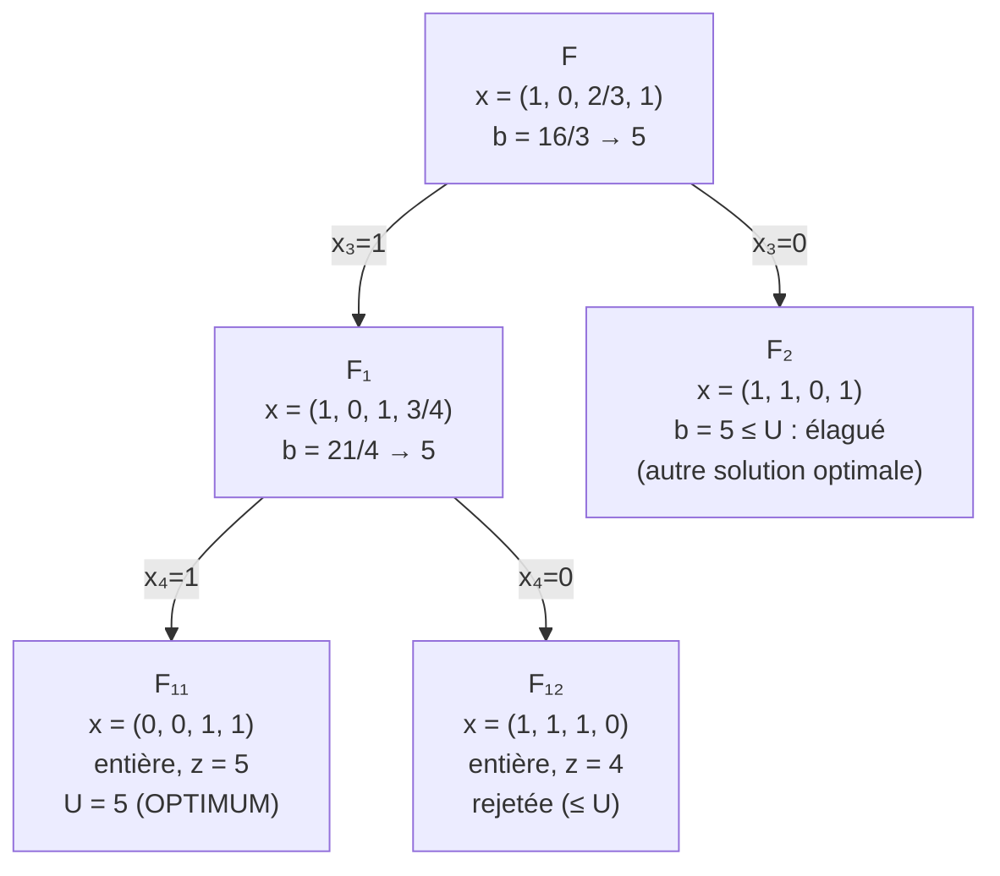

$$\boxed{\max z = x_1 + x_2 + 2x_3 + 3x_4 \quad \text{s.c.} \quad x_1 + 2x_2 + 3x_3 + 4x_4 \le 7,\ \ x_i \in \{0,1\}}$$

```mermaid
graph TD
    F["F<br/>x = (1, 0, 2/3, 1)<br/>b = 16/3 → 5"] -->|"x₃=1"| F1["F₁<br/>x = (1, 0, 1, 3/4)<br/>b = 21/4 → 5"]
    F -->|"x₃=0"| F2["F₂<br/>x = (1, 1, 0, 1)<br/>b = 5 ≤ U : élagué<br/>(autre solution optimale)"]
    F1 -->|"x₄=1"| F11["F₁₁<br/>x = (0, 0, 1, 1)<br/>entière, z = 5<br/>U = 5 (OPTIMUM)"]
    F1 -->|"x₄=0"| F12["F₁₂<br/>x = (1, 1, 1, 0)<br/>entière, z = 4<br/>rejetée (≤ U)"]
```
