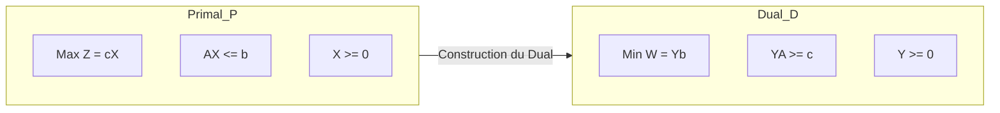

---
### 1. Idée en une phrase

Le simplexe **primal** reste **admissible** (b ≥ 0) et cherche l'optimalité. Le simplexe **dual** fait l'inverse : il part d'une base **optimale mais non admissible** (Z ≥ 0 avec des b < 0) et **répare l'admissibilité** sans perdre l'optimalité.

## Définition du Dual (Forme Symétrique)

Chaque programme linéaire (appelé **Primal**) possède un jumeau appelé **Dual**.

### Structure de passage



---

##  Règles Générales de Passage (Signes)

| Primal (MAX) | Dual (MIN) |
| :--- | :--- |
| **Contraintes** | **Variables** |
| Type $\le$ | $y_i \ge 0$ |
| Type $\ge$ | $y_i \le 0$ |
| Type $=$ | $y_i$ libre ($\in \mathbb{R}$) |
| **Variables** | **Contraintes** |
| $x_j \ge 0$ | Type $\ge$ |
| $x_j \le 0$ | Type $\le$ |
| $x_j$ libre | Type $=$ |

---

## 4. Les Théorèmes Fondamentaux

C'est le cœur de la théorie que vous devez connaître pour l'examen.

### A. Théorème de la Dualité Faible
Pour toute solution réalisable $X$ du Primal et toute solution réalisable $Y$ du Dual :
$$Z(X) \le W(Y)$$
*Interprétation : Le profit (Max) est toujours inférieur ou égal au coût des ressources (Min).*

### B. Théorème de la Dualité Forte
Si le Primal possède une solution optimale $X^*$, alors le Dual possède une solution optimale $Y^*$ et les valeurs des fonctions objectifs sont égales :
$$Z(X^*) = W(Y^*)$$


```
 PRIMAL                              DUAL
 ┌────────────────────┐              ┌────────────────────┐
 │ b ≥ 0   ✔ admissible│              │ ligne Z ≥ 0 ✔ optimal│
 │ ligne Z ≥ 0 ?  ✘    │              │ b ≥ 0 ?  ✘           │
 └─────────┬──────────┘              └─────────┬──────────┘
           ▼                                   ▼
   on améliore Z jusqu'à                on rend b ≥ 0 jusqu'à
   ligne Z ≥ 0                          arrêt quand tout b ≥ 0
```

### 2. Quand l'utiliser ?

|Situation|Intérêt|
|---|---|
|Contraintes **≥** dans un problème de min|Évite les variables artificielles (Big-M / 2 phases)|
|Ajout d'une contrainte après avoir résolu le PL|On repart du tableau optimal au lieu de tout refaire|
|Analyse de sensibilité, branch & bound|Réoptimisation rapide|

### 3. Les 4 étapes (inversion du primal)

```
┌──────────────────────────────────────────────────────────┐
│ 0. Tableau de départ : ligne Z ≥ 0 (dual-admissible)     │
│    mais certains bᵢ < 0                                  │
└───────────────────────────┬──────────────────────────────┘
                            ▼
┌──────────────────────────────────────────────────────────┐
│ 1. TEST D'ADMISSIBILITÉ                                  │
│    Tous les bᵢ ≥ 0 ?                                     │
│        OUI ──► STOP : solution optimale                  │
│        NON ──► étape 2                                   │
└───────────────────────────┬──────────────────────────────┘
                            ▼
┌──────────────────────────────────────────────────────────┐
│ 2. VARIABLE SORTANTE (d'abord la ligne !)                │
│    Ligne r du bᵣ le plus NÉGATIF                         │
└───────────────────────────┬──────────────────────────────┘
                            ▼
┌──────────────────────────────────────────────────────────┐
│ 3. VARIABLE ENTRANTE (ratio sur la ligne Z)              │
│    min { |Zⱼ / aᵣⱼ|  |  aᵣⱼ < 0 }                       │
│    Aucun aᵣⱼ < 0 ──► problème NON ADMISSIBLE (vide)      │
└───────────────────────────┬──────────────────────────────┘
                            ▼
┌──────────────────────────────────────────────────────────┐
│ 4. PIVOTAGE (Gauss-Jordan) ──► retour à l'étape 1        │
└──────────────────────────────────────────────────────────┘
```

#### Primal vs Dual : l'ordre des choix s'inverse

||Primal|Dual|
|---|---|---|
|1er choix|Colonne entrante (Z le plus négatif)|**Ligne sortante** (b le plus négatif)|
|2e choix|Ligne sortante (ratio bᵢ/aᵢⱼ, aᵢⱼ > 0)|**Colonne entrante** (ratio Zⱼ/aᵣⱼ, aᵣⱼ < 0)|
|Pivot|> 0|**< 0**|
|Invariant|b ≥ 0|Z ≥ 0|
|Arrêt|Z ≥ 0|b ≥ 0|
|Échec|Non borné|Non admissible|

### 4. Exemple complet

**min Z = 2x₁ + 3x₂**

```
 (C1)  x₁ +  x₂ ≥ 4
 (C2)  x₁ + 3x₂ ≥ 6
 x₁, x₂ ≥ 0
```

**Mise en forme** : on passe en max W = −Z, et on multiplie les contraintes par −1 pour obtenir des ≤ :

```
 −x₁ −  x₂ + e₁ = −4
 −x₁ − 3x₂ + e₂ = −6          W + 2x₁ + 3x₂ = 0
```

La ligne W vaut (2, 3, 0, 0), tous ≥ 0, donc dual-admissible. Mais b = (−4, −6) est négatif : l'origine n'est pas admissible.

#### Tableau initial (point O = (0,0), non admissible)

|Base|x₁|x₂|e₁|e₂|b|
|---|---|---|---|---|---|
|e₁|−1|−1|1|0|−4|
|**e₂**|−1|**[−3]**|0|1|**−6** ◄ plus négatif|
|**W**|2|3|0|0|0|
|ratio \|W/a\||2/1 = 2|**3/3 = 1** ◄ min||||

▲ **e₂ sort**, **x₂ entre**, pivot = −3.

#### Itération 1 (point P₁ = (0,2), Z = 6, encore non admissible)

|Base|x₁|x₂|e₁|e₂|b|
|---|---|---|---|---|---|
|**e₁**|**[−2/3]**|0|1|−1/3|**−2** ◄ négatif|
|x₂|1/3|1|0|−1/3|2|
|**W**|1|0|0|1|−6|
|ratio \|W/a\||**1/(2/3) = 1,5** ◄ min|||1/(1/3) = 3||

▲ **e₁ sort**, **x₁ entre**, pivot = −2/3.

#### Itération 2 (point B = (3,1), Z = 9)

|Base|x₁|x₂|e₁|e₂|b|
|---|---|---|---|---|---|
|x₁|1|0|−3/2|1/2|3|
|x₂|0|1|1/2|−1/2|1|
|**W**|0|0|**3/2**|**1/2**|**−9**|

Tous les b ≥ 0, donc **optimum atteint** :

> **x₁ = 3, x₂ = 1, Z* = −W = 9** (vérification : 2·3 + 3·1 = 9 ✔)

### 5. Visualisation géométrique

```
 x₂
  4 ┤ S ░░░░░░░░░░░░░░░░░░    ░ = zone admissible
    │   ░░░░░░░░░░░░░░░░░       (au-dessus de C1 et C2)
  3 ┤     ░░░░░░░░░░░░░░
    │       ░░░░░░░░░░░
  2 ┤ P₁ ──────╲░░░░░░░░░
    │  ▲        ╲░░░░░░░
  1 ┤  │         B★░░░░░░   ◄── optimum B(3,1), Z=9
    │  │           ╲░░░░
  0 ┼─ O ───────────────╲──► x₁
                (schéma indicatif)

 Parcours du simplexe dual :  O ───► P₁ ───► B
                            (0,0)  (0,2)  (3,1)
                             Z=0    Z=6    Z=9
                          ✘ non adm. ✘ non adm. ✔ admissible
```

Le dual **marche à l'extérieur** du polyèdre (O et P₁ violent C1) et n'y **entre qu'à la fin**. Z **croît** vers l'optimum par en dessous, alors que le primal le fait décroître depuis un point admissible.

### 6. Lien avec la dualité : lecture des variables duales

La ligne W finale sous les variables d'écart donne la **solution du problème dual** :

```
 Primal : min 2x₁+3x₂            Dual : max 4y₁ + 6y₂
          x₁ + x₂  ≥ 4                  y₁ +  y₂ ≤ 2
          x₁ + 3x₂ ≥ 6                  y₁ + 3y₂ ≤ 3
                                        y ≥ 0

 Lecture sous e₁, e₂ :  y₁ = 3/2 , y₂ = 1/2
 Vérification : 4·(3/2) + 6·(1/2) = 6 + 3 = 9 = Z*  ✔  (dualité forte)
```

**Chaque pas du simplexe dual sur le primal = un pas du simplexe primal sur le dual.**

### 7. À retenir

|Situation dans le tableau|Conclusion|
|---|---|
|Tous les b ≥ 0|Optimum atteint|
|Ligne r avec bᵣ < 0 et **aucun** aᵣⱼ < 0|Problème non admissible|
|Ratios égaux|Dégénérescence (risque de cycle)|
|Ligne Z finale, colonnes des écarts|Variables duales y*|