# Chapitre 5 : Structures de données hiérarchiques - Explications Strictes

Conformément à la règle stricte, **chaque concept** abordé dans ce chapitre est structuré en trois parties sans exception :
1. **Explication détaillée en texte**
2. **Exemple visuel via un diagramme Mermaid**
3. **Implémentation en code C**

---

## Concept 1 : Définition Générale d'un Arbre

**1. Explication en texte :**
Un arbre est une structure de données hiérarchique qui part d'un point d'origine (la racine) et s'étend en ramifications (les enfants). Contrairement aux listes, les données ne sont pas linéaires. La règle d'or est qu'il n'y a **aucun cycle** : il n'y a qu'un seul et unique chemin entre la racine et un élément donné.

**2. Exemple visuel :**
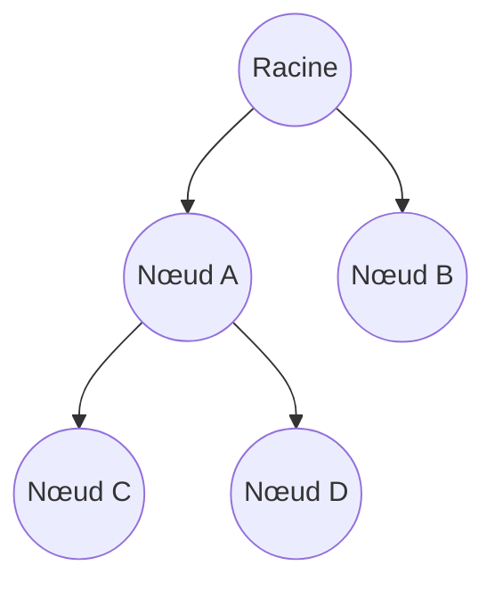

**3. Implémentation en C :**
Pour représenter un arbre avec un nombre arbitraire d'enfants (n-aire), on utilise couramment la structure "Premier fils / Frère droit".
```c
typedef struct NodeGen { // Définition de la structure pour un nœud d'arbre n-aire
    int info; // Variable pour stocker la donnée (ici un entier)
    struct NodeGen* premierFils; // Pointeur vers le premier enfant de ce nœud
    struct NodeGen* frereDroit;  // Pointeur vers le frère immédiatement à droite (de même niveau)
} NodeGen; // Alias NodeGen pour faciliter la déclaration de variables
```

---

## Concept 2 : Qualification des Nœuds

**1. Explication en texte :**
*   **Racine** : Le seul nœud de l'arbre qui n'a pas de parent.
*   **Feuille (nœud externe)** : Un nœud qui n'a aucun enfant. C'est l'extrémité d'une branche.
*   **Nœud interne** : Un nœud qui possède au moins un enfant.
*   **Parent / Enfant** : Le nœud au-dessus est le parent, celui en-dessous est l'enfant. Les enfants d'un même parent sont des **frères**.

**2. Exemple visuel :**
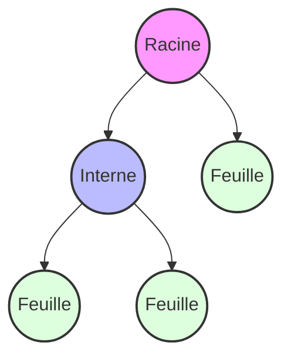

**3. Implémentation en C :**
Logique pour identifier si un nœud (dans un arbre binaire) est une feuille :
```c
int estFeuille(struct node* a) { // Fonction qui prend un pointeur de nœud et retourne un entier (booléen)
    if (a == NULL) return 0; // Si le pointeur est nul (nœud inexistant), on retourne 0 (Faux)
    // Retourne 1 (Vrai) uniquement si l'enfant gauche ET l'enfant droit sont tous les deux NULL
    return (a->left == NULL && a->right == NULL); 
}
```

---

## Concept 3 : Mesures (Profondeur et Hauteur)

**1. Explication en texte :**
*   **Profondeur (Niveau)** : La distance (nombre d'arêtes) d'un nœud par rapport à la racine. La racine est par définition à la profondeur 0.
*   **Hauteur** : La profondeur maximale de l'arbre (la distance de la racine jusqu'à la feuille la plus lointaine).

**2. Exemple visuel :**
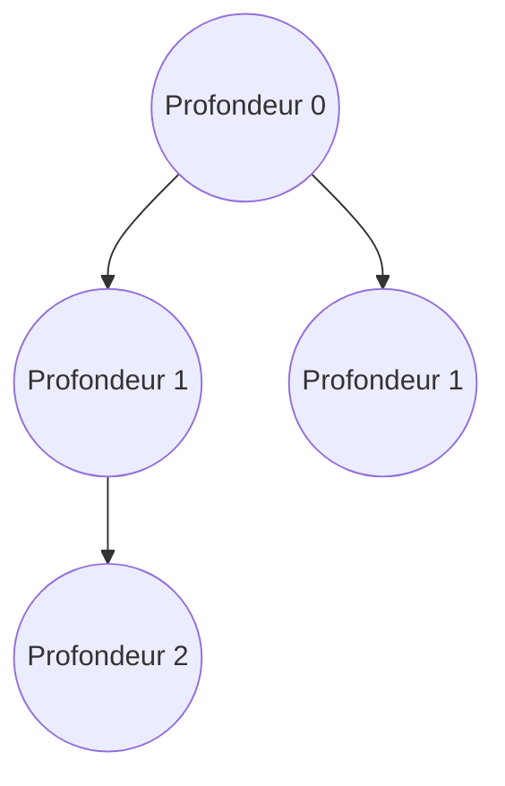

**3. Implémentation en C :**
On calcule la hauteur de manière récursive :
```c
int Hauteur(struct node* a) { // Fonction récursive calculant la hauteur d'un arbre binaire
    if (a == NULL) return 0; // Condition d'arrêt : un sous-arbre vide a une hauteur de 0
    int hg = Hauteur(a->left); // Appel récursif pour calculer la hauteur totale du côté gauche
    int hd = Hauteur(a->right); // Appel récursif pour calculer la hauteur totale du côté droit
    // On conserve uniquement la branche la plus longue et on y ajoute 1 (pour compter le nœud courant)
    if (hg > hd) return 1 + hg; // Si la gauche est plus grande, on retourne hg + 1
    else return 1 + hd; // Sinon, on retourne hd + 1
}
```

---

## Concept 4 : L'Arbre Binaire (AB) et sa Structure

**1. Explication en texte :**
Un arbre binaire est une spécialisation où **chaque nœud possède au maximum deux enfants**. On les distingue systématiquement sous les appellations **sous-arbre gauche (sag)** et **sous-arbre droit (sad)**.

**2. Exemple visuel :**
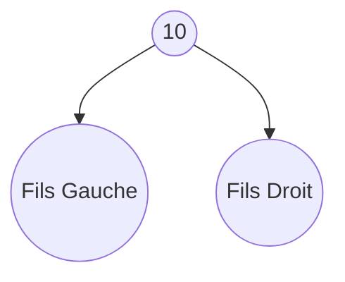

**3. Implémentation en C :**
C'est la structure de données (SDD) fondamentale en algorithmique.
```c
typedef int Element; // Définition du type 'Element' (ici un entier) pour faciliter d'éventuels changements

typedef struct node { // Définition de la structure mémoire pour un nœud binaire
    Element info;          // Variable contenant la donnée utile du nœud
    struct node *left;     // Pointeur vers le nœud enfant de gauche (sag)
    struct node *right;    // Pointeur vers le nœud enfant de droite (sad)
} Node; // Alias 'Node' pour désigner la structure plus facilement

typedef Node *BTree; // Définition de 'BTree' comme étant un pointeur vers un Node (représente l'arbre via sa racine)
```

---

## Concept 5 : Arbres Binaires Spéciaux (Complets et Parfaits)

**1. Explication en texte :**
*   **Arbre Complet** : Tous les niveaux de l'arbre sont entièrement remplis, sauf éventuellement le dernier niveau, qui doit obligatoirement être rempli de gauche à droite.
*   **Arbre Parfait** : Tous les nœuds internes ont exactement deux enfants, et absolument toutes les feuilles se trouvent à la même profondeur.

**2. Exemple visuel :**
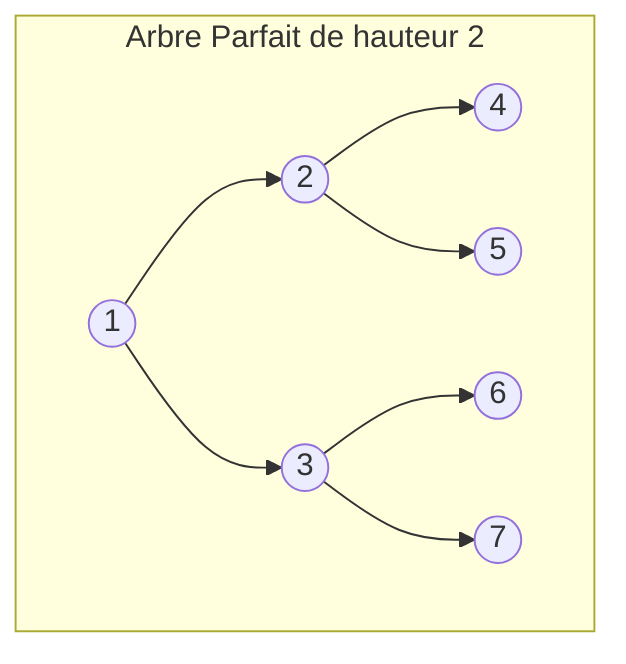

**3. Implémentation en C :**
Algorithme pour construire mathématiquement un arbre parfait de hauteur $n$ :
```c
BTree NouvelArbreParfait(int n, int e) { // Fonction récursive créant un arbre parfait de hauteur 'n' avec une valeur initiale 'e'
    if (n <= 0) return NULL; // Condition d'arrêt : si la hauteur souhaitée est nulle ou négative, on retourne un arbre vide
    BTree a = (BTree)malloc(sizeof(Node)); // Allocation en mémoire d'un nouveau nœud
    a->info = e; // On assigne la valeur 'e' à ce nouveau nœud
    a->left = NouvelArbreParfait(n - 1, 2 * e); // On génère le fils gauche avec une hauteur réduite (n-1) et une valeur doublée
    a->right = NouvelArbreParfait(n - 1, 2 * e + 1); // On génère le fils droit avec une hauteur réduite et la valeur (2*e + 1)
    return a; // On retourne le pointeur du nœud racine fraîchement construit
}
```

---

## Concept 6 : Représentation d'un Arbre Complet par Tableau

**1. Explication en texte :**
Puisqu'un arbre binaire complet n'a aucun "trou" dans sa structure, on peut le stocker de manière séquentielle dans un simple tableau au lieu d'utiliser des pointeurs. Cela offre un accès ultra-rapide en temps constant $\mathcal{O}(1)$. (La racine est généralement à l'indice 1).

**2. Exemple visuel :**
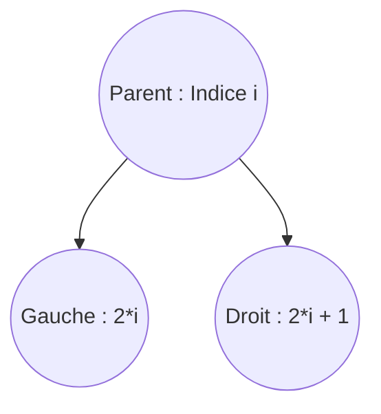

**3. Implémentation en C :**
Au lieu de déréférencer des pointeurs, on utilise des index mathématiques :
```c
int getFilsGauche(int indexParent) { // Fonction pour calculer l'indice du fils gauche
    return 2 * indexParent; // Formule : indice du parent multiplié par 2
}

int getFilsDroit(int indexParent) { // Fonction pour calculer l'indice du fils droit
    return 2 * indexParent + 1; // Formule : indice du parent multiplié par 2, auquel on ajoute 1
}

int getParent(int indexEnfant) { // Fonction pour remonter et trouver l'indice du parent
    return indexEnfant / 2; // Formule : division entière de l'indice de l'enfant par 2
}
```

---

## Concept 7 : Algorithme - Compter les nœuds

**1. Explication en texte :**
Pour compter le total des éléments d'un arbre binaire, on utilise la récursivité : le nombre total de nœuds est égal à 1 (le nœud courant) + le nombre de nœuds présents dans tout le côté gauche + le nombre de nœuds du côté droit.

**2. Exemple visuel :**
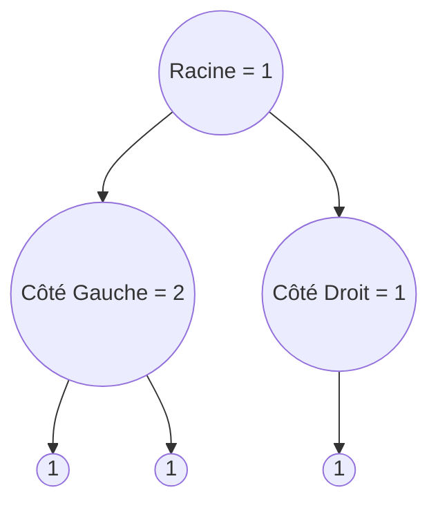

**3. Implémentation en C :**
```c
int NombreElements(BTree a) { // Fonction récursive comptant le total de nœuds dans un arbre
    if (a == NULL) return 0; // Condition de base : un sous-arbre vide contient 0 élément
    // On additionne 1 (le nœud courant) + le nombre d'éléments à sa gauche + le nombre d'éléments à sa droite
    return 1 + NombreElements(a->left) + NombreElements(a->right); 
}
```

---

## Concept 8 : Parcours en Largeur (BFS)

**1. Explication en texte :**
Ce parcours visite l'arbre couche par couche (niveau par niveau), de haut en bas et de gauche à droite. Contrairement aux autres parcours, il n'est pas récursif. Il nécessite l'utilisation d'une structure de données de type **File** (First In, First Out).

**2. Exemple visuel :**
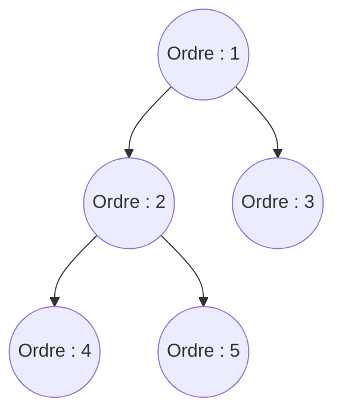

**3. Implémentation en C :**
```c
// Ce code présuppose l'existence d'une structure de File (Enfiler, Defiler, EstFileVide)
void ParcoursLargeur(BTree a) { // Fonction de parcours itératif par niveau
    if (a == NULL) return; // Si l'arbre est vide, on quitte immédiatement la fonction
    File f; // Déclaration d'une variable de type File (Structure FIFO auxiliaire)
    InitialiserFile(&f); // Initialisation mémoire de la file
    Enfiler(&f, a); // Étape initiale : on place la racine de l'arbre dans la file
    
    while (!EstFileVide(f)) { // On boucle tant qu'il y a des nœuds en attente dans la file
        BTree noeud = Defiler(&f); // On extrait le premier nœud de la file pour le traiter
        printf("%d ", noeud->info); // On effectue l'action (ici, un affichage de la valeur)
        
        // On prépare le niveau suivant : si un enfant gauche existe, on l'ajoute à la fin de la file
        if (noeud->left != NULL) Enfiler(&f, noeud->left);
        // De même, si un enfant droit existe, on l'ajoute à son tour à la fin de la file
        if (noeud->right != NULL) Enfiler(&f, noeud->right);
    } // On recommence la boucle pour traiter les nœuds qu'on vient d'enfiler
}
```

---

## Concept 9 : Parcours en Profondeur Pré-ordre (Préfixe)

**1. Explication en texte :**
C'est un parcours récursif où l'on traite le Parent **avant** de descendre explorer ses enfants. L'ordre d'action est toujours : **Parent $\rightarrow$ Gauche $\rightarrow$ Droite**.

**2. Exemple visuel :**
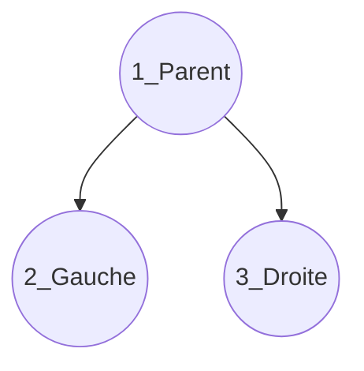

**3. Implémentation en C :**
```c
void ParcoursPrefixe(BTree a) { // Fonction récursive pour le parcours Préfixe
    if (a == NULL) return; // Condition d'arrêt : on a atteint le bout d'une branche
    printf("%d ", a->info);     // Étape 1 : On traite d'abord le nœud courant (le Parent)
    ParcoursPrefixe(a->left);   // Étape 2 : On lance l'exploration complète du sous-arbre gauche
    ParcoursPrefixe(a->right);  // Étape 3 : On lance l'exploration complète du sous-arbre droit
}
```

---

## Concept 10 : Parcours en Profondeur In-ordre (Infixe)

**1. Explication en texte :**
Ici, on traite le Parent **au milieu** de l'exploration de ses enfants. L'ordre est : **Gauche $\rightarrow$ Parent $\rightarrow$ Droite**. Très important : dans un Arbre Binaire de Recherche, c'est ce parcours qui permet d'afficher les valeurs triées dans l'ordre croissant.

**2. Exemple visuel :**
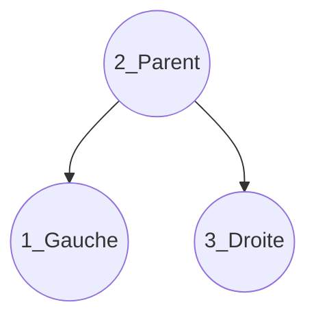

**3. Implémentation en C :**
```c
void ParcoursInfixe(BTree a) { // Fonction récursive pour le parcours Infixe
    if (a == NULL) return; // Condition d'arrêt
    ParcoursInfixe(a->left);    // Étape 1 : On plonge à gauche jusqu'au bout sans rien afficher
    printf("%d ", a->info);     // Étape 2 : Au moment où on "remonte", on traite le nœud courant (Parent)
    ParcoursInfixe(a->right);   // Étape 3 : Puis on descend explorer le côté droit
}
```

---

## Concept 11 : Parcours en Profondeur Post-ordre (Postfixe) et Libération Mémoire

**1. Explication en texte :**
On traite le Parent **après** avoir exploré ses enfants. L'ordre est : **Gauche $\rightarrow$ Droite $\rightarrow$ Parent**. Ce parcours est obligatoire pour libérer la mémoire (détruire l'arbre), car on ne peut pas détruire un nœud parent sans avoir préalablement détruit ses enfants (sinon on perd leurs adresses mémoires).

**2. Exemple visuel :**
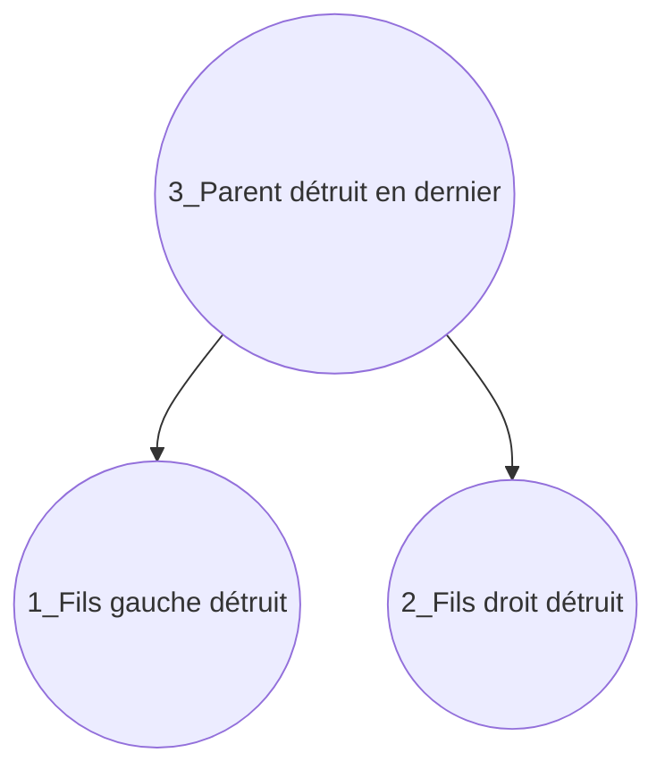

**3. Implémentation en C :**
```c
void Liberer(BTree a) { // Fonction récursive appliquant un parcours Postfixe pour nettoyer la mémoire
    if (a != NULL) { // Si le nœud existe en mémoire
        Liberer(a->left);  // Étape 1 : On ordonne la destruction de tous les descendants gauches
        Liberer(a->right); // Étape 2 : On ordonne la destruction de tous les descendants droits
        free(a);           // Étape 3 : Maintenant que les enfants sont morts, on peut désallouer le parent en toute sécurité
    }
}
```

---

## Concept 12 : Arbre Binaire de Recherche (ABR)

**1. Explication en texte :**
L'ABR est un arbre binaire doté d'une règle de rangement stricte : pour chaque nœud de l'arbre, toutes les valeurs situées dans son sous-arbre gauche sont strictement inférieures à lui, et toutes les valeurs de son sous-arbre droit sont strictement supérieures.

**2. Exemple visuel :**
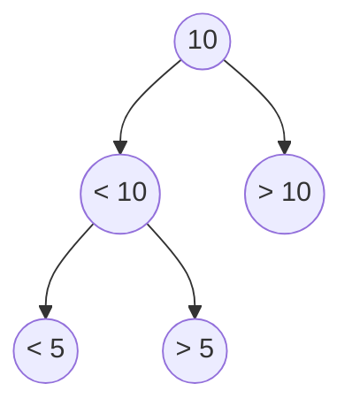

**3. Implémentation en C :**
Fonction conceptuelle pour vérifier si un nœud respecte localement la règle d'un ABR par rapport à ses enfants directs :
```c
int estABRLocal(BTree a) { // Fonction testant si la hiérarchie immédiate respecte les règles de l'ABR
    if (a == NULL) return 1; // Un arbre vide respecte la règle par défaut (retourne 1 / Vrai)
    // Vérification de l'enfant gauche : s'il existe et qu'il est supérieur ou égal au parent, la règle est brisée
    if (a->left != NULL && a->left->info >= a->info) return 0; // Retourne 0 (Faux)
    // Vérification de l'enfant droit : s'il existe et qu'il est inférieur ou égal au parent, la règle est brisée
    if (a->right != NULL && a->right->info <= a->info) return 0; // Retourne 0 (Faux)
    return 1; // Si les deux vérifications passent, le nœud local est valide (retourne 1)
}
```

---

## Concept 13 : Recherche dans un ABR

**1. Explication en texte :**
La structure de l'ABR permet une recherche par dichotomie. À chaque nœud, on effectue une comparaison : si la valeur cherchée est plus petite, on ignore la moitié droite et on descend à gauche. Si elle est plus grande, on descend à droite.

**2. Exemple visuel :**
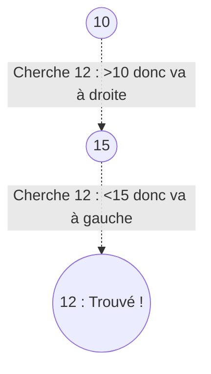

**3. Implémentation en C (Version Itérative) :**
```c
int RechercheABR(BTree a, int e) { // Fonction itérative pour rechercher l'élément 'e' dans l'arbre 'a'
    while (a != NULL) { // Boucle qui continue de descendre tant qu'on ne tombe pas sur un vide (fin de branche)
        if (a->info == e) return 1; // Succès : la valeur du nœud courant correspond à notre recherche
        if (e < a->info) a = a->left;  // L'élément est plus petit, on déplace le pointeur sur l'enfant gauche
        else a = a->right;             // L'élément est plus grand, on déplace le pointeur sur l'enfant droit
    }
    return 0; // Si la boucle s'est terminée (a est devenu NULL), l'élément n'existe pas. On retourne 0 (Faux).
}
```

---

## Concept 14 : Ajout dans un ABR

**1. Explication en texte :**
L'ajout d'une nouvelle valeur se fait toujours au niveau d'une feuille. L'algorithme parcourt l'arbre avec la logique de la dichotomie jusqu'à trouver un emplacement vide (`NULL`). On mémorise le nœud parent pour y accrocher le nouveau nœud fraîchement créé.

**2. Exemple visuel :**
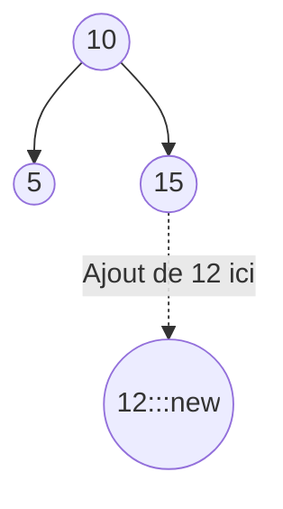

**3. Implémentation en C :**
```c
BTree AjoutABR(BTree a, int e) { // Fonction itérative insérant la valeur 'e' et retournant la racine modifiée
    if (a == NULL) return CreerNoeud(e); // Cas initial : si l'arbre est vide, on alloue le nœud et il devient la racine
    
    BTree b = a, parent = NULL; // 'b' est le curseur pour chercher la place, 'parent' mémorisera l'endroit de l'accrochage final
    // Étape 1 : Recherche itérative de l'emplacement vide
    while (b != NULL) { // On descend jusqu'à sortir de l'arbre
        parent = b; // Avant de descendre d'un niveau, on sauvegarde le nœud courant comme étant le futur parent
        if (e < b->info) b = b->left; // On descend à gauche si la valeur est plus petite
        else b = b->right; // On descend à droite si la valeur est plus grande
    } // Fin de boucle : 'parent' pointe maintenant sur la feuille qui adoptera le nouveau nœud
    
    // Étape 2 : Accrochage du nouveau nœud fraîchement créé
    if (e < parent->info) parent->left = CreerNoeud(e); // Si la valeur est plus petite que la feuille, elle devient son fils gauche
    else parent->right = CreerNoeud(e); // Sinon, elle devient son fils droit
    
    return a; // On retourne la racine globale de l'arbre
}
```

---

## Concept 15 : Suppression ABR - Cas A (Feuille)

**1. Explication en texte :**
Cas le plus simple : le nœud à supprimer n'a aucun enfant. Il suffit de le libérer de la mémoire et de mettre à jour le pointeur de son parent direct pour qu'il pointe désormais vers `NULL`.

**2. Exemple visuel :**
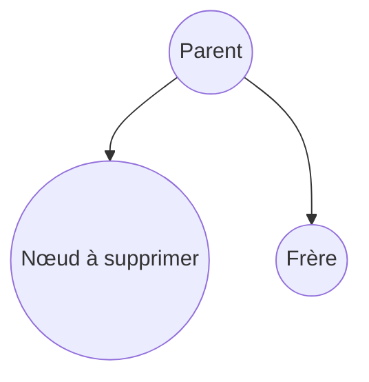

**3. Implémentation en C :**
```c
// Extrait logique d'une fonction de suppression traitant le Cas A
if (noeud->left == NULL && noeud->right == NULL) { // Vérification stricte : le nœud n'a aucun descendant
    free(noeud); // On libère l'espace mémoire alloué par malloc pour ce nœud
    return NULL; // On retourne NULL, qui ira écraser l'ancien pointeur chez le parent pour briser le lien proprement
}
```

---

## Concept 16 : Suppression ABR - Cas B (Un seul enfant)

**1. Explication en texte :**
Le nœud à supprimer possède un seul enfant (situé à gauche ou à droite). Le nœud supprimé agit alors comme un "relais" que l'on saute. Le parent du nœud supprimé adoptera directement l'enfant orphelin.

**2. Exemple visuel :**
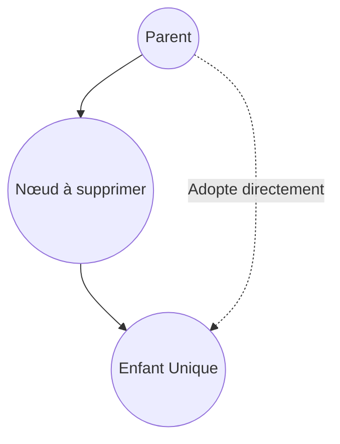

**3. Implémentation en C :**
```c
// Extrait logique d'une fonction de suppression traitant le Cas B
if (noeud->left == NULL) { // Si l'enfant gauche est absent (donc l'enfant unique est forcément à droite)
    BTree temp = noeud->right; // On sauvegarde l'adresse de l'enfant droit unique dans un pointeur temporaire
    free(noeud);               // On supprime le nœud courant qui était ciblé pour la destruction
    return temp;               // On retourne l'adresse de l'enfant unique pour que le grand-parent l'adopte
} else if (noeud->right == NULL) { // Vice versa : si l'enfant droit est absent (l'enfant unique est à gauche)
    BTree temp = noeud->left;  // On sauvegarde l'adresse de l'enfant gauche unique
    free(noeud);               // On détruit le parent
    return temp;               // On retourne l'enfant gauche au grand-parent
}
```

---

## Concept 17 : Suppression ABR - Cas C (Deux enfants)

**1. Explication en texte :**
C'est le cas complexe. Le nœud a deux enfants, on ne peut pas le retirer sans briser l'arbre. Il faut remplacer sa valeur par celle du nœud qui est **le plus grand du sous-arbre gauche** (ou le plus petit du sous-arbre droit). Une fois la valeur copiée, on lance la suppression récursive de cet ancien nœud "remplaçant" (qui, étant un maximum, n'aura au plus qu'un seul enfant, retombant dans le Cas A ou B).

**2. Exemple visuel :**
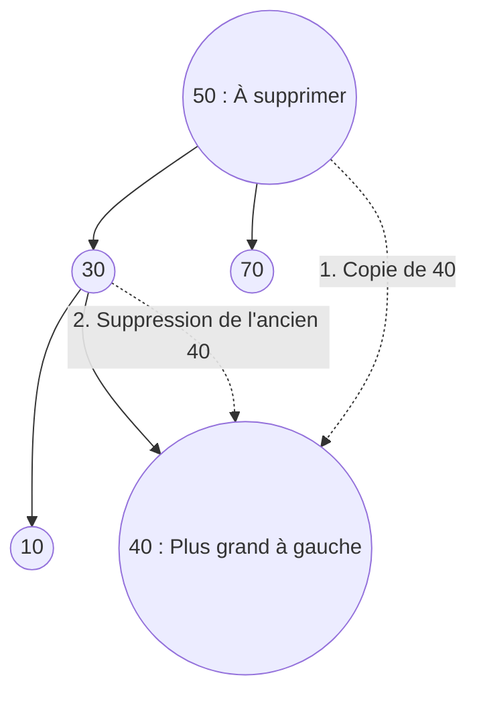

**3. Implémentation en C :**
```c
// Extrait logique d'une fonction de suppression traitant le Cas C
// Étape 1 : Trouver un nœud de remplacement qui respectera les règles de l'ABR
BTree remplaçant = noeud->left; // On se positionne sur la racine du sous-arbre gauche
while (remplaçant->right != NULL) { // Tant que ce nœud a des descendants sur sa droite
    remplaçant = remplaçant->right; // On glisse le plus à droite possible pour trouver la valeur maximale du sous-arbre
}

// Étape 2 : Transférer l'information
noeud->info = remplaçant->info; // On copie la donnée du nœud remplaçant directement à la place de la valeur qu'on voulait supprimer

// Étape 3 : Supprimer l'ancien emplacement du remplaçant
// On lance récursivement une suppression (ex: fonction SupprimerMax) pour aller effacer physiquement l'ancien nœud remplaçant.
// Par définition mathématique (étant le maximum), ce nœud remplaçant n'avait pas d'enfant droit. Sa suppression tombera donc dans le Cas A ou B.
noeud->left = SupprimerMax(noeud->left); 
```