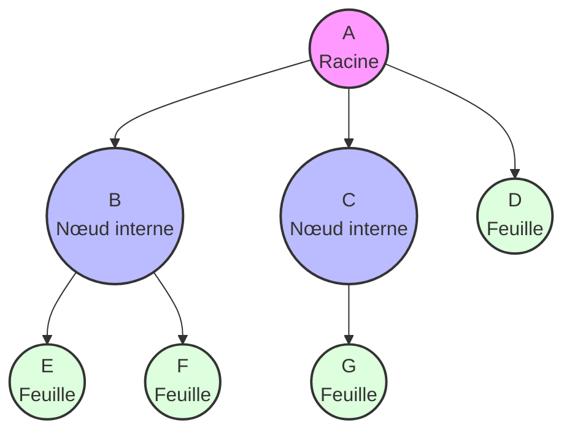
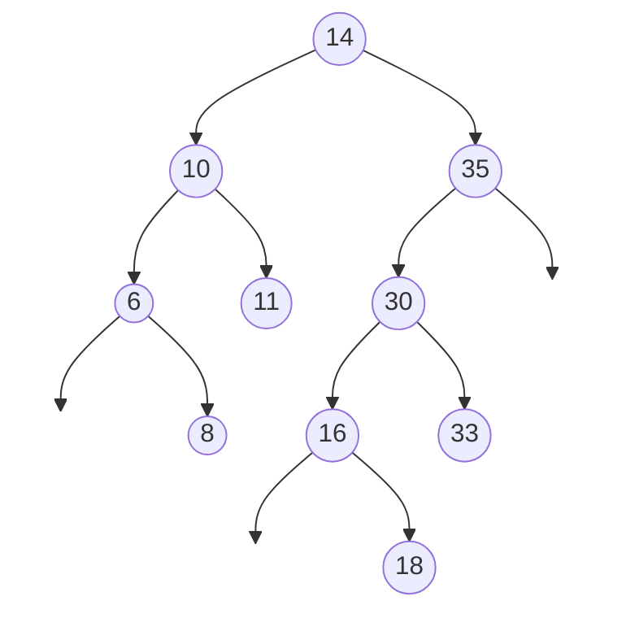

# Chapitre 5 : Structures de données hiérarchiques - Les Arbres

Bienvenue dans ce guide détaillé sur les arbres, une structure de données fondamentale en informatique. Contrairement aux listes ou aux tableaux qui sont des structures linéaires, les arbres permettent d'organiser les données de manière hiérarchique, avec un ordre vertical (parents/enfants) ou horizontal (frères).

On les retrouve partout en informatique : systèmes de fichiers (UNIX, Windows), arborescences de tournois, organigrammes d'entreprises, ou encore arbres de syntaxe en compilation.

---

## 1. Concepts de base et Vocabulaire

Un arbre est un ensemble d'éléments appelés **nœuds**, reliés entre eux par des **arêtes**. L'arbre commence par un nœud principal unique, appelé la **racine**. Il n'y a **aucun cycle** : entre deux nœuds, il n'existe qu'un seul chemin.

### 1.1 Vocabulaire essentiel :
* **Racine** : L'ancêtre de tous les nœuds, le seul nœud qui n'a pas de parent.
* **Nœud interne** : Un nœud qui a au moins un enfant.
* **Feuille (ou Nœud externe)** : Un nœud qui n'a aucun enfant.
* **Parent / Enfant (Fils)** : Un nœud $A$ au-dessus d'un nœud $B$ est le parent. $B$ est l'enfant.
* **Ancêtre / Descendant** : Extension de la relation Parent/Enfant par transitivité.
* **Frères** : Nœuds partageant le même parent.
* **Profondeur d'un nœud** : Sa distance par rapport à la racine (la racine est de profondeur 0).
* **Hauteur d'un arbre** : La profondeur maximale atteinte par une feuille.

### 1.2 Catégories spéciales d'arbres
* **Arbre vide** : Ne possède aucun nœud.
* **Arbre entier** : Tous les nœuds sont soit internes (avec des enfants), soit des feuilles.
* **Arbre complet** : Arbre entier où la différence de profondeur entre toutes les feuilles n'excède pas 1.
* **Arbre parfait** : Arbre entier où **toutes** les feuilles sont exactement à la même profondeur.



---

## 2. Arbres Binaires (AB) et Implémentation en C

Un **Arbre Binaire (AB)** est un arbre où **chaque nœud possède au maximum 2 enfants**, nommés le **fils gauche (sag)** et le **fils droit (sad)**.
*Propriété : Un arbre binaire de hauteur $h$ contient au maximum $2^{h}-1$ nœuds au total.*

### 2.1 Définition de la structure (SDD) en C

En mémoire, on l'implémente généralement avec des structures auto-référentielles (pointeurs) :

```c
typedef int Element;

// Structure d'un noeud
typedef struct node {
    Element elem;           // La donnée
    struct node *left;      // Pointeur vers le Sous-Arbre Gauche (sag)
    struct node *right;     // Pointeur vers le Sous-Arbre Droit (sad)
} Node;

// Un arbre est un pointeur vers son nœud racine
typedef Node *BTree;
```

### 2.2 Fonctions de base

```c
#include <stdlib.h>

// Vérifier si un arbre est vide
int EstArbreVide(BTree a) {
    return a == NULL;
}

// Créer un nouveau nœud (singleton)
BTree CreerNoeud(Element e) {
    BTree a = (BTree)malloc(sizeof(Node));
    a->elem = e;
    a->left = NULL;
    a->right = NULL;
    return a;
}
```

### 2.3 Représentation d'un Arbre Binaire Complet par Tableau
Si l'arbre est **complet**, on peut le stocker dans un tableau simple $A$ (en lisant niveau par niveau). L'accès y est en $\mathcal{O}(1)$ :
* L'enfant gauche du nœud $A[i]$ se trouve en $A[2i]$.
* L'enfant droit du nœud $A[i]$ se trouve en $A[2i+1]$.
* Le parent du nœud $A[i]$ se trouve en $A[i/2]$ (division entière).

---

## 3. Algorithmes sur Arbre Binaire

### 3.1 Algorithmes Classiques (Mesures et Gestion)

Les arbres se prêtent naturellement aux algorithmes **récursifs**.

```c
// 1. Compter le nombre d'éléments
int NombreElements(BTree a) {
    if (EstArbreVide(a)) return 0;
    return 1 + NombreElements(a->left) + NombreElements(a->right);
}

// 2. Mesurer la hauteur d'un arbre
int Hauteur(BTree a) {
    if (EstArbreVide(a)) return 0;
    int hg = Hauteur(a->left);
    int hd = Hauteur(a->right);
    if (hg > hd) return 1 + hg;
    else return 1 + hd;
}

// 3. Libérer la mémoire (Post-ordre)
void Liberer(BTree a) {
    if (!EstArbreVide(a)) {
        Liberer(a->left);
        Liberer(a->right);
        free(a);
    }
}
```

*(D'autres algorithmes existent comme `EstSousArbreDe(a, b)` pour vérifier si $b$ appartient à $a$, ou `NouvelArbreParfait(n, e)` pour initialiser mathématiquement un arbre complet).*

### 3.2 Parcours d'Arbres Binaires
Parcourir signifie visiter chaque nœud une fois.

#### A. Parcours en Largeur (BFS)
On lit l'arbre niveau par niveau. Cet algorithme est **itératif** et utilise une **File**.
1. Enfiler la racine.
2. Tant que la file n'est pas vide : Défiler un nœud, le traiter, et Enfiler ses enfants (gauche puis droit).

#### B. Parcours en Profondeur (DFS)
On explore une branche jusqu'au bout avant de remonter. Naturellement **récursif** (ou itératif avec une **Pile**).

```c
// Pré-ordre (Préfixe) : Parent -> Gauche -> Droit
void ParcoursPrefixe(BTree a) {
    if (EstArbreVide(a)) return;
    printf("%d ", a->elem);     // Traitement du parent
    ParcoursPrefixe(a->left);   // Gauche
    ParcoursPrefixe(a->right);  // Droit
}

// In-ordre (Infixe) : Gauche -> Parent -> Droit
void ParcoursInfixe(BTree a) {
    if (EstArbreVide(a)) return;
    ParcoursInfixe(a->left);    // Gauche
    printf("%d ", a->elem);     // Traitement du parent
    ParcoursInfixe(a->right);   // Droit
}

// Post-ordre (Postfixe) : Gauche -> Droit -> Parent
void ParcoursPostfixe(BTree a) {
    if (EstArbreVide(a)) return;
    ParcoursPostfixe(a->left);   // Gauche
    ParcoursPostfixe(a->right);  // Droit
    printf("%d ", a->elem);      // Traitement du parent
}
```

---

## 4. Arbres Binaires de Recherche (ABR)

L'**ABR** est l'application la plus utile des arbres. C'est un arbre binaire avec une condition d'ordre forte :
* Pour tout nœud $N$, **$max(SousArbreGauche) < N < min(SousArbreDroit)$**.
* Un parcours infixe sur un ABR renvoie les éléments **triés**.

### 4.1 Recherche
Très performante (similaire à une dichotomie).

```c
// Recherche d'un élément (Itératif, plus optimisé que récursif)
int RechercheABR(BTree a, Element e) {
    while (!EstArbreVide(a)) {
        if (a->elem == e) return 1; // Vrai (trouvé)
        if (e < a->elem) 
            a = a->left;  // Chercher à gauche
        else 
            a = a->right; // Chercher à droite
    }
    return 0; // Faux (non trouvé)
}
```

### 4.2 Insertion (Exemple complet)
L'ajout se fait toujours au niveau d'une feuille.

```c
// Ajouter un élément (Itératif)
BTree AjoutABR(BTree a, Element e) {
    if (EstArbreVide(a)) return CreerNoeud(e);
    
    BTree b = a;
    BTree p = NULL; // Gardera trace du parent
    
    while (!EstArbreVide(b)) {
        p = b;
        if (e < b->elem) b = b->left;
        else b = b->right;
    }
    
    // Ajout effectif
    if (e < p->elem) p->left = CreerNoeud(e);
    else p->right = CreerNoeud(e);
    
    return a;
}
```

**Exemple du cours :** Construction par ajouts successifs de `14, 10, 35, 6, 30, 33, 11, 16, 8, 18` :



### 4.3 La Suppression
Opération complexe comportant **3 cas**.

#### Cas A : Le nœud est une feuille
On met simplement le pointeur du parent à `NULL`.
*Exemple : Supprimer 8.* Le 6 n'aura plus d'enfant droit.

#### Cas B : Le nœud a UN SEUL enfant
On "saute" le nœud à supprimer. Le parent pointe directement sur le petit-fils.
*Exemple : Supprimer 16.* Le 30 (parent de 16) pointera directement sur 18 (enfant de 16).

#### Cas C : Le nœud a DEUX enfants
Le nœud est bloqué. On doit le remplacer par une valeur qui maintient l'ordre de l'ABR :
1. On cherche soit le **plus grand élément du sous-arbre gauche**, soit le **plus petit élément du sous-arbre droit**.
2. On copie cette valeur à la place du nœud à supprimer.
3. On supprime le nœud remplaçant (qui, par nature, n'aura qu'un enfant au maximum, retombant dans le Cas A ou B).

```mermaid
flowchart TD
    subgraph 1. Cas C: Supprimer 30
        14a((14)) --> 10a((10))
        14a --> 35a((35))
        35a --> 30a((30:::target))
        30a --> 16a((16))
        30a --> 33a((33))
        
        classDef target fill:#faa,stroke:#333,stroke-width:2px;
    end
    
    subgraph 2. Copie du remplaçant (ex: max du sag)
        14b((14)) --> 10b((10))
        14b --> 35b((35))
        35b --> 30b((16:::highlight))
        30b --> 16b((16:::highlight))
        30b --> 33b((33))
        
        classDef highlight fill:#ff9,stroke:#333,stroke-width:2px;
    end
    
    subgraph 3. Suppression de l'ancienne position
        14c((14)) --> 10c((10))
        14c --> 35c((35))
        35c --> 16c((16))
        16c --> null4[ ]
        16c --> 33c((33))
        style null4 stroke-width:0px,fill:none
    end
```

---

## 5. Synthèse des Coûts (Complexité)

L'ABR brille particulièrement sur les opérations de modification par rapport aux structures linéaires, à condition que sa hauteur $h$ soit proche de $\log n$ (arbre équilibré).

| Structure | Insertion | Recherche | Suppression |
| :--- | :--- | :--- | :--- |
| **Tableau** | $\mathcal{O}(1)$ | $\mathcal{O}(n)$ | $\mathcal{O}(n)$ |
| **Tableau trié** | $\mathcal{O}(n)$ | $\mathcal{O}(\log n)$ | $\mathcal{O}(n)$ |
| **Liste chaînée** | $\mathcal{O}(1)$ | $\mathcal{O}(n)$ | $\mathcal{O}(n)$ |
| **ABR** | $\mathcal{O}(h)$ | $\mathcal{O}(h)$ | $\mathcal{O}(h)$ |

*Où $h$ est la hauteur de l'arbre : $\mathcal{O}(\log n)$ dans le meilleur des cas (arbre équilibré type AVL), et $\mathcal{O}(n)$ dans le pire des cas (arbre peigne / dégénéré).*
