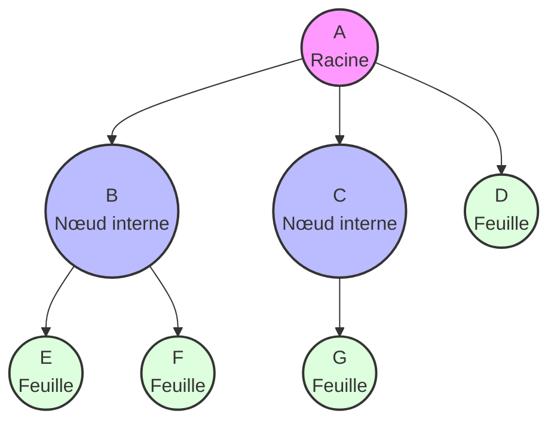
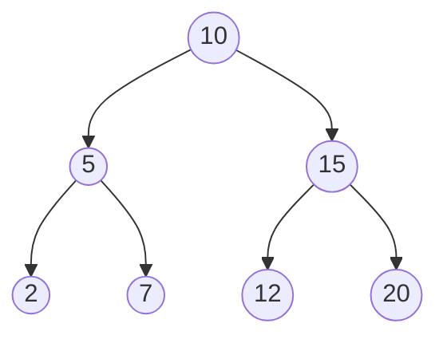
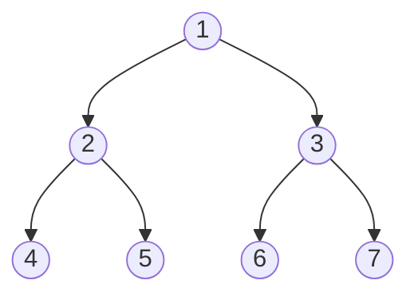
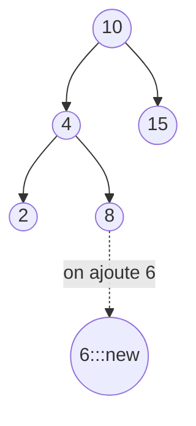
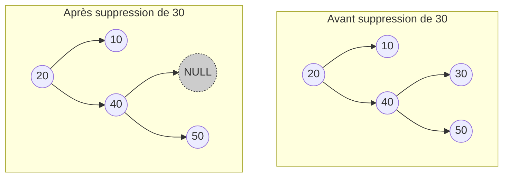
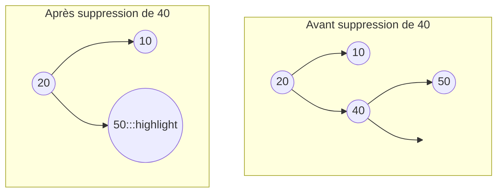
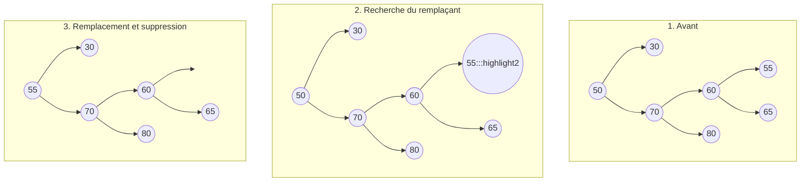

# Chapitre 5 : Structures de données hiérarchiques - Les Arbres

Bienvenue dans ce guide détaillé sur les arbres, une structure de données fondamentale en informatique. Contrairement aux listes ou aux tableaux qui sont des structures linéaires, les arbres permettent d'organiser les données de manière hiérarchique.

## 1. Concepts de base et Vocabulaire

Un arbre est un ensemble d'éléments appelés **nœuds**, reliés entre eux par des **arêtes**. L'arbre commence par un nœud principal unique, appelé la **racine**. À partir de cette racine, les données se ramifient.

### Vocabulaire essentiel :
* **Racine** : Le seul nœud de l'arbre qui n'a pas de parent (le point de départ).
* **Nœud interne** : Un nœud qui a au moins un enfant.
* **Feuille (ou Nœud externe)** : Un nœud qui n'a aucun enfant (les extrémités de l'arbre).
* **Parent / Enfant (Fils)** : Un nœud $A$ relié à un nœud inférieur $B$ est le parent de $B$. Inversement, $B$ est l'enfant de $A$.
* **Frères** : Des nœuds qui partagent le même parent.
* **Profondeur d'un nœud** : Sa distance par rapport à la racine (la racine est à la profondeur 0).
* **Hauteur de l'arbre** : La profondeur maximale atteinte par une feuille dans l'arbre.

### Illustration d'un Arbre Générique

*Ici, A est la racine (profondeur 0). B et C sont des nœuds internes (profondeur 1). D, E, F et G sont des feuilles. La hauteur de cet arbre est de 2.*

---

## 2. Arbres Binaires (AB) et Représentation

Un **Arbre Binaire (AB)** est un type d'arbre spécifique où **chaque nœud possède au maximum 2 enfants**, que l'on nomme systématiquement le **fils gauche** et le **fils droit**.

### Structure et Implémentation
En mémoire, un nœud d'un arbre binaire est généralement représenté par une structure contenant 3 éléments :
1. **La donnée** (ou la valeur).
2. Un pointeur vers le **Sous-Arbre Gauche (SAG)**.
3. Un pointeur vers le **Sous-Arbre Droit (SAD)**.

Si un enfant n'existe pas, le pointeur correspond à `NULL` (ou une adresse vide).

*Note : Pour un arbre binaire **complet** (où tous les niveaux sont remplis sauf éventuellement le dernier qui est rempli de gauche à droite), on peut utiliser un simple **Tableau** pour le représenter en mémoire. Le fils gauche de l'indice $i$ se trouve à l'indice $2i$ et le fils droit à $2i+1$.*

### Illustration d'un Arbre Binaire

---

## 3. Algorithmes de Parcours

Parcourir un arbre signifie visiter tous ses nœuds une et une seule fois. Mais dans quel ordre ? Il existe deux grandes familles de parcours.

Prenons cet arbre de référence pour comprendre les parcours :

### 3.1. Parcours en Largeur (BFS - Breadth-First Search)
Ce parcours visite l'arbre **niveau par niveau**, de haut en bas et de gauche à droite.
* **Algorithme (Itératif avec une File)** : On place la racine dans une file. Tant que la file n'est pas vide, on retire le premier élément, on le traite, puis on ajoute ses enfants (gauche puis droit) à la fin de la file.
* **Ordre de visite pour notre arbre** : `1, 2, 3, 4, 5, 6, 7`

### 3.2. Parcours en Profondeur (DFS - Depth-First Search)
Ce parcours plonge le plus profondément possible dans une branche (généralement à gauche) avant de remonter. Comme l'arbre est une structure récursive, on utilise la **récursivité** (ou une Pile) pour l'implémenter. Il y a trois variantes principales selon le moment où l'on "traite" (ou affiche) le parent par rapport à ses enfants :

#### A. Parcours Pré-ordre (Préfixe)
**Ordre** : Parent -> Fils Gauche -> Fils Droit.
*(Utile pour copier un arbre).*
* **Étape par étape** : On affiche 1, on va à gauche sur 2. On affiche 2, on va à gauche sur 4. On affiche 4, plus d'enfant, on remonte. On va sur 5, on l'affiche. On remonte sur 1, on va à droite sur 3. Etc.
* **Ordre de visite** : `1, 2, 4, 5, 3, 6, 7`

#### B. Parcours In-ordre (Infixe)
**Ordre** : Fils Gauche -> Parent -> Fils Droit.
*(Très utilisé pour obtenir les valeurs triées d'un Arbre Binaire de Recherche).*
* **Ordre de visite** : `4, 2, 5, 1, 6, 3, 7`

#### C. Parcours Post-ordre (Postfixe)
**Ordre** : Fils Gauche -> Fils Droit -> Parent.
*(Utile pour supprimer ou libérer la mémoire d'un arbre : on supprime d'abord les enfants avant le parent).*
* **Ordre de visite** : `4, 5, 2, 6, 7, 3, 1`

---

## 4. Arbres Binaires de Recherche (ABR)

Un **Arbre Binaire de Recherche** est un arbre binaire doté d'une règle stricte de rangement (relation d'ordre) qui le rend extrêmement puissant pour la recherche d'informations :
* **Règle** : Pour tout nœud $N$, toutes les valeurs de son **sous-arbre gauche** sont **strictement inférieures** à la valeur de $N$, et toutes les valeurs de son **sous-arbre droit** sont **strictement supérieures** à la valeur de $N$.

### 4.1. Recherche et Insertion
Grâce à cette règle, la recherche (ou l'insertion) s'apparente à une dichotomie.
* Si on cherche `11` en partant de `10` : $11 > 10$, donc on descend directement dans le sous-arbre droit. On ignore toute la moitié gauche de l'arbre.
* **Complexité** : La recherche est très rapide en moyenne $O(\log n)$, mais peut dégénérer en $O(n)$ si l'arbre est complètement déséquilibré (ressemblant à une simple liste chaînée).

**Exemple d'Insertion du nombre `6` :**

### 4.2. La Suppression dans un ABR
C'est l'opération la plus complexe car il faut conserver la structure (la propriété ABR) de l'arbre après le retrait d'un nœud. Il y a **3 cas possibles**.

#### Cas A : Le nœud à supprimer est une feuille
C'est le cas le plus simple. Le nœud n'a aucun enfant. Il suffit de le "décrocher" en mettant à jour le pointeur de son parent vers `NULL`.

#### Cas B : Le nœud à supprimer a un seul enfant
On décroche le nœud à supprimer et on connecte directement son enfant (unique) à la place, au niveau de son ancien parent.

#### Cas C : Le nœud à supprimer a deux enfants
C'est le cas délicat. On ne peut pas simplement retirer le nœud car il laisserait deux sous-arbres orphelins, or le parent ne peut accepter qu'un seul successeur.
**La solution** : 
1. Trouver une valeur de "remplacement" qui ne viole pas les règles de l'ABR. Cette valeur est soit :
   * **Le maximum de son sous-arbre gauche** (le nœud le plus à droite à gauche).
   * **Le minimum de son sous-arbre droit** (le nœud le plus à gauche à droite).
2. On copie la valeur de ce nœud remplaçant à la place de la valeur que l'on veut supprimer.
3. On supprime le nœud remplaçant d'origine (qui tombe forcément dans le Cas A ou le Cas B, puisqu'étant un extremum, il n'a au maximum qu'un seul enfant).

**Exemple : Suppression de la racine `50` (en utilisant le plus petit des plus grands).**

*Ici, pour remplacer 50, on cherche le minimum de son sous-arbre droit (le 55). On met 55 à la place de 50. Puis, on supprime l'ancien nœud 55 (qui n'avait pas d'enfant, Cas A).*

---
*Ce document couvre les concepts essentiels du Chapitre 5. Assurez-vous de bien maîtriser les parcours récursifs et les cas de suppression dans un ABR pour vos applications et examens !*
