# III. Diagramme de Séquences — Cours Complet avec Exemples

---

## 1. Définition

Un **diagramme de séquences** est un diagramme UML comportemental qui modélise les **interactions chronologiques** entre les acteurs et les objets d'un système pour réaliser un cas d'utilisation.

Il répond à la question : **"Qui envoie quoi à qui, et dans quel ordre ?"**

> **Analogie** : Imaginez un scénario de cinéma — le diagramme de séquences est le script qui décrit les répliques échangées entre les personnages, dans l'ordre du récit.

### Vue d'ensemble — Structure de base

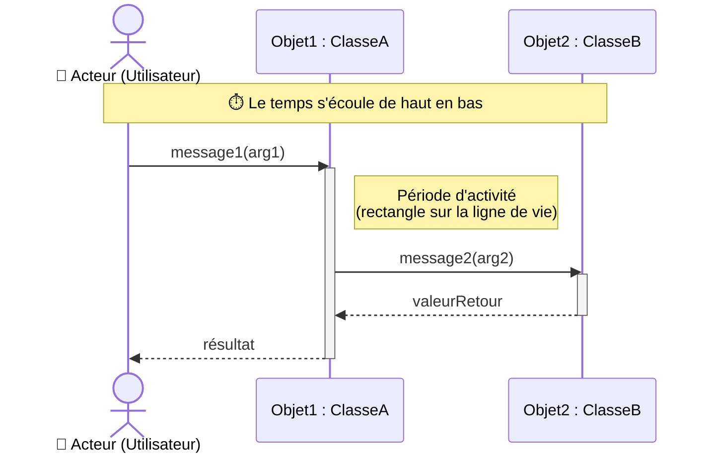

---

## 2. Éléments Constitutifs

### a. Les Lignes de Vie (Lifelines)

Chaque participant possède une **ligne de vie** verticale en pointillés, qui représente son existence dans le temps.

| Élément | Représentation | Rôle |
|---|---|---|
| Acteur | Bonhomme | Déclenche le scénario |
| Objet | Rectangle + ligne pointillée | Traite les messages |
| Période d'activité | Rectangle plein sur la ligne | Durée d'exécution d'une opération |

---

## 3. Types de Messages

### 🔵 Message Synchrone (flèche pleine `—→`)

L'émetteur **se bloque** et attend la fin de l'opération avant de continuer. C'est le type le plus courant (appel de méthode classique).

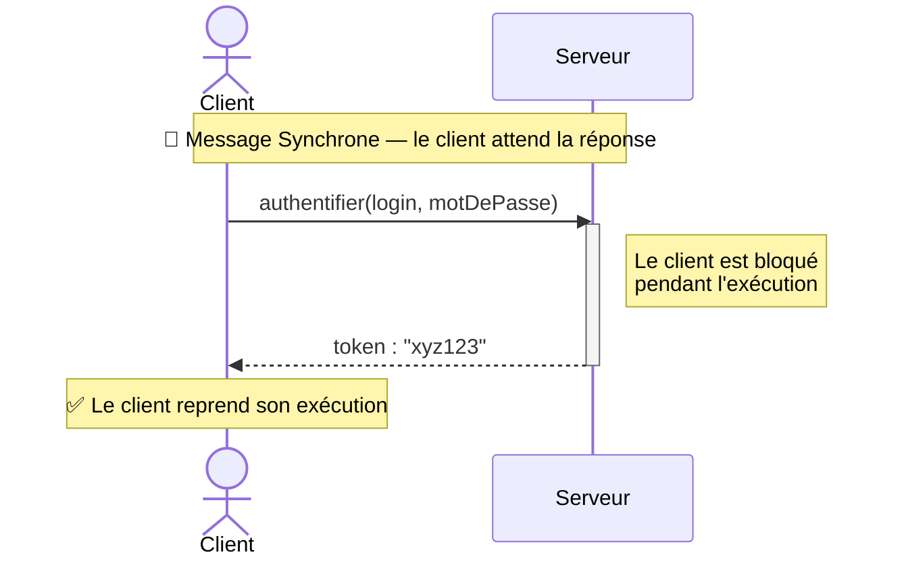

> **Exemple concret** : Appel d'une API REST — le navigateur attend la réponse du serveur avant d'afficher la page.

---

### 🟢 Message Asynchrone (flèche ouverte `-→`)

L'émetteur **n'attend pas** la réponse et continue immédiatement. Utilisé pour les événements, files de messages, notifications.

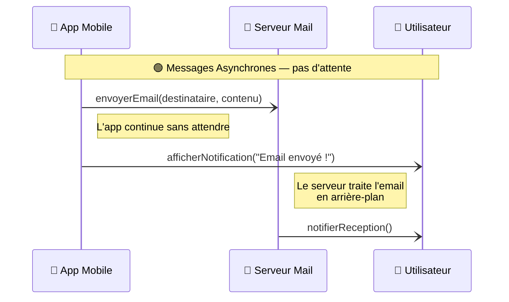

> **Exemple concret** : Envoi d'un email — l'application n'attend pas la confirmation de réception pour continuer.

---

### 🟡 Message de Création (`create`) et Destruction (`destroy`)

Un objet peut être **créé dynamiquement** pendant le scénario, et **détruit** en fin de vie.

```mermaid
sequenceDiagram
    actor Admin
    participant Systeme as Système
    participant Panier as 🛒 Panier (nouvel objet)

    Admin->>Systeme: ouvrirSession(userId)
    activate Systeme

    Note over Systeme,Panier: Création dynamique d'un objet Panier
    create participant Panier
    Systeme->>Panier: create(userId)
    activate Panier

    Admin->>Panier: ajouterArticle("Livre Java", 1)
    Panier-->>Admin: articleAjouté : true

    Admin->>Systeme: fermerSession()

    Note over Panier: Destruction de l'objet
    destroy Panier
    Systeme->>Panier: destroy()
    deactivate Panier
    deactivate Systeme
```

> **Exemple concret** : Dans un site e-commerce, le panier est créé à l'ouverture de la session et détruit à la fermeture.

---

### 🔴 Message Réflexif (auto-message)

Un objet s'envoie **un message à lui-même** — il appelle l'une de ses propres méthodes.

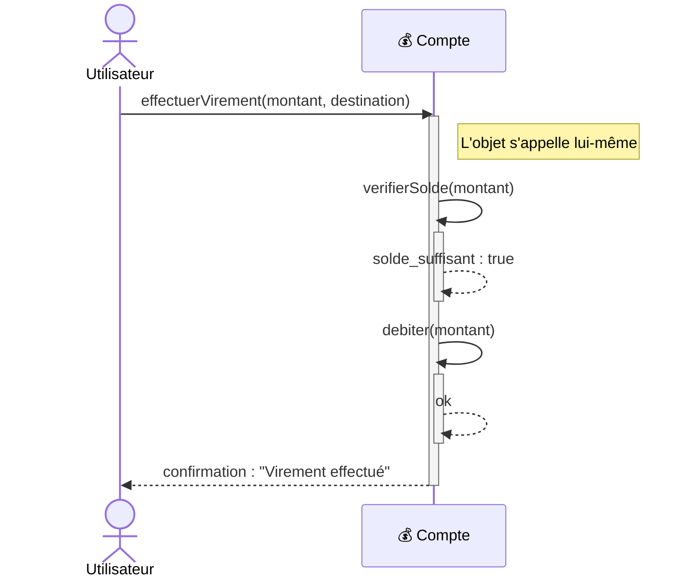

> **Exemple concret** : Un objet `Compte` vérifie son propre solde avant d'effectuer un débit.

---

## 4. Les Fragments Combinés

Les fragments combinés permettent de modéliser des **structures de contrôle** (conditions, boucles, options) directement dans le diagramme.

---

### 🔀 Fragment `alt` — Condition (équivalent `if / else if / else`)

Permet de représenter plusieurs chemins d'exécution alternatifs selon des conditions.

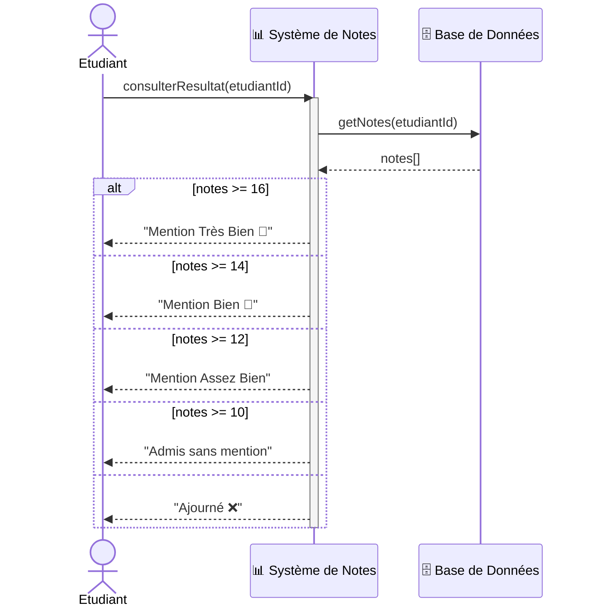

> **Exemple concret** : Affichage du résultat d'un étudiant selon sa moyenne — chaque alternative correspond à une mention différente.

---

### ❓ Fragment `opt` — Option (équivalent `if` sans `else`)

Représente un comportement **facultatif** qui peut ou non se produire selon une condition.

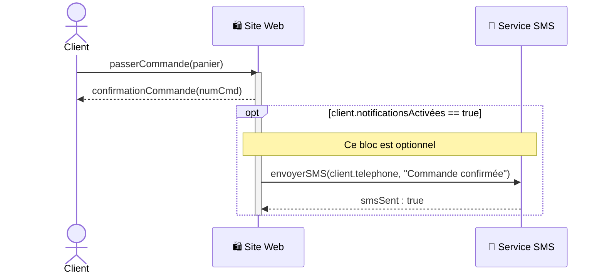

> **Exemple concret** : Un SMS de confirmation n'est envoyé **que si** le client a activé les notifications.

---

### 🔁 Fragment `loop` — Boucle

Modélise une répétition d'interactions. On peut préciser la condition de maintien de la boucle ou le nombre d'itérations.

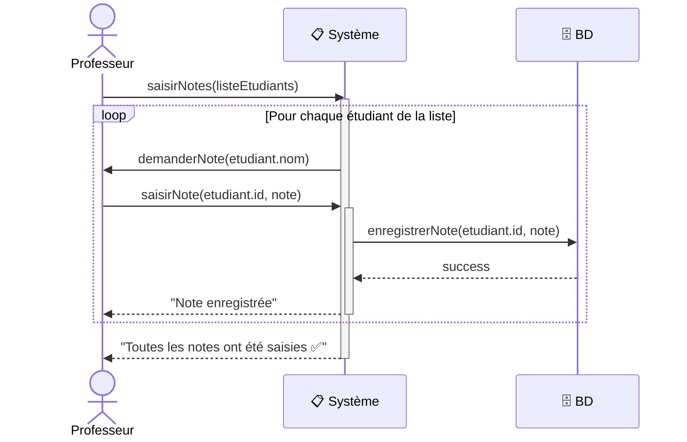

> **Exemple concret** : Un professeur saisit les notes une par une pour chaque étudiant d'une liste.

---

### 🔗 Fragment `ref` — Référence à un autre diagramme

Permet de **factoriser** des comportements communs en référençant un autre diagramme de séquences, allégeant ainsi les diagrammes complexes.

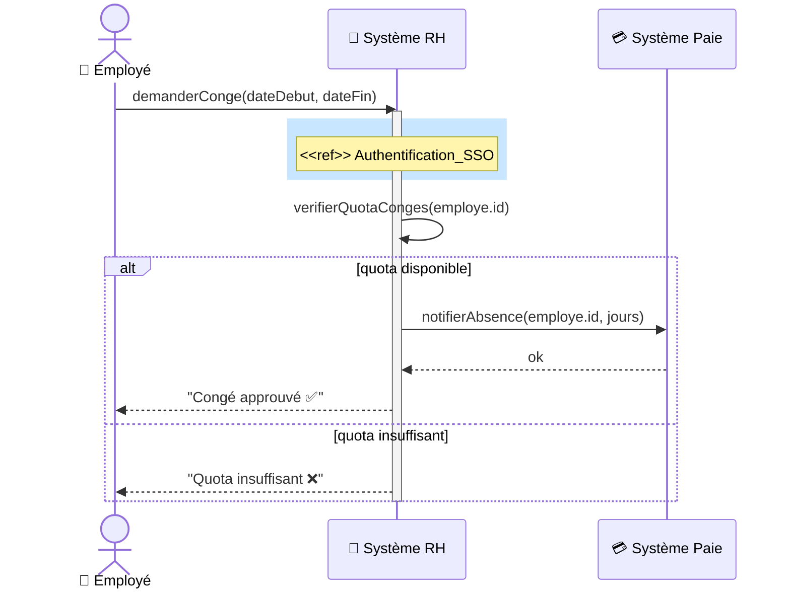

> **Exemple concret** : Le scénario "Demande de congé" réutilise le diagramme "Authentification SSO" sans le redessiner.

---

## 5. Combinaison de Fragments — Exemple Complet

Il est possible de **combiner plusieurs fragments** dans le même diagramme pour modéliser des scénarios complexes.

```mermaid
sequenceDiagram
    actor Client
    participant AppBanque as 📱 App Banque
    participant Auth as 🔐 Service Auth
    participant Compte as 💰 Compte
    participant BD as 🗄️ Base de Données

    Client->>AppBanque: seConnecter(login, mdp)
    activate AppBanque
    AppBanque->>Auth: verifierCredentials(login, mdp)
    activate Auth

    alt credentials valides
        Auth-->>AppBanque: token_jwt
        deactivate Auth
        AppBanque-->>Client: "Connexion réussie ✅"

        loop Tant que session active (< 30 min)
            Client->>AppBanque: consulterSolde()
            AppBanque->>Compte: getSolde(userId)
            activate Compte
            Compte->>BD: SELECT solde FROM comptes WHERE id=userId
            BD-->>Compte: solde : 1540.00
            Compte-->>AppBanque: solde : 1540.00
            deactivate Compte
            AppBanque-->>Client: afficher(1540.00 EUR)

            opt Client demande un virement
                Client->>AppBanque: effectuerVirement(montant, iban)
                activate AppBanque
                AppBanque->>Compte: virer(montant, iban)
                activate Compte
                Compte->>Compte: verifierSolde(montant)
                Compte->>BD: UPDATE comptes SET solde=solde-montant
                BD-->>Compte: ok
                Compte-->>AppBanque: virementOk
                deactivate Compte
                AppBanque-->>Client: "Virement effectué ✅"
                deactivate AppBanque
            end
        end

    else credentials invalides
        Auth-->>AppBanque: erreur_auth
        deactivate Auth
        AppBanque-->>Client: "Login ou mot de passe incorrect ❌"
    end

    deactivate AppBanque
```

---

## 6. Diagramme de Séquences Système (DSS)

Un **DSS** est une version simplifiée où le système entier est représenté comme **une seule boîte noire**. On ne détaille pas les objets internes — on montre uniquement les échanges entre les acteurs et le système global.

### Quand utiliser un DSS ?
- En **début de conception** pour aller vite
- Pour valider les **interfaces externes** du système
- Pour alléger des diagrammes trop complexes

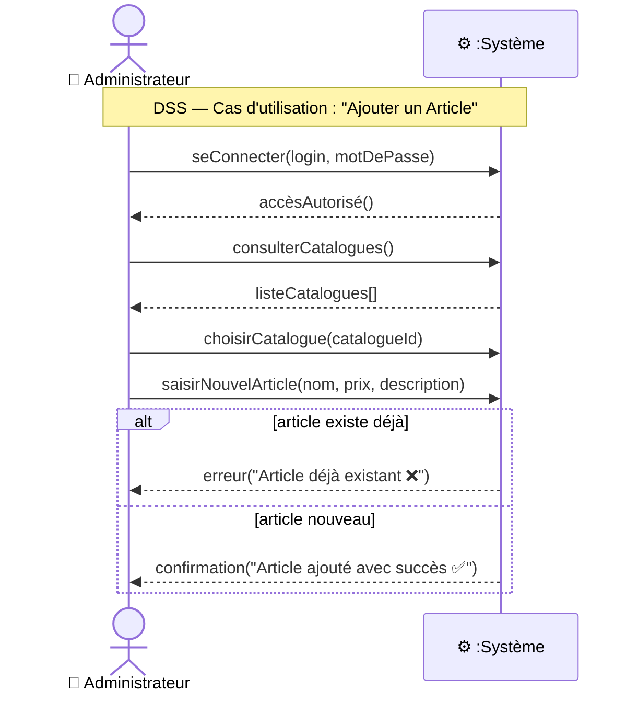

---

## 7. Exemple d'Application Complet — Gestion de Catalogue Produits

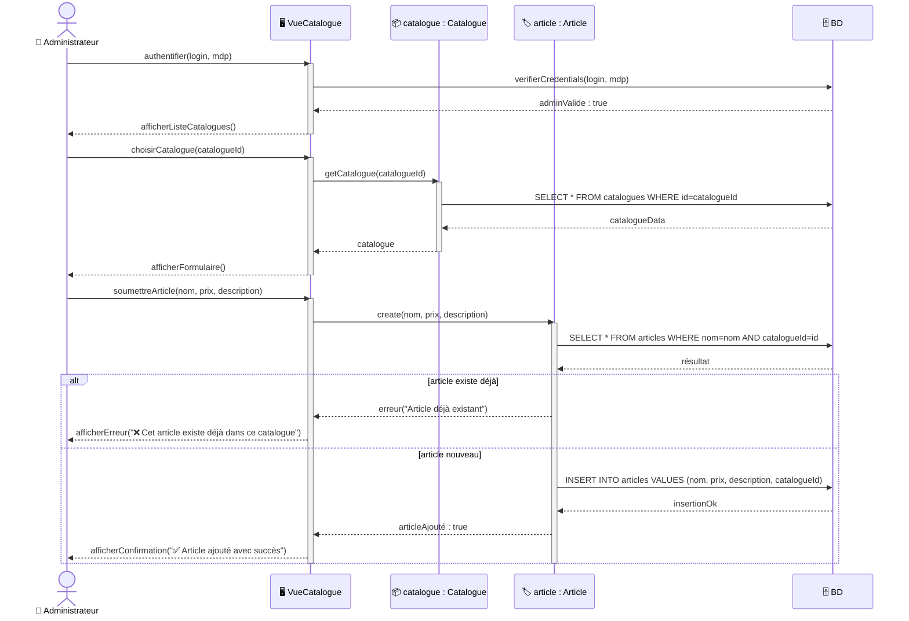

## 8. Résumé Visuel des Notations

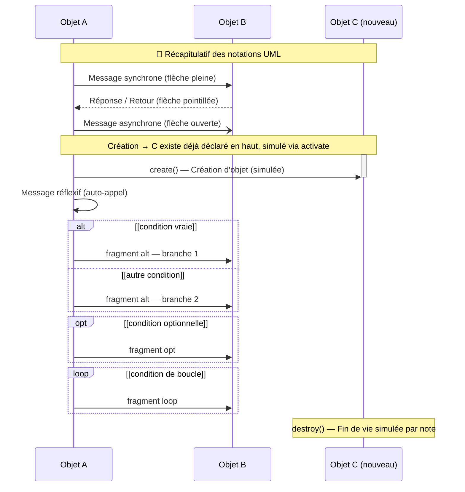
## 9. Tableau de Synthèse

| Concept | Notation Mermaid | Signification |
|---|---|---|
| Message synchrone | `->>` | Bloquant, attend la réponse |
| Message asynchrone | `-)` | Non bloquant, continue |
| Message de retour | `-->>` | Réponse optionnelle (pointillés) |
| Création d'objet | `create participant` + `->>` | Nouvel objet dynamique |
| Destruction | `destroy` + `->>` | Fin de vie de l'objet |
| Message réflexif | `A->>A:` | L'objet s'appelle lui-même |
| Fragment `alt` | `alt / else / end` | Condition if/else |
| Fragment `opt` | `opt / end` | Condition if sans else |
| Fragment `loop` | `loop / end` | Boucle |
| Fragment `ref` | `rect` (simulation) | Référence à un autre DS |
| DSS | Système = boîte unique | Vue externe simplifiée |

---
# Diagramme de Séquences — Cas d'Utilisation : "Accès Sécurisé à un ATM"

## Contexte et Analyse

**Système** : Guichet Automatique Bancaire (ATM)  
**Acteurs** :
- 👤 **Client** : insère sa carte et saisit son code

**Classes du système identifiées** :
- `ATM` — Interface du guichet (écran + lecteur carte)
- `Carte` — Entité représentant la carte bancaire
- `BD` — Base de données bancaire (vérification carte et code)

---

## Identification des Fragments

| Situation | Fragment UML |
|---|---|
| Carte valide ou non | `alt` |
| Mauvais code → réessayer (max 3 tentatives) | `loop` (max 3) |
| Code correct ou 3 échecs | `alt` imbriqué dans le `loop` |

---

## Diagramme de Séquences Système (DSS)

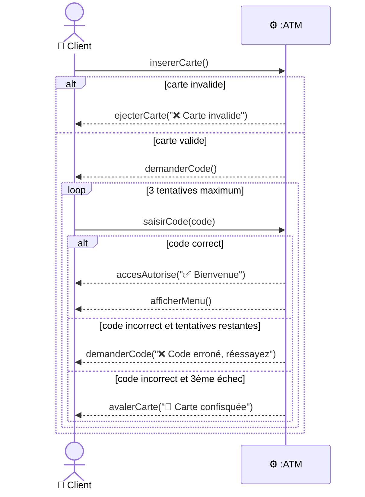

---

## Diagramme de Séquences Détaillé

```mermaid
sequenceDiagram
    actor Client as 👤 Client
    participant ATM as 🏧 ATM
    participant Carte as 💳 carte : Carte
    participant BD as 🗄️ BD

    Note over Client,BD: Étape 1 — Insertion et vérification de la carte

    Client->>ATM: insererCarte()
    activate ATM

    ATM->>Carte: lireCarte()
    activate Carte
    Carte->>BD: SELECT * FROM cartes WHERE numero=carteId AND statut='active'
    BD-->>Carte: resultat

    alt carte invalide (expirée, bloquée ou inconnue)
        Carte-->>ATM: carteInvalide
        deactivate Carte
        ATM-->>Client: ejecterCarte("❌ Carte invalide, veuillez contacter votre banque")
        deactivate ATM

    else carte valide
        Carte-->>ATM: carteValide
        deactivate Carte

        Note over Client,BD: Étape 2 — Saisie du code PIN (3 tentatives max)

        ATM-->>Client: afficherEcranCode("Veuillez saisir votre code PIN")

        loop max 3 tentatives [tentative <= 3]

            Client->>ATM: saisirCode(codeSaisi)
            activate ATM
            ATM->>BD: verifierCode(carteId, hash(codeSaisi))
            BD-->>ATM: resultat

            alt code correct
                ATM-->>Client: afficherConfirmation("✅ Code accepté")
                Note over Client,BD: Étape 3 — Accès aux fonctionnalités

                ATM-->>Client: afficherMenu(["Retrait", "Solde", "Virement", "Quitter"])
                Client->>ATM: choisirAction(action)
                ATM-->>Client: executerAction(action)
                deactivate ATM

            else code incorrect — tentative 1 ou 2
                ATM-->>Client: afficherErreur("❌ Code erroné — tentatives restantes : " + (3 - tentative))
                deactivate ATM

            else code incorrect — 3ème tentative échouée
                ATM-->>Client: avalerCarte("🚫 Trop de tentatives, carte confisquée")
                ATM->>BD: UPDATE cartes SET statut='bloquee' WHERE numero=carteId
                BD-->>ATM: ok
                deactivate ATM
            end

        end

        deactivate ATM
    end
```
