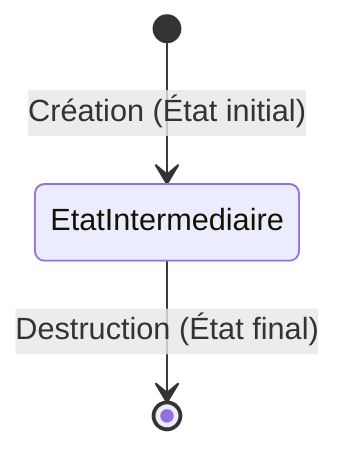
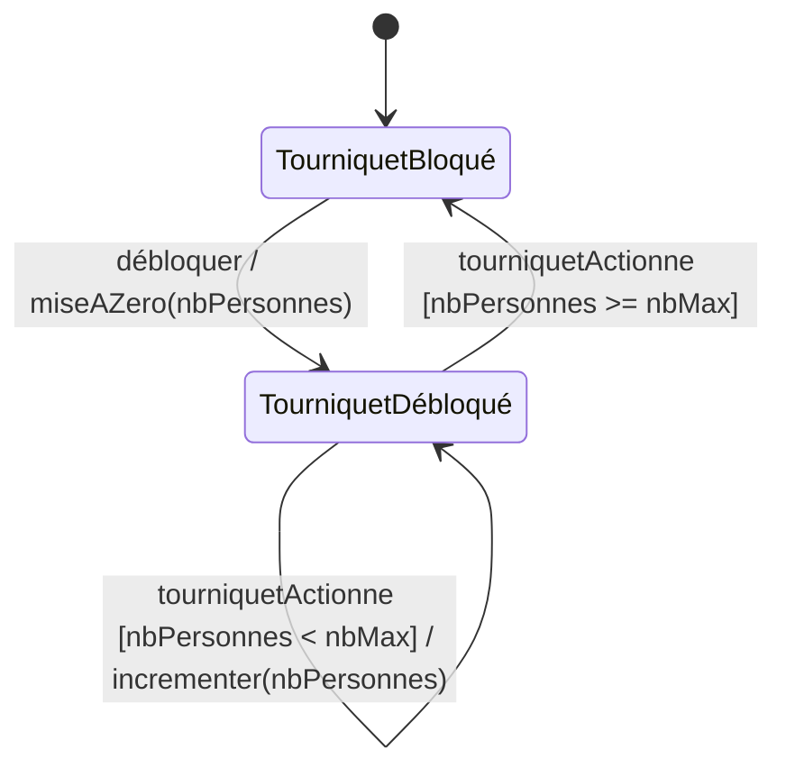
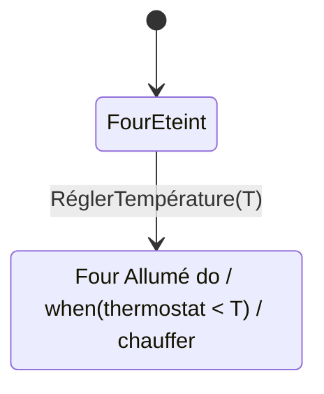
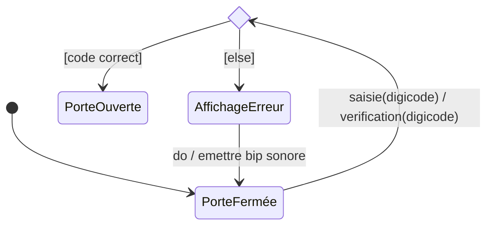
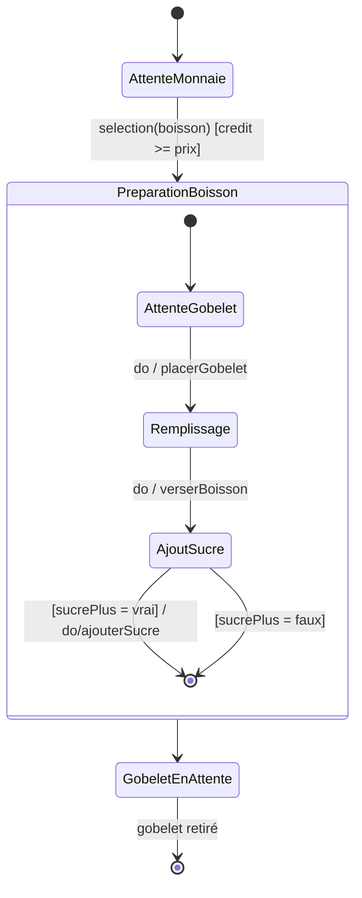
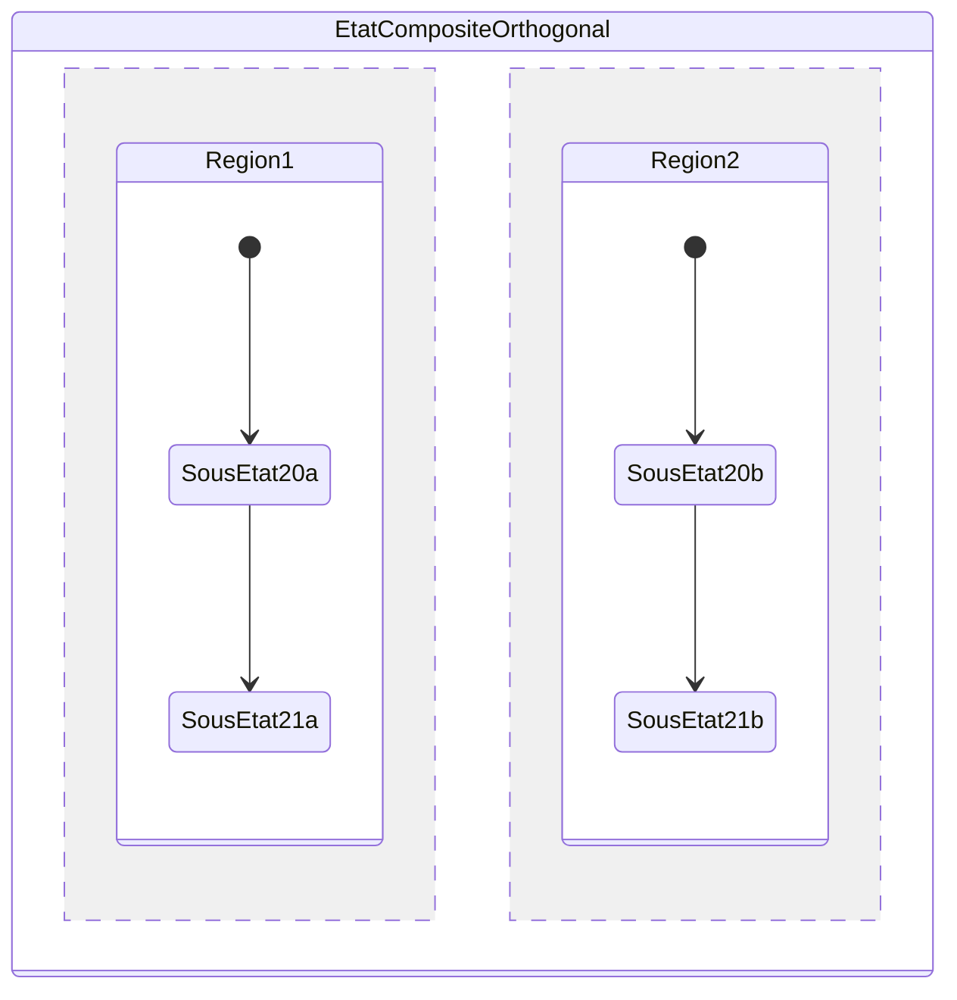
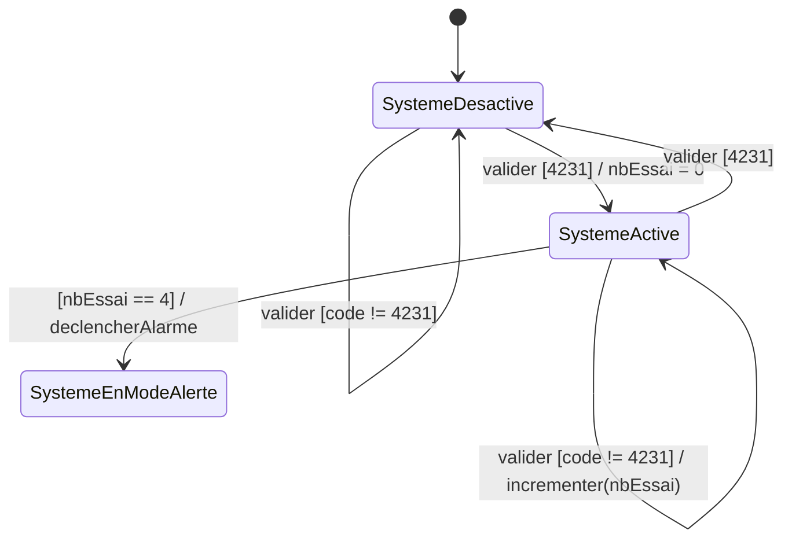
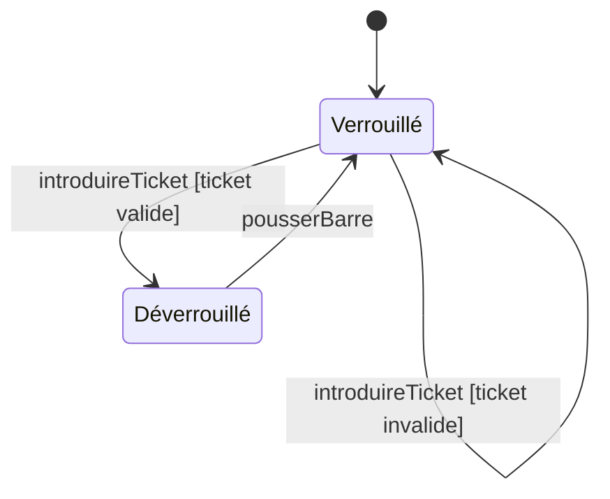
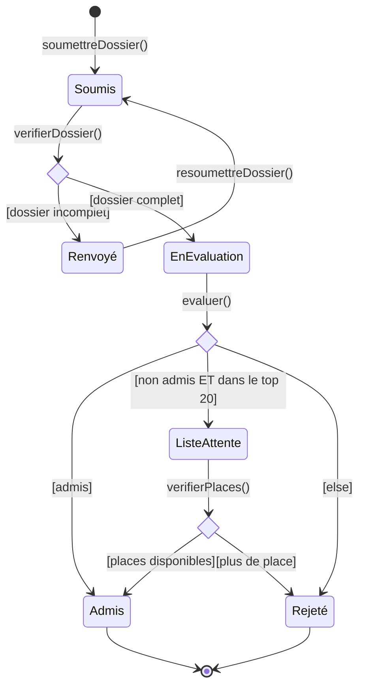

# Cours d'Ingénierie Logicielle : Le Diagramme d'États-Transitions

Ce document est une explication détaillée du cours sur les diagrammes d'états-transitions, accompagnée d'exemples visuels générés avec Mermaid pour faciliter la compréhension.

---

## 1. Définition et Objectifs

Un **diagramme d'états-transitions** modélise le comportement séquentiel d'un objet spécifique (instance d'une classe) tout au long de son cycle de vie. Il décrit :
- Les différents **états** (situations) dans lesquels l'objet peut se trouver.
- Comment l'objet passe d'un état à un autre (les **transitions**) en réponse à des **événements**.

**Pourquoi l'utiliser ?**
Il est particulièrement utile pour analyser et comprendre le comportement d'objets ayant des traitements complexes, où la réaction à un événement dépend de l'état actuel de l'objet (ex: un distributeur automatique, un système d'alarme, un emprunt de livre).

---

## 2. Les Éléments de Base

### 2.1 L'État
Un état représente une étape de la vie de l'objet, une période durant laquelle il attend un événement ou accomplit une activité. Il est stable et possède une certaine durée.

- **État initial :** Le point de départ juste après la création de l'objet (représenté par un cercle noir).
- **État intermédiaire :** L'état courant de l'objet (rectangle aux coins arrondis).
- **État final :** La phase de destruction de l'objet (cercle entouré). Un objet peut ne jamais avoir d'état final s'il n'est jamais détruit.

### 2.2 L'Événement
Un événement est un fait instantané qui déclenche le changement d'état de l'objet. Il figure sur les transitions. Il existe 4 types d'événements :
1. **Événement de type signal (Signal event) :** Réception d'un message asynchrone. (ex: `nom_événement(parametres)`)
2. **Appel d'opération (Call event) :** Message synchrone lié à une opération de la classe.
3. **Événement de changement (Change event) :** Se déclenche lorsqu'une condition booléenne devient vraie (testée en permanence). Syntaxe : `when (condition)`
4. **Événement temporel (Time event) :** Basé sur l'écoulement du temps. Absolu (`when(date=...)`) ou relatif (`after(durée)`).

### 2.3 La Transition (Externe)
Une transition relie deux états et indique le passage de l'un à l'autre. Elle est **instantanée** (n'a pas de durée).

**Syntaxe complète :** `événement [condition de garde] / effet`
- **événement :** Ce qui déclenche la transition.
- **condition de garde :** Expression booléenne qui doit être vraie au moment de l'événement pour que la transition s'exécute.
- **effet :** Action(s) ponctuelle(s) déclenchée(s) par la transition (ex: affecter une valeur, envoyer un signal).

**Exemple : Le Tourniquet de métro**

---

## 3. Comportements Internes d'un État (Transition Interne)

Un état peut effectuer plusieurs activités pour lui-même, spécifiées à l'intérieur de la boîte de l'état. Ces activités ne provoquent pas de changement d'état.

Mots-clés UML standards :
- `entry` : Action exécutée **à l'entrée** dans l'état (facultatif).
- `do` : Activité exécutée **pendant** que l'objet est dans l'état (dès que l'action `entry` est finie).
- `exit` : Action exécutée **à la sortie** de l'état (facultatif).

**Exemple : État d'un four**

*(Ici, tant que le four est dans l'état "Four Allumé", il vérifie en continu le thermostat pour déclencher l'action de chauffer).*

---

## 4. Éléments de Routage Avancés

### 4.1 Point de Jonction
Un point de jonction (cercle noir en UML) permet de factoriser (partager) des segments de transition communs entre plusieurs transitions pour rendre le diagramme plus lisible. Il sert aussi à représenter un branchement conditionnel pour un même événement mais avec des conditions de gardes différentes.

### 4.2 Point de Décision
Un point de décision (losange) possède une entrée et au moins deux sorties. Contrairement à la jonction, les conditions de garde sortantes sont évaluées **seulement au moment où le point est atteint** (après l'action de la transition entrante). Il est crucial de prévoir une sortie par défaut (souvent notée `[else]`) pour éviter le blocage du modèle.

**Exemple : Ouverture d'une porte avec digicode**

---

## 5. Structuration : États Composites et Orthogonaux

### 5.1 État Composite
Certains états sont complexes et correspondent à la réalisation de plusieurs activités ou sous-états. Un état composite regroupe ces sous-états dans des régions. Cela permet de structurer les comportements et de factoriser les transitions (ex: une transition sortant de l'état composite s'applique à tous ses sous-états).

**Exemple simplifié : Distributeur de boisson**

### 5.2 État Orthogonal
Quand un état composite contient **plusieurs régions** actives simultanément, on l'appelle état orthogonal. Il y a un parallélisme : l'objet se trouve dans un sous-état de chaque région en même temps. (Modélisé avec `--` sous Mermaid).

---

## 6. Exemple Complet d'Application : Le Système d'Alarme

**Cahier des charges :**
- L'alarme s'active avec le code `4231`.
- S'il y a une erreur lors de la désactivation, l'utilisateur a droit à 3 essais maximum.
- À la 4ème erreur consécutive, le système se déclenche et passe en mode alerte.

**Modélisation avec Mermaid :**

---

## 7. Exercices Pratiques

### Exercice 1 : Gestion d'un Tourniquet

**Énoncé :**
On souhaite représenter le comportement d’un tourniquet qui permet d’accéder à un espace grâce à un ticket valide. Le comportement du tourniquet est le suivant :
Par défaut le tourniquet est toujours verrouillé. Il se déverrouille uniquement si le passant introduit un ticket valide, dans d’autres cas (si le passant essaye de pousser la barre métallique ou introduit un ticket non valide) il ne se passe rien. Une fois le tourniquet déverrouillé, le passant doit pousser la barre métallique pour passer, ensuite le tourniquet se remet à l’état verrouillé.

**Solution :**

### Exercice 2 : Processus de Candidature à un MS

**Énoncé :**
Les candidatures des étudiants pour l’accès à un Mastère Spécialisé (MS) dans une école supérieure sont traitées de la manière suivante : quand un candidat soumet son dossier, la candidature est par défaut à l’état soumis. Le système vérifie si le dossier est complet, s’il ne l’est pas, le dossier est renvoyé à l’étudiant pour qu’il puisse le resoumettre. Si le dossier est complet, il passe à l’évaluation par un jury spécialisé. Après évaluation, la candidature peut être admise, ou mise sur la liste attente si le dossier est classé dans le top 20 des dossiers non admis au départ. Si des places se libèrent, la candidature finit par être admise. S’il n’y a plus de place, elle sera rejetée définitivement. 
Donner le diagramme d’états-transitions représentant le cycle de vie de la candidature d’un étudiant à un MS.

**Solution :**

