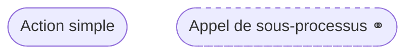
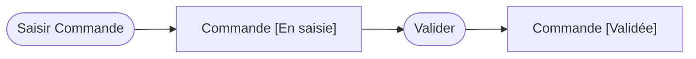
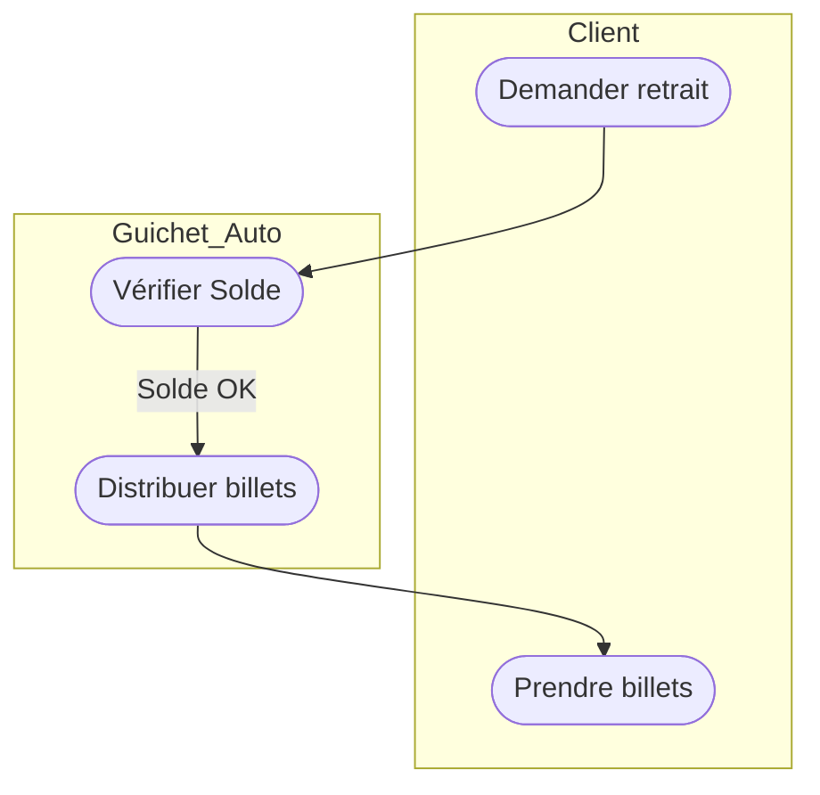

# Guide Approfondi : Maîtriser le Diagramme d'Activités UML

Ce guide explique non seulement *comment* dessiner un diagramme d'activités, mais surtout *pourquoi* et *comment* modéliser des processus métier complexes de manière logique.

---

## 1. La Philosophie : "Le Flux du Jeton" (Token Flow)

Pour comprendre un diagramme d'activités, imaginez un **jeton** (token) qui circule :
1. Il part du **Nœud Initial**.
2. Il traverse les **Actions**.
3. Il se multiplie au niveau d'une **Bifurcation (Fork)**.
4. Il attend ses "camarades" au niveau d'une **Union (Join)**.
5. Il disparaît au **Nœud Final**.

> **Règle d'or :** Une action ne peut démarrer que lorsqu'elle reçoit le jeton de toutes ses transitions entrantes.

---

## 2. Actions vs Activités : La Granularité

Il est crucial de ne pas confondre les deux :
- **Action** : Unitaire et atomique (ex: `Calculer la TVA`). On ne peut pas "rentrer" dedans.
- **Activité** : Un processus complet qui peut être détaillé dans un autre diagramme (ex: `Gestion du Paiement`).

---

## 3. Le Parallélisme : Fork & Join (La puissance de l'UML)

C'est ici que le diagramme d'activités surpasse le simple logigramme (flowchart).

- **Fork (Bifurcation)** : Un jeton arrive, plusieurs jetons sortent **en même temps**.
- **Join (Union)** : C'est une barrière de synchronisation. Elle attend que **tous** les chemins parallèles soient terminés avant de laisser passer un seul jeton.

### Exemple concret : Préparation d'une commande

```mermaid
graph TD
    Start(( )) --> Pay(["Payer"])
    Pay --> Fork[ ]
    
    Fork --> Stock(["Mettre à jour stock"])
    Fork --> Email(["Envoyer confirmation"])
    
    Stock --> Join[ ]
    Email --> Join[ ]
    
    Join --> End(⦿)

    style Fork fill:#000,stroke:#000
    style Join fill:#000,stroke:#000
```

---

## 4. Gestion des Flux de Données (Object Nodes)

Un diagramme d'activités montre aussi **l'évolution des objets**. On utilise des rectangles avec des guillemets pour éviter les erreurs de syntaxe avec les crochets d'états.

---

## 5. Partitions (Swimlanes) : Qui est responsable ?

Les couloirs définissent les frontières de responsabilité.

### Exemple d'interaction Système/Utilisateur

---

## 6. Différence entre Nœud Final et Fin de Flot

- **Nœud Final (⦿)** : Arrête **toute** l'activité immédiatement.
- **Fin de Flot (⦻)** : Arrête uniquement le chemin actuel.

---

## 7. Cas d'étude : Système de Réservation de Vol

```mermaid
graph TD
    Start(( )) --> Search(["Chercher Vol"])
    Search --> Select(["Sélectionner Vol"])
    Select --> Fork[ ]
    
    subgraph Parallèle
        Fork --> Info(["Saisir Infos Passager"])
        Fork --> Seat(["Choisir Siège"])
    end
    
    Info --> Join[ ]
    Seat --> Join[ ]
    
    Join --> Pay{Paiement ?}
    Pay -- "Réussit" --> Ticket(["Émettre Billet"])
    Pay -- "Échoue" --> Cancel(["Annuler Réservation"])
    
    Ticket --> End(⦿)
    Cancel --> End
    
    style Fork fill:#000,stroke:#000
    style Join fill:#000,stroke:#000
```

