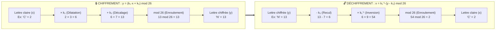

```mermaid

flowchart LR
    subgraph Chiffrement ["🔒 CHIFFREMENT : y = (k₁·x + k₂) mod 26"]
        direction LR
        P["Lettre claire (x)<br/>Ex: 'C' = 2"] --> M1["× k₁ (Dilatation)<br/>2 × 3 = 6"]
        M1 --> A1["+ k₂ (Décalage)<br/>6 + 7 = 13"]
        A1 --> MOD1["mod 26 (Enroulement)<br/>13 mod 26 = 13"]
        MOD1 --> C["Lettre chiffrée (y)<br/>'N' = 13"]
    end

    subgraph Dechiffrement ["🔓 DÉCHIFFREMENT : x = k₁⁻¹·(y - k₂) mod 26"]
        direction LR
        C2["Lettre chiffrée (y)<br/>Ex: 'N' = 13"] --> S2["- k₂ (Recul)<br/>13 - 7 = 6"]
        S2 --> M2["× k₁⁻¹ (Inversion)<br/>6 × 9 = 54"]
        M2 --> MOD2["mod 26 (Enroulement)<br/>54 mod 26 = 2"]
        MOD2 --> P2["Lettre claire (x)<br/>'C' = 2"]
    end

    Chiffrement ==> Dechiffrement
```

```mermaid
``
```