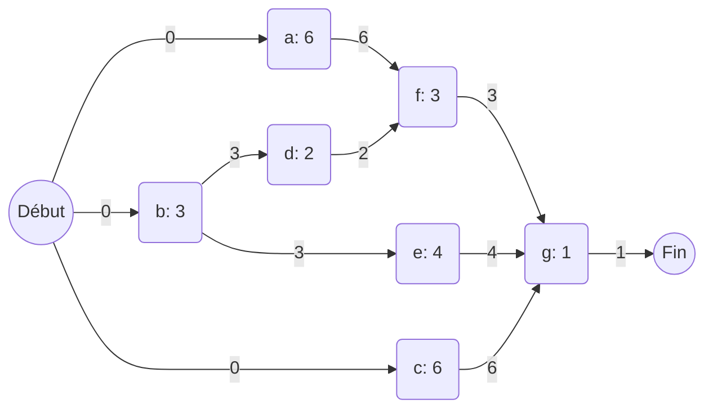
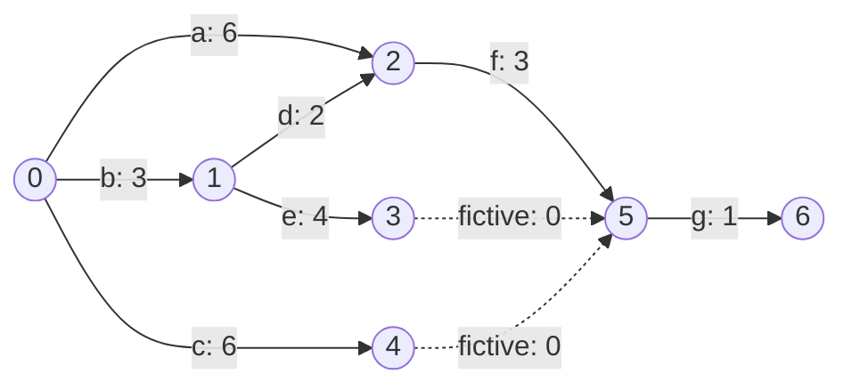
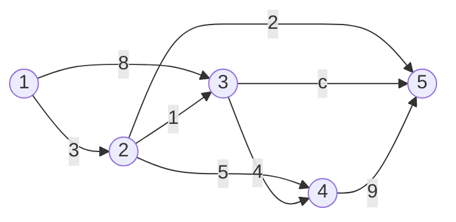
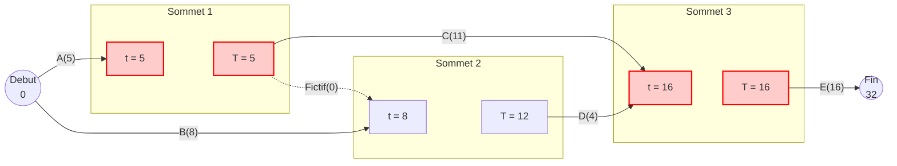
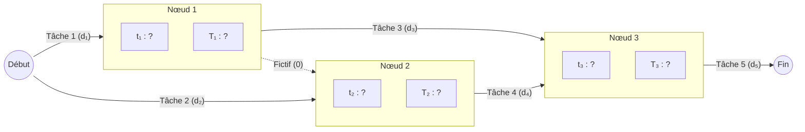

# TD : Problèmes d'Ordonnancement - Résolutions Détaillées

Ce document contient la résolution des exercices de TD pour la préparation à l'examen. Chaque question est accompagnée d'un rappel de cours et d'une explication détaillée.

---

## Exercice 1 : Méthode Potentiels-Tâches (MPM)

**Énoncé :**
Sept tâches (a à g) avec les durées et contraintes suivantes :

| Tâches | Durée | Contraintes |
| :---: | :---: | :--- |
| **a** | 6 | -- |
| **b** | 3 | -- |
| **c** | 6 | -- |
| **d** | 2 | b achevée |
| **e** | 4 | b achevée |
| **f** | 3 | d et a achevées |
| **g** | 1 | f, e, c achevées |

---

### 1. Dessiner le graphe potentiel-tâches (MPM) associé

**Concept : Le Graphe MPM**
Dans la méthode des Potentiels-Tâches (MPM), les **sommets** (nœuds) représentent les tâches et les **arcs** représentent les relations d'ordre. Un arc allant de $i$ vers $j$ avec une valeur $d(i)$ signifie que la tâche $j$ ne peut commencer qu'après la fin de $i$ (soit $t_j \ge t_i + d(i)$). 
On ajoute souvent un sommet "Début" et un sommet "Fin" fictifs pour structurer le graphe.

**Résolution :**
*   **Tâches sans antécédents** : a, b, c (liées au "Début").
*   **Liaisons** :
    *   b $\to$ d et b $\to$ e
    *   a $\to$ f et d $\to$ f
    *   f $\to$ g, e $\to$ g et c $\to$ g
*   **Tâche finale** : g (liée à "Fin").

---

### 2. Calculer les dates au plus tôt (ES)

**Concept : Date au plus tôt ($ES$)**
La date au plus tôt d'une tâche $j$ est le moment minimum auquel elle peut commencer. Elle correspond au **plus long chemin** allant du début du projet jusqu'à l'entrée de cette tâche.
Formule : $ES(j) = \max_{i \in Pred(j)} [ES(i) + d(i)]$

**Résolution :**
1.  **ES(a)** = 0
2.  **ES(b)** = 0
3.  **ES(c)** = 0
4.  **ES(d)** = $ES(b) + d(b) = 0 + 3 = \mathbf{3}$
5.  **ES(e)** = $ES(b) + d(b) = 0 + 3 = \mathbf{3}$
6.  **ES(f)** = $\max(ES(a)+d(a), ES(d)+d(d)) = \max(0+6, 3+2) = \max(6, 5) = \mathbf{6}$
7.  **ES(g)** = $\max(ES(f)+d(f), ES(e)+d(e), ES(c)+d(c)) = \max(6+3, 3+4, 0+6) = \max(9, 7, 6) = \mathbf{9}$
8.  **Date de Fin (T)** = $ES(g) + d(g) = 9 + 1 = \mathbf{10}$

---

### 3. Déterminer un chemin critique. Est-il unique ?

**Concept : Chemin Critique**
Un chemin critique est un chemin du début à la fin dont la somme des durées est égale à la durée totale du projet. Les tâches sur ce chemin ont une **marge totale nulle** ($MT = 0$). Tout retard sur une tâche critique retarde l'ensemble du projet.

**Résolution :**
Reprenons les calculs du maximum pour trouver d'où vient la durée totale (10) :
*   Fin (10) vient de g (9+1).
*   g (9) vient de f (6+3).
*   f (6) vient de a (0+6).
*   a (0) vient de Début.

Le chemin critique est : **Début $\to$ a $\to$ f $\to$ g $\to$ Fin**.
**Est-il unique ?** Vérifions les autres options pour g :
*   Via e : $ES(e)+d(e) = 3+4 = 7 < 9$.
*   Via c : $ES(c)+d(c) = 0+6 = 6 < 9$.
*   Via d (pour f) : $ES(d)+d(d) = 3+2 = 5 < 6$.
Aucun autre chemin n'atteint la durée de 10. Le chemin critique est donc **unique**.

---

### 4. Calculer les dates au plus tard (LS)

**Concept : Date au plus tard ($LS$)**
La date au plus tard est le moment maximum où une tâche peut commencer sans retarder la fin du projet ($T$). On calcule en partant de la fin.
Formule : $LS(i) = \min_{j \in Succ(i)} [LS(j) - d(i)]$
*(Note: Pour la dernière tâche, $LS = T - durée$)*

**Résolution (T = 10) :**
1.  **LS(g)** = $10 - 1 = \mathbf{9}$
2.  **LS(f)** = $LS(g) - d(f) = 9 - 3 = \mathbf{6}$
3.  **LS(e)** = $LS(g) - d(e) = 9 - 4 = \mathbf{5}$
4.  **LS(c)** = $LS(g) - d(c) = 9 - 6 = \mathbf{3}$
5.  **LS(a)** = $LS(f) - d(a) = 6 - 6 = \mathbf{0}$
6.  **LS(d)** = $LS(f) - d(d) = 6 - 2 = \mathbf{4}$
7.  **LS(b)** = $\min(LS(d) - d(b), LS(e) - d(b)) = \min(4-3, 5-3) = \min(1, 2) = \mathbf{1}$

---

### 5. Calculer les marges totales (MT) et libres (ML)

**Concept : Marges**
*   **Marge Totale (MT)** : $LS - ES$. Retard maximal sans retarder le projet.
*   **Marge Libre (ML)** : $ES(\text{suivante}) - EF(\text{actuelle})$. Retard maximal sans retarder le début au plus tôt des tâches suivantes.

**Résolution :**

| Tâche | Durée | ES  | LS  | EF (ES+d) | MT (LS-ES) | ML  | Critique |     |
| :---: | :---: | :-: | :-: | :-------: | :--------: | :-: | :------: | --- |
| **a** |   6   |  0  |  0  |     6     |     0      |  0  | **Oui**  |     |
| **b** |   3   |  0  |  1  |     3     |     1      |  0  |   Non    |     |
| **c** |   6   |  0  |  3  |     6     |     3      |  3  |   Non    |     |
| **d** |   2   |  3  |  4  |     5     |     1      |  1  |   Non    |     |
| **e** |   4   |  3  |  5  |     7     |     2      |  2  |   Non    |     |
| **f** |   3   |  6  |  6  |     9     |     0      |  0  | **Oui**  |     |
| **g** |   1   |  9  |  9  |    10     |     0      |  0  | **Oui**  |     |

---

### 6. Diagramme de GANTT (Ordonnancement au plus tôt)

**Concept : Diagramme de GANTT**
C'est une représentation temporelle où chaque barre représente une tâche positionnée à sa date de début au plus tôt ($ES$).

```mermaid
gantt
    title GANTT - Exercice 1 (Au plus tôt)
    dateFormat X
    axisFormat %s
    section Critique
    Tâche a :crit, 0, 6
    Tâche f :crit, 6, 9
    Tâche g :crit, 9, 10
    section Flottantes
    Tâche b : 0, 3
    Tâche d : 3, 5
    Tâche e : 3, 7
    Tâche c : 0, 6
```

---

## Exercice 2 : Méthode PERT

**Énoncé :**
Reprendre les données de l'exercice 1 (tâches a à g) et résoudre le problème en utilisant la **méthode PERT**.

---

### 1. Concept : Différence entre PERT et MPM

*   **MPM (Méthode des Potentiels Métra)** : Les tâches sont sur les **sommets** (nœuds). Les arcs représentent les contraintes.
*   **PERT (Program Evaluation and Review Technique)** : Les tâches sont sur les **arcs**. Les sommets représentent des **étapes** (milestones ou événements : début ou fin d'une tâche).

**Difficulté du PERT** : Il faut parfois utiliser des **tâches fictives** (durée 0) pour représenter des contraintes complexes sans créer de dépendances erronées ou de doubles arcs entre deux mêmes sommets.

---

### 2. Dessiner le graphe PERT

Pour construire le graphe, nous définissons des étapes :
*   **Étape 0** : Début du projet.
*   **Étape 1** : Fin de **b** (nécessaire pour débuter d et e).
*   **Étape 2** : Fin de **a** et **d** (nécessaire pour débuter f).
*   **Étape 3** : Fin de **e**.
*   **Étape 4** : Fin de **c**.
*   **Étape 5** : Fin de **f** (et regroupement de e et c via des tâches fictives pour débuter g).
*   **Étape 6** : Fin du projet (Fin de g).

---

### 3. Calcul des dates des étapes (sommets)

En PERT, on calcule d'abord les dates au plus tôt et au plus tard des **étapes**.

#### A. Dates au plus tôt des étapes ($t_i$)
*   $t_0 = 0$
*   $t_1 = t_0 + d(b) = 0 + 3 = \mathbf{3}$
*   $t_2 = \max(t_0 + d(a), t_1 + d(d)) = \max(0+6, 3+2) = \max(6, 5) = \mathbf{6}$
*   $t_3 = t_1 + d(e) = 3 + 4 = \mathbf{7}$
*   $t_4 = t_0 + d(c) = 0 + 6 = \mathbf{6}$
*   $t_5 = \max(t_2 + d(f), t_3 + 0, t_4 + 0) = \max(6+3, 7, 6) = \mathbf{9}$
*   $t_6 = t_5 + d(g) = 9 + 1 = \mathbf{10}$

#### B. Dates au plus tard des étapes ($T_i$)
On repart de la fin ($T_6 = t_6 = 10$) :
*   $T_6 = \mathbf{10}$
*   $T_5 = T_6 - d(g) = 10 - 1 = \mathbf{9}$
*   $T_4 = T_5 - 0 = \mathbf{9}$
*   $T_3 = T_5 - 0 = \mathbf{9}$
*   $T_2 = T_5 - d(f) = 9 - 3 = \mathbf{6}$
*   $T_1 = \min(T_2 - d(d), T_3 - d(e)) = \min(6-2, 9-4) = \min(4, 5) = \mathbf{4}$
*   $T_0 = \min(T_2 - d(a), T_1 - d(b), T_4 - d(c)) = \min(6-6, 4-3, 9-6) = \min(0, 1, 3) = \mathbf{0}$

---

### 4. Calcul des marges des tâches

En PERT, pour une tâche représentée par l'arc $(i, j)$ de durée $d$ :
*   **Marge Totale (MT)** $= T_j - t_i - d$
*   **Marge Libre (ML)** $= t_j - t_i - d$

| Tâche | Arc | Durée | $t_i$ | $T_j$ | MT | ML | Critique |
| :---: | :---: | :---: | :---: | :---: | :---: | :---: | :---: |
| **a** | 0-2 | 6 | 0 | 6 | 0 | 0 | **Oui** |
| **b** | 0-1 | 3 | 0 | 4 | 1 | 0 | Non |
| **c** | 0-4 | 6 | 0 | 9 | 3 | 0 | Non |
| **d** | 1-2 | 2 | 3 | 6 | 1 | 1 | Non |
| **e** | 1-3 | 4 | 3 | 9 | 2 | 0 | Non |
| **f** | 2-5 | 3 | 6 | 9 | 0 | 0 | **Oui** |
| **g** | 5-6 | 1 | 9 | 10 | 0 | 0 | **Oui** |

---

### 5. Conclusion et Comparaison

*   **Durée totale** : 10 unités (identique au MPM).
*   **Chemin Critique** : a $\to$ f $\to$ g (identique au MPM).
*   **Interprétation** : Bien que la représentation visuelle change, les résultats mathématiques de l'ordonnancement restent les mêmes. La méthode PERT est plus rigoureuse sur les étapes clés, tandis que la méthode MPM est plus simple à dessiner car elle évite les tâches fictives.

---

## Exercice 3 : Analyse de Durée avec Variable

**Énoncé :**
Soit le graphe PERT suivant où les arcs représentent les tâches et les nombres leurs durées. L'une des tâches a une durée variable $c$. Calculer la durée minimale du projet et identifier les chemins critiques en fonction de $c$.

---

### 1. Concept : Calcul avec une variable

Dans un graphe d'ordonnancement, la durée totale du projet est égale au **plus long chemin** entre le début et la fin. Lorsqu'une durée est inconnue (variable $c$), la durée totale $T$ devient une fonction de $c$ : $T(c) = \max(\text{chemins sans c, chemins avec c})$.

---

### 2. Calcul des dates au plus tôt des étapes

Calculons les dates au plus tôt $t_i$ pour chaque sommet $N_i$ :

*   **$t_1$** = 0 (Début)
*   **$t_2$** = $t_1 + 3 = \mathbf{3}$
*   **$t_3$** = $\max(t_1 + 8, t_2 + 1) = \max(8, 3+1) = \mathbf{8}$
*   **$t_4$** = $\max(t_2 + 5, t_3 + 4) = \max(3+5, 8+4) = \mathbf{12}$
*   **$t_5$** = $\max(t_2 + 2, t_3 + c, t_4 + 9)$
    *   En remplaçant par les valeurs : $t_5 = \max(3+2, 8+c, 12+9)$
    *   $t_5 = \max(5, 8+c, 21)$

---

### 3. Analyse de la durée totale $T(c)$

La durée totale du projet est donnée par $t_5$. Puisque 21 est supérieur à 5, l'expression se simplifie en :
$$\mathbf{T(c) = \max(21, 8+c)}$$

Nous devons maintenant comparer **21** et **$8+c$** pour trouver le basculement :
$21 = 8+c \implies c = 13$

#### Cas 1 : $c \le 13$
Dans ce cas, $\max(21, 8+c) = 21$.
*   **Durée totale** : 21.
*   **Chemin Critique** : C'est le chemin qui a mené à la valeur 21. En remontant :
    $N_5 (21) \leftarrow N_4 (12) + 9 \leftarrow N_3 (8) + 4 \leftarrow N_1 (0) + 8$.
*   **Chemin** : **N1 $\to$ N3 $\to$ N4 $\to$ N5**.
*   *Note : Si $c=13$, le chemin N1 $\to$ N3 $\to$ N5 devient aussi critique.*

#### Cas 2 : $c > 13$
Dans ce cas, $\max(21, 8+c) = 8+c$.
*   **Durée totale** : $8+c$.
*   **Chemin Critique** : C'est le chemin passant par la variable $c$. En remontant :
    $N_5 (8+c) \leftarrow N_3 (8) + c \leftarrow N_1 (0) + 8$.
*   **Chemin** : **N1 $\to$ N3 $\to$ N5**.

---

### 4. Résumé des résultats

| Valeur de $c$ | Durée du projet | Chemin(s) Critique(s) |
| :--- | :---: | :--- |
| **$c < 13$** | 21 | N1 $\to$ N3 $\to$ N4 $\to$ N5 |
| **$c = 13$** | 21 | N1 $\to$ N3 $\to$ N4 $\to$ N5 **ET** N1 $\to$ N3 $\to$ N5 |
| **$c > 13$** | $8 + c$ | N1 $\to$ N3 $\to$ N5 |

---

## Exercice 4 : Construction de Maison et Gestion de Retard

**Énoncé :**
Calculer la durée minimale de construction d'une maison individuelle à partir des tâches suivantes. Analyser ensuite l'impact d'un retard de livraison pour la tâche électrique (I).

| Tâche | Désignation | Durée | Contraintes |
| :---: | :--- | :---: | :--- |
| **A** | Signature du marché | 0 | Précède tout |
| **B** | Excavation-Fondations | 5 | Après A |
| **C** | Plomberie extérieure | 3 | Après B |
| **D** | Construction des murs | 8 | Après B |
| **E** | Charpente | 3 | Après D |
| **F** | Couverture | 4 | Après E |
| **G** | Maçonnerie intérieure | 8 | Après D |
| **H** | Plomberie intérieure | 7 | Après C, D, E |
| **I** | Électricité | 4 | Après D, E, G |
| **J** | Finitions | 6 | Après F, G, H, I |
| **K** | Livraison | 0 | Après J |

---

### 1. Calcul de la durée minimale (Sans retard)

Utilisons la méthode des dates au plus tôt ($ES$) :

*   **ES(A)** = 0
*   **ES(B)** = $ES(A) + 0 = \mathbf{0}$
*   **ES(C)** = $ES(B) + 5 = \mathbf{5}$
*   **ES(D)** = $ES(B) + 5 = \mathbf{5}$
*   **ES(E)** = $ES(D) + 8 = \mathbf{13}$
*   **ES(F)** = $ES(E) + 3 = \mathbf{16}$
*   **ES(G)** = $ES(D) + 8 = \mathbf{13}$
*   **ES(H)** = $\max(ES(C)+3, ES(D)+8, ES(E)+3) = \max(8, 13, 16) = \mathbf{16}$
*   **ES(I)** = $\max(ES(D)+8, ES(E)+3, ES(G)+8) = \max(13, 16, 21) = \mathbf{21}$
*   **ES(J)** = $\max(ES(F)+4, ES(G)+8, ES(H)+7, ES(I)+4) = \max(20, 21, 23, 25) = \mathbf{25}$
*   **ES(K)** = $ES(J) + 6 = \mathbf{31}$

**Durée minimale initiale : 31 jours.**
Le chemin critique est : **A $\to$ B $\to$ D $\to$ G $\to$ I $\to$ J $\to$ K**.

---

### 2. Impact du retard de la tâche I (Électricité)

**Nouvelle contrainte :** La tâche **I** ne peut commencer qu'au jour **28** ($ES(I) \ge 28$).

Recalculons les dates impactées :
*   Les dates de A à G ne changent pas.
*   **ES(I)** était de 21. Avec la contrainte de retard, **$ES(I) = 28$**.
*   **ES(J)** dépend de I : $ES(J) = \max(F_{fin}, G_{fin}, H_{fin}, I_{fin})$
    *   $F_{fin} = 16 + 4 = 20$
    *   $G_{fin} = 13 + 8 = 21$
    *   $H_{fin} = 16 + 7 = 23$
    *   $I_{fin} = \mathbf{28} + 4 = \mathbf{32}$
    *   Donc $ES(J) = \max(20, 21, 23, 32) = \mathbf{32}$.
*   **ES(K)** = $ES(J) + 6 = 32 + 6 = \mathbf{38}$.

**Conclusion :** 
La durée minimale est modifiée. Elle passe de **31 jours à 38 jours**. Le retard de 7 jours sur le début de la tâche I (de 21 à 28) se répercute entièrement sur la livraison finale.

---

### 3. Diagramme de GANTT avec Retard (38 jours)

```mermaid
gantt
    title GANTT - Construction avec Retard Électricité
    dateFormat X
    axisFormat %s
    section Fondations
    B : 0, 5
    C : 5, 8
    section Structure
    D : 5, 13
    E : 13, 16
    F : 16, 20
    G : 13, 21
    section Second Œuvre
    H : 16, 23
    I (Retardée) : 28, 32
    section Finitions
    J : 32, 38
```

---

## Exercice 9 : Complétion d'un Réseau PERT

**Énoncé :**
On donne un réseau PERT avec des valeurs manquantes. Le projet se termine à la semaine 32. Les sommets sont divisés en deux : la case du haut pour la date au plus tôt ($t_i$) et celle du bas pour la date au plus tard ($T_i$).

---

### 1. Déduction des valeurs manquantes

Pour compléter le graphe, on utilise deux balayages :
1.  **Parcours Retour (Latest dates)** : On part de la fin (32) pour trouver les durées et les dates au plus tard.
2.  **Parcours Aller (Earliest dates)** : On part du début (0) pour trouver les dates au plus tôt.

#### A. Calcul des durées (Parcours Retour)
*   **Tâche E** : Elle relie N3 ($T_3=16$) à la Fin (32).
    $d(E) = T_{Fin} - T_3 = 32 - 16 = \mathbf{16}$.
*   **Tâche D** : Elle relie N2 ($T_2=12$) à N3 ($T_3=16$).
    $d(D) = T_3 - T_2 = 16 - 12 = \mathbf{4}$.
*   **Date au plus tard de N1 ($T_1$)** :
    N1 possède deux successeurs : N3 (via C: 11) et N2 (via Fictif: 0).
    $T_1 = \min(T_3 - d(C), T_2 - d(Fictif)) = \min(16 - 11, 12 - 0) = \min(5, 12) = \mathbf{5}$.
*   **Tâche A** : Elle relie Début (0) à N1 ($T_1=5$).
    $d(A) = T_1 - 0 = \mathbf{5}$.

#### B. Calcul des dates au plus tôt (Parcours Aller)
*   **$t_{Debut}$** = 0.
*   **$t_1$** = $t_{Debut} + d(A) = 0 + 5 = \mathbf{5}$.
*   **$t_2$** = $\max(t_{Debut} + d(B), t_1 + d(Fictif)) = \max(0 + 8, 5 + 0) = \mathbf{8}$.
*   **$t_3$** = $\max(t_1 + d(C), t_2 + d(D)) = \max(5 + 11, 8 + 4) = \max(16, 12) = \mathbf{16}$.
*   **$t_{Fin}$** = $t_3 + d(E) = 16 + 16 = \mathbf{32}$ (Cohérent avec l'énoncé).

---

### 2. Chemin Critique et Durée

Un sommet est critique si $t_i = T_i$.
*   N1 : $5 = 5$ (Critique)
*   N2 : $8 \ne 12$ (Non critique, Marge = 4)
*   N3 : $16 = 16$ (Critique)

Le chemin critique est : **Début $\to$ A $\to$ N1 $\to$ C $\to$ N3 $\to$ E $\to$ Fin**.
**Durée totale : 32 semaines.**

---

### 3. Modification : Si la tâche C dure 13 semaines

Si $d(C) = 13$ au lieu de 11 :
1.  **Date $t_3$** : $t_3 = \max(t_1 + 13, t_2 + 4) = \max(5 + 13, 8 + 4) = \max(18, 12) = \mathbf{18}$.
2.  **Date Fin** : $T = t_3 + d(E) = 18 + 16 = \mathbf{34}$.

**Impact** :
*   La durée totale du projet augmente de **2 semaines** (passe de 32 à 34).
*   L'ordonnancement est décalé pour toutes les tâches suivant C (ici E).
*   Le chemin critique reste le même car C était déjà sur le chemin critique et son augmentation ne fait que renforcer sa criticité.

# prof  style

