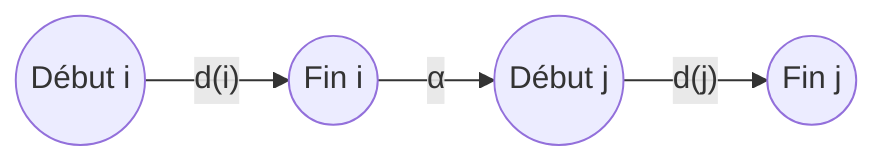
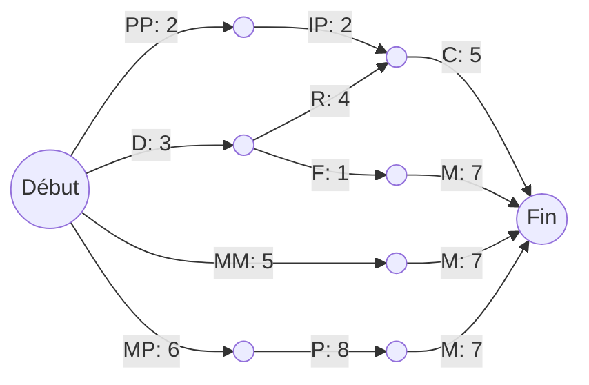
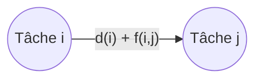
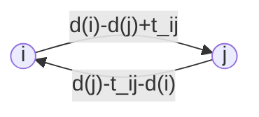
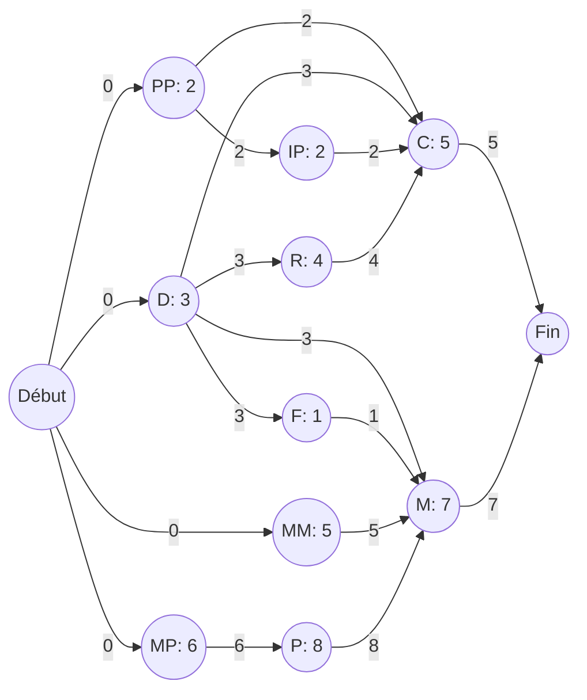
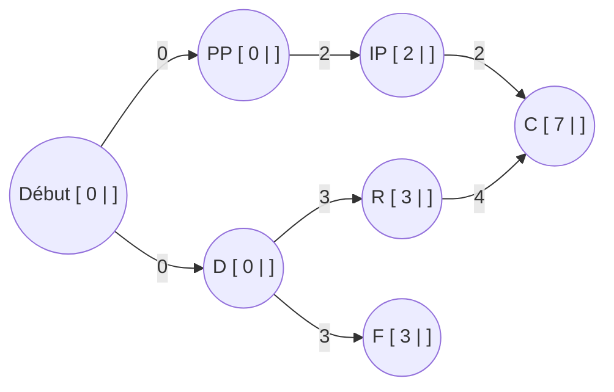
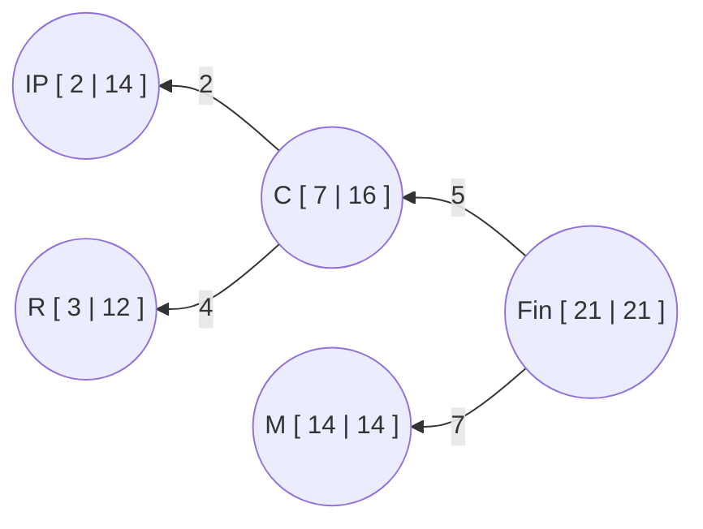

# Cours Complet : Les Problèmes d'Ordonnancement (Graphes et Algorithmes)

Ce document synthétise l'intégralité des 41 pages du cours de Maria Zrikem (ENSA Marrakech), avec des exemples visuels reproduits via Mermaid.

*Note technique : Les schémas du PDF d'origine ayant été dessinés sous forme de graphiques vectoriels superposés et non d'images embarquées (JPG/PNG), le script d'extraction d'images retourne 0 image. Tous les concepts visuels ont donc été fidèlement recréés ci-dessous avec Mermaid.*

---

## 1. Définition et Types de Contraintes

Un problème d'ordonnancement consiste à déterminer un "calendrier d'exécution" (dates de début $t(i)$ pour $n$ tâches de durée $d(i)$) qui minimise la durée totale d'exécution du projet $T$, tout en respectant un ensemble de contraintes.

### 1.1 Contraintes Temporelles (Pages 4-5)
1. **Contrainte de localisation temporelle** : La tâche $i$ doit débuter après une date $a(i)$.
   $$t(i) \ge a(i)$$
2. **Contrainte de postériorité stricte** : $j$ ne peut débuter avant l'achèvement de $i$.
   $$t(j) \ge t(i) + d(i)$$
3. **Contrainte de postériorité avec délai** : Un délai minimum $f(i,j)$ doit être respecté.
   $$t(j) \ge t(i) + d(i) + f(i,j)$$
4. **Contrainte de postériorité partielle** : $j$ peut commencer quand $i$ atteint un degré d'avancement $\alpha$ (où $0 \le \alpha \le 1$).
   $$t(j) \ge t(i) + \alpha(i,j) \times d(i)$$
5. **Contrainte de continuité** : Limite le temps maximum écoulé depuis le début de $i$.
   $$t(j) - t(i) \le t_{ij}$$

### 1.2 Contraintes sur les moyens (Page 6)
Appelées aussi **contraintes cumulatives**. Elles limitent les ressources (matériel, financement, main-d'œuvre) à un instant $t$ ou sur une période donnée.

---

## 2. La Méthode PERT (Chemin Critique)

Introduite en 1958, elle ne prend en compte que les contraintes temporelles avec durées certaines. 
*   **Principe (Page 8)** : Les tâches sont représentées par les **arcs**. Les sommets représentent les étapes (début/fin de tâche).
*   **Simplification (Page 11-12)** : On fusionne les sommets reliés par un arc de valeur 0 pour simplifier le graphe. Attention à ne pas créer de fausses contraintes !

### 2.1 Représentation d'une contrainte PERT (Page 9)


### 2.2 L'Exemple Fil Rouge : Construction d'une Mine (Pages 16-18)
**Le problème :**
| Tâche | Description | Durée | Contraintes |
| :--- | :--- | :---: | :--- |
| PP | Port provisoire | 2 | -- |
| D | Déblai route/fer | 3 | -- |
| MM | Matériel minier | 5 | -- |
| MP | Matériel portuaire | 6 | -- |
| IP | Install. port | 2 | Après PP |
| R | Route | 4 | Après D |
| F | Voie ferrée | 1 | Après D |
| P | Install. portuaire | 8 | Après MP |
| C | Cité | 5 | Après PP, D, IP, R |
| M | Install. minière | 7 | Après D, MM, MP, F, P |

**Graphe PERT Simplifié du Projet Mine (Page 18) :**


---

## 3. Ordonnancement : Calcul des Dates et Marges (Pages 13-15)

### 3.1 Définitions des dates
*   **ES(i) (Earliest Start)** : Plus grand chemin du début des travaux au début de $i$. : Date au plus tôt 
*   **EF(i) (Earliest Finish)** : $EF(i) = ES(i) + d(i)$
*   **LF(i) (Latest Finish)** : $T$ (Durée totale) - chemin maximum joignant la fin des travaux à la fin de $i$.
*   **LS(i) (Latest Start)** : $LS(i) = LF(i) - d(i)$ : **Date au plus tard 

### 3.2 Définitions des Marges
*   **Marge Totale MT(i)** : Délai maximal de mise à exécution sans retarder le projet final.
    $MT(i) = LS(i) - ES(i)$
*   **Marge Libre ML(i)** : Retard permis sans perturber le début au plus tôt des tâches suivantes.
    $ML(i) = \min_{j \text{ suit } i}(ES(j)) - EF(i)$
*   **Tâche Critique** : Tâche où $MT = 0$ (donc $ES = LS$).

### 3.3 Tableau de Solution de la Mine (Pages 19-20)
| Tâche | Durée | ES | EF | LF | LS | ML | MT | Tâche Critique |
| :--- | :---: | :---: | :---: | :---: | :---: | :---: | :---: | :---: |
| **PP** | 2 | 0 | 2 | 14 | 12 | 0 | 12 | |
| **D** | 3 | 0 | 3 | 12 | 9 | 0 | 9 | |
| **MM** | 5 | 0 | 5 | 14 | 9 | 9 | 9 | |
| **MP** | 6 | 0 | 6 | 6 | 0 | 0 | 0 | **VRAI** |
| **IP** | 2 | 2 | 4 | 16 | 14 | 3 | 12 | |
| **R** | 4 | 3 | 7 | 16 | 12 | 0 | 9 | |
| **F** | 1 | 3 | 4 | 14 | 13 | 10 | 8 | |
| **P** | 8 | 6 | 14 | 14 | 6 | 0 | 0 | **VRAI** |
| **C** | 5 | 7 | 12 | 21 | 16 | 9 | 9 | |
| **M** | 7 | 14 | 21 | 21 | 14 | 0 | 0 | **VRAI** |

**Conclusion** : Le chemin critique est **MP -> P -> M**, fixant la durée totale à **T = 21 semaines**.

---

## 4. La Méthode des Potentiels (Pages 26-34)

Contrairement à PERT, les **sommets** sont les tâches à effectuer, et les **arcs** sont associés aux contraintes de délai du type : $t(j) - t(i) \ge a(i,j)$.
*   L'arc $(i,j)$ est affecté de la valeur $a(i,j)$.

### 4.1 Traduction Visuelle des Contraintes
*   **$T(j) \ge t(i) + d(i) + f(i,j)$** (Page 28)

*   **La fin de $j$ suit exactement $t_{ij}$ unités après la fin de $i$** (Page 29)


### 4.2 Graphe des Potentiels pour le Projet Mine (Page 30)


### 4.3 Mise en graphe : Calcul des dates au plus tôt et au plus tard (Pages 33-34)

Dans la méthode des potentiels, on accole à chaque sommet une case à deux compartiments `[ ES | LF ]` pour suivre le calcul étape par étape.

*   **Case gauche (Date au plus tôt - ES)** : Se calcule en parcours "aller" (du début vers la fin). S'il y a plusieurs chemins entrants, on prend le **maximum**.
*   **Case droite (Date au plus tard - LF)** : Se calcule en parcours "retour" (de la fin vers le début). S'il y a plusieurs chemins sortants, on prend le **minimum** des valeurs calculées.

#### A. Calcul des dates au plus tôt (Parcours Aller)
*(Extrait du graphe pour illustrer la règle du Maximum)*

**Exemple de calcul pour la tâche C :** 
La tâche `C` doit attendre la fin de `IP` et de `R`.
*   Chemin via `IP` : Fin de `IP` = $ES(IP) + d(IP) = 2 + 2 = 4$
*   Chemin via `R` : Fin de `R` = $ES(R) + d(R) = 3 + 4 = 7$
*   **Règle du Maximum** : $ES(C) = \max(4, 7) = 7$.

#### B. Calcul des dates au plus tard (Parcours Retour)
*(Extrait du graphe en remontant depuis la fin)*

**Exemple de calcul pour la tâche IP :**
Pour calculer le $LF$ de `IP`, on part du nœud suivant `C` ($LF=16$) et on soustrait la contrainte de l'arc (2). 
*   **Calcul** : $LF(IP) = LF(C) - a(IP,C) = 16 - 2 = 14$. 
On inscrit **14** dans la case de droite de `IP`. S'il y avait plusieurs chemins repartant vers la gauche, on prendrait la plus petite valeur.

---

## 5. Contraintes Cumulatives et Courbe de Charge (Pages 35-38)

Les tâches nécessitent des équipes limitées.
Pour un ordonnancement donné (au plus tôt), on dessine une **courbe de charge**. C'est un histogramme représentant au cours du temps les quantités cumulées des moyens à mettre en œuvre (ouvriers, machines). 

Si ces quantités dépassent la limite fixée, il y a **surcharge**. On doit alors déterminer les tâches responsables et les déplacer dans la limite de leurs marges.

### 5.1 Visualisation de la Courbe de charge (Empilement des équipes) - Page 37
Supposons que chaque tâche nécessite un nombre d'équipes fixe :
`PP:1`, `D:1`, `MM:0`, `MP:0`, `IP:3`, `R:2`, `F:1`, `P:0`, `C:3`, `M:1`.

Si on place toutes les tâches au plus tôt (selon les dates $ES$), on obtient cet empilement. Chaque bloc représente 1 équipe :

```text
Nombre d'équipes
  ^
4 |       [IP][IP]
  |       [IP][IP]             [ C][ C][ C][ C][ C]
3 |       [IP][IP][ R]         [ C][ C][ C][ C][ C]
  |       [IP][IP][ R]         [ C][ C][ C][ C][ C]
2 | [ D][ D][IP][IP][ R][ R]   [ C][ C][ C][ C][ C]
  | [PP][PP][ D][IP][ R][ R]   [ C][ C][ C][ C][ C]
1 | [PP][PP][ D][IP][ R][ R][ F][ C][ C][ C][ C][ C]               [ M][ M][ M][ M][ M][ M][ M]
  +--------------------------------------------------------------------------------------------> Semaines
    0   1   2   3   4   5   6   7   8   9   10  11  12  13  14  15  16  17  18  19  20  21
```

**Analyse de la courbe :** 
On constate un pic de charge à la semaine 2 et 3. 
La tâche `IP` (qui consomme 3 équipes) se superpose avec la fin de la tâche `D` (qui consomme 1 équipe). On a donc un total de **4 équipes nécessaires** en semaine 2, ce qui est problématique si l'on ne dispose que de 3 équipes !

### 5.2 Diagramme de GANTT classique
Le GANTT ci-dessous montre la durée de ces mêmes tâches. On repère facilement le chevauchement (ex: D et IP) qui cause le pic de charge vu ci-dessus.

```mermaid
gantt
    title GANTT (Mine au plus tôt - Surchargé en semaine 2)
    dateFormat X
    axisFormat %s
    section Critique
    MP :crit, 0, 6
    P :crit, 6, 14
    M :crit, 14, 21
    section Flottantes
    PP : 0, 2
    IP : 2, 4
    D : 0, 3
    R : 3, 7
    F : 3, 4
    MM : 0, 5
    C : 7, 12
```


---

## 6. Algorithme de MILORD (Pages 39-41)

C'est une heuristique pour résoudre les surcharges.
**Hypothèse :** Disposer de max **3 équipes**.
*Equipes nécessaires :* PP(1), D(1), MM(0), MP(0), IP(3), R(2), F(1), P(0), C(3), M(1).

### Étape 1 : Tri
On trie les tâches par **LS croissant**. En cas d'exæquo, on prend la tâche avec la plus petite **ML**.
**Ordre obtenu :** MP(0), P(6), D(9, ML=0), MM(9, ML=9), R(12, ML=0), PP(12, ML=0), F(13), M(14), IP(14), C(16).

### Étape 2 : Placement (Page 41)
On place au plus tôt en vérifiant à chaque instant de ne pas dépasser 3 équipes :
*   **D** commence en 0 (1 équipe)
*   **PP** commence en 0 (1 équipe)
*   *Total à t=0 : 2 équipes (OK).*
*   A t=2, PP finit. **IP** doit commencer, mais nécessite 3 équipes. À t=2, D utilise toujours 1 équipe.
*   *Surcharge si IP démarre en 2 : 1 (D) + 3 (IP) = 4 équipes > 3.*
*   **Action :** On recule IP d'une semaine (à t=3) lorsque D se termine. 
*   **Conséquence en chaîne :** Puisque IP recule, les tâches qui dépendent d'IP (ex: **C**) sont aussi repoussées au-delà de leur $ES$ si nécessaire. **C** commence finalement en 9.

### Visualisation du Lissage (Résultat Final de MILORD)

```mermaid
gantt
    title Lissage de Charge - MILORD (Max 3 Équipes)
    dateFormat X
    axisFormat %s
    section Lissé
    D (1 eq) : 0, 3
    PP (1 eq) : 0, 2
    R (2 eq) : 3, 7
    F (1 eq) : 3, 4
    IP (3 eq) décalée : 7, 9
    C (3 eq) décalée : 9, 14
```

*(Le décalage de tâches comme IP et C garantit qu'il n'y a jamais plus de 3 équipes en action simultanément).*
