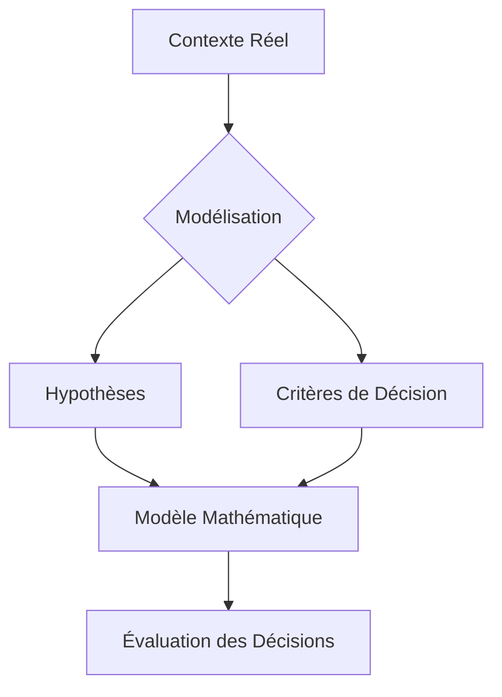
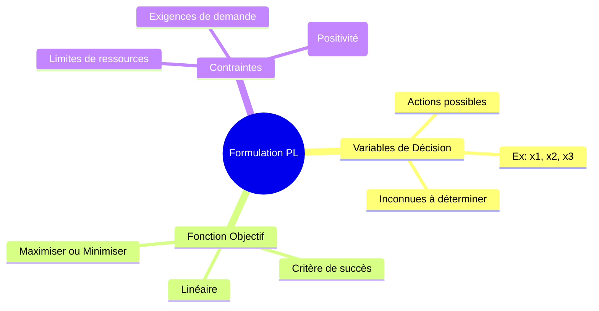
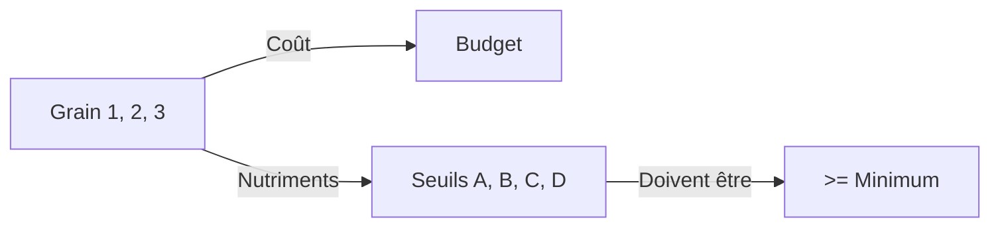
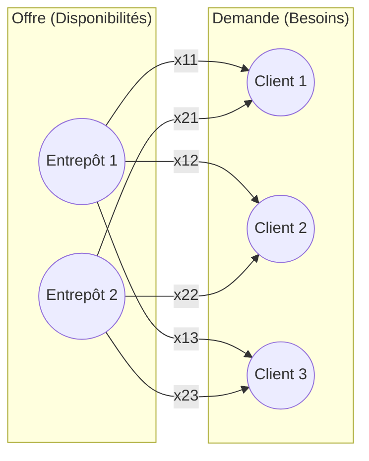

# Chapitre 1 : Formulation en Programmation Linéaire & Théorie des Graphes

Ce cours détaille les principes fondamentaux de la modélisation mathématique appliquée à l'optimisation, un pilier essentiel pour résoudre des problèmes complexes de réseaux et de graphes.

---

## 1. Le Concept de Modèle
Un **modèle** est une représentation schématique et partielle d'une réalité. En théorie des graphes et recherche opérationnelle, il sert à traduire un problème concret en langage mathématique pour évaluer les conséquences de chaque décision.

---

## 2. La Programmation Linéaire (PL)
La programmation mathématique est l'outil naturel pour modéliser une vaste classe de problèmes d'optimisation.
- **Objectif** : Maximiser (ex: profit, flux) ou Minimiser (ex: coût, distance).
- **Moyen** : Une **fonction objectif** linéaire dépendant de variables de décision.
- **Contraintes** : Restrictions imposées par le problème (équations ou inéquations linéaires).

**Note du Spécialiste** : En théorie des graphes, la PL est utilisée pour résoudre des problèmes comme le *Flot Maximum* ou le *Chemin le plus court* via des formulations algorithmiques puissantes (ex: algorithme du Simplexe).

---

## 3. Les Trois Entités Fondamentales de la Formulation
Pour construire un modèle de PL, nous devons impérativement identifier trois éléments :

1.  **Variables de Décision** : L'ensemble des actions possibles (ex: quantité de produit $x_i$).
2.  **Fonction Objectif** : La mesure de performance à optimiser ($Z$).
3.  **Contraintes** : Les limites physiques ou logiques du système (ressources, temps, capacités).

---

## 4. Présentation Théorique (Modèle Mathématique)

### A. Les Variables de Décision
Elles représentent les choix de l'agent. Par nature physique, elles sont souvent **non-négatives** :
$$x_1 \ge 0, x_2 \ge 0, \dots, x_n \ge 0$$

### B. La Fonction Objectif
C'est une forme linéaire associant un coût ou un profit $c_i$ à chaque variable $x_i$ :
$$\text{Max/Min } Z = c_1x_1 + c_2x_2 + \dots + c_nx_n$$

### C. Le Système de Contraintes
Chaque ressource $j$ limitée à une quantité $b_j$ impose une restriction :
$$a_{i1}x_1 + a_{i2}x_2 + \dots + a_{in}x_n \le b_i$$

---

## 5. Exemples Détaillés et Études de Cas

### Exemple 1 : Problème de Maximisation de Profil
**Contexte** : Une entreprise fabrique 3 produits (P1, P2, P3) sur une machine (45h/semaine).
- **Rendements** : P1 (50 art/h), P2 (25 art/h), P3 (75 art/h).
- **Profils** : P1 (4€), P2 (12€), P3 (3€).
- **Limites Marché** : P1 $\le$ 1000, P2 $\le$ 500, P3 $\le$ 1500.

**Modèle Algébrique** :
- **Variables** : $x_1, x_2, x_3$ (quantités produites).
- **Max $Z$** = $4x_1 + 12x_2 + 3x_3$
- **S.C.** (Sous Contraintes) :
    1. Temps machine : $\frac{1}{50}x_1 + \frac{1}{25}x_2 + \frac{1}{75}x_3 \le 45$ (soit $3x_1 + 6x_2 + 2x_3 \le 6750$)
    2. Marché : $x_1 \le 1000, x_2 \le 500, x_3 \le 1500$
    3. Non-négativité : $x_i \ge 0$

---

### Exemple 2 : Problème de Médecine (Minimisation de pilules)
**Contexte** : Un médecin doit prescrire deux types de pilules (Petite et Grande taille) contenant de l'aspirine, du bicarbonate et de la codéine pour atteindre des seuils de guérison minimaux.
- **Min $Z$** = $x_1 + x_2$ (Nombre total de pilules)
- **S.C.** :
    - Aspirine : $2x_1 + x_2 \ge 12$
    - Bicarbonate : $5x_1 + 8x_2 \ge 74$
    - Codéine : $x_1 + 6x_2 \ge 24$
    - $x_1, x_2 \ge 0$

---

### Exemple 3 : Problème de la Diète (Minimisation de coût)
**Contexte** : Un éleveur veut nourrir ses animaux au coût minimal tout en respectant des seuils nutritionnels (A, B, C, D) présents dans 3 types de grains.

**Modèle** :
- **Min $Z$** = $41x_1 + 35x_2 + 96x_3$
- **Contraintes (ex: Nutriment A)** : $2x_1 + 3x_2 + 7x_3 \ge 1250$
- (Et ainsi de suite pour B, C, D)

---

### Exemple 4 : Problème de Transport (Lien direct avec les Graphes)
**Contexte** : Transporter des items depuis 2 entrepôts ($E_1, E_2$) vers 3 clients ($C_1, C_2, C_3$) au coût minimal.

**Représentation en Graphe** :
Il s'agit d'un **graphe biparti** où les arcs représentent les flux de transport.

- **Variables** : $x_{ij}$ = quantité de $E_i$ vers $C_j$.
- **Min $Z$** = $x_{11} + 4x_{12} + 9x_{13} + 6x_{21} + 8x_{22} + 4x_{23}$ (Coûts totaux)
- **Contraintes** :
    - Disponibilité $E_1$ : $x_{11} + x_{12} + x_{13} \le 200$
    - Disponibilité $E_2$ : $x_{21} + x_{22} + x_{23} \le 500$
    - Demande $C_1$ : $x_{11} + x_{21} = 200$
    - ... (Demandes $C_2$ et $C_3$)

---

### Exemple 5 : Problème d'Entreposage (Multi-périodes)
**Contexte** : Gérer l'achat, la vente et le stockage sur 3 périodes pour maximiser le profit, avec une capacité d'entrepôt limitée (60 unités) et un stock initial (30 unités).
- **Variables** : $x_{1t}$ (achat), $x_{2t}$ (vente), $x_{3t}$ (stockage) pour $t=1, 2, 3$.
- **Max $Z$** = Revenus des ventes - Coûts d'achat - Coûts de stockage.
- **Contrainte de stock (Période 1)** : $x_{11} + 30 - x_{21} = x_{31}$ (Flux conservatif).

---

### Exemple 6 : Gestion d'Atelier (Complexité Industrielle)
Optimisation de la fabrication de 3 produits (P1, P2, P3) sur 3 machines (M1, M2, M3).
- **Contraintes** : Temps machine, Main d'œuvre, Budget matières premières, Demande client.
- **Max $Z$** = $10.75x_1 + 15x_2 + 10x_3$ (Profit net par unité)

---

### Exemple 7 : Problème d'Investissement
**Contexte** : Investir 10 000€ dans trois produits (A, B, C) avec des rendements et des plafonds d'investissement différents.
- **Rendements** : A (9%), B (4%), C (8%).
- **Max $Z$** = $0.09x_A + 0.04x_B + 0.08x_C$
- **Contraintes** :
    - Budget total : $x_A + x_B + x_C \le 10000$
    - Plafonds : $x_A \le 4000, x_B \le 5000, x_C \le 5000$

---

## 6. Synthèse des Concepts Clés
| Concept | Définition | Application Graphe |
| :--- | :--- | :--- |
| **Variable** | Action quantifiable | Flux sur un arc, présence d'un sommet |
| **Fonction Objectif** | Performance totale | Longueur de chemin, Capacité de flot |
| **Contrainte** | Limite de ressource | Capacité d'arc, Conservation de flot |
| **Linéarité** | Proportionnalité des effets | Additivité des poids dans les graphes |
| **Algorithme du Simplexe** | Méthode de résolution | Résolution de flots optimaux |

---
*Ce document constitue le support visuel complet pour le Chapitre 1 du cours ODAID sur la formulation.*
