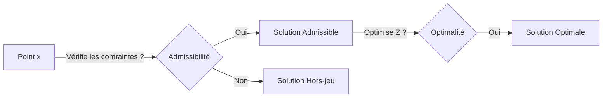
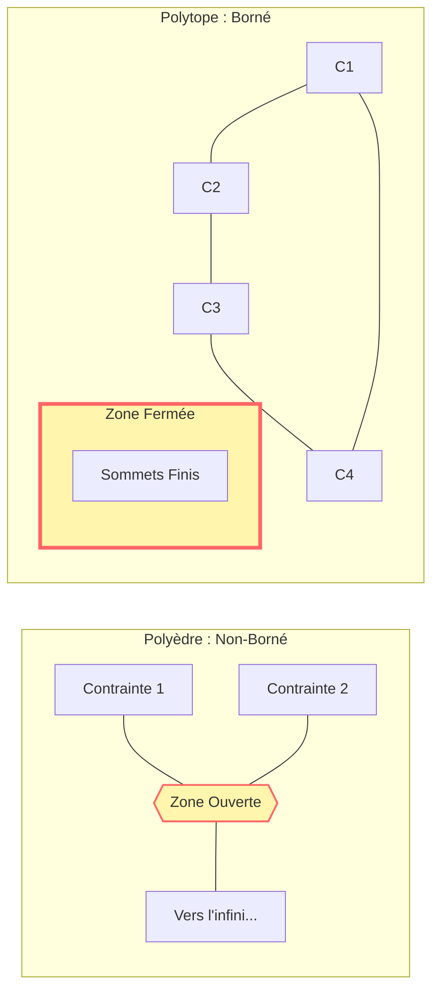
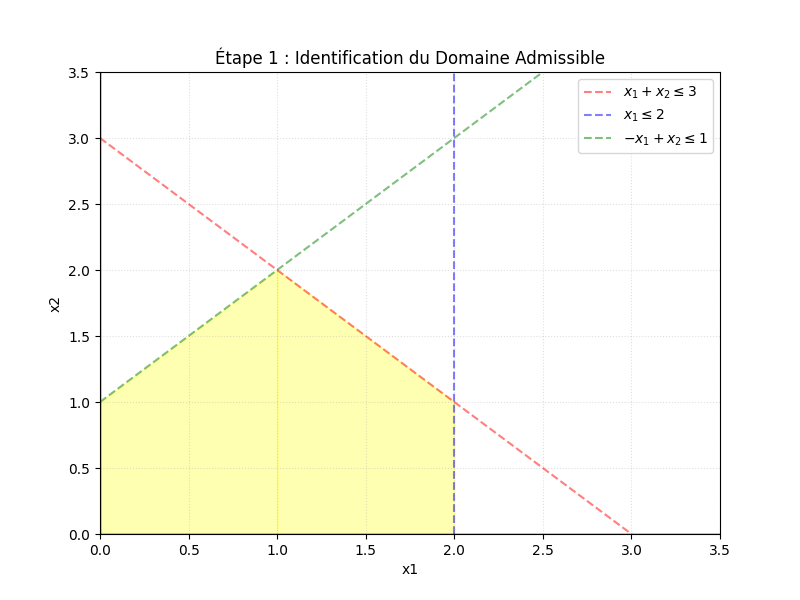
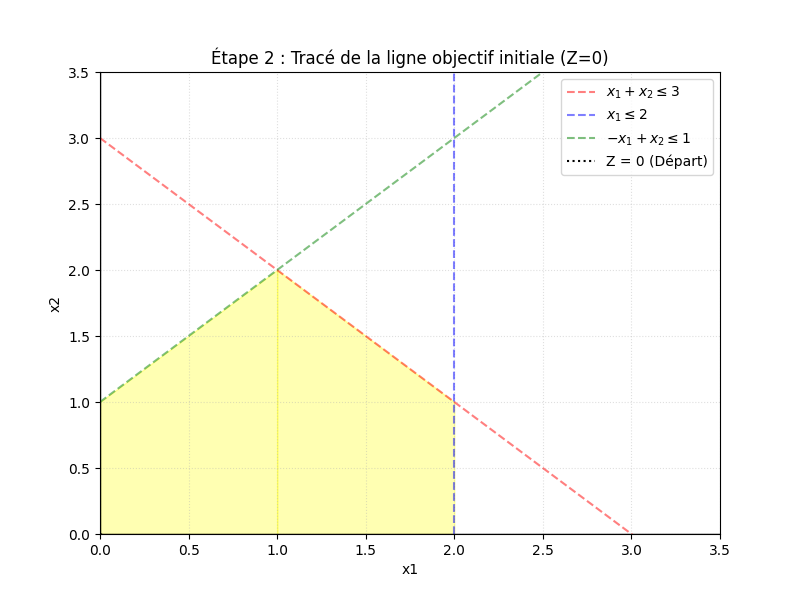
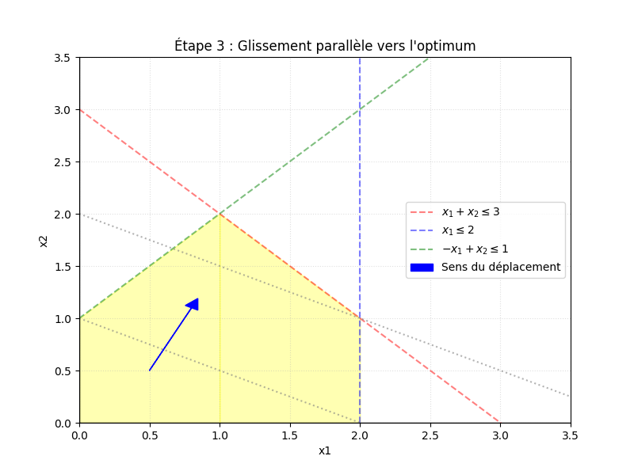
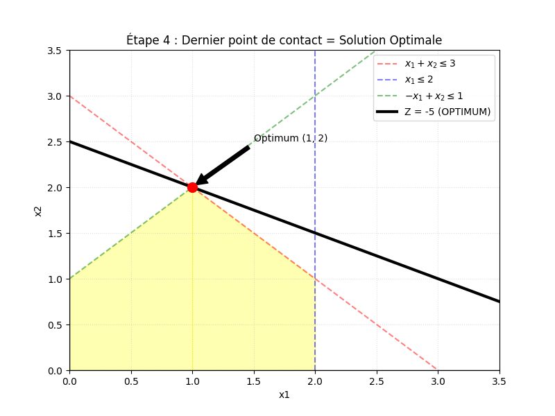
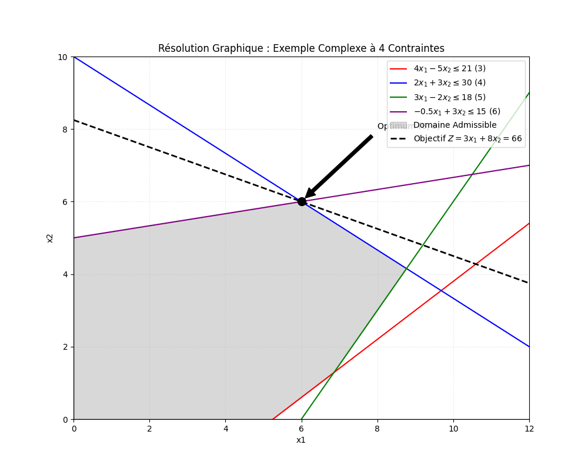
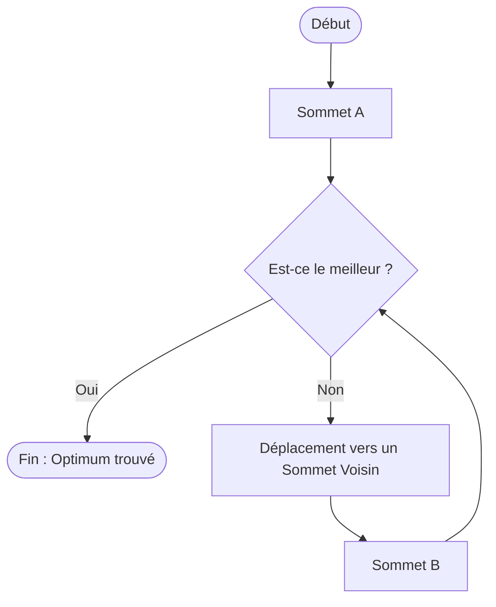
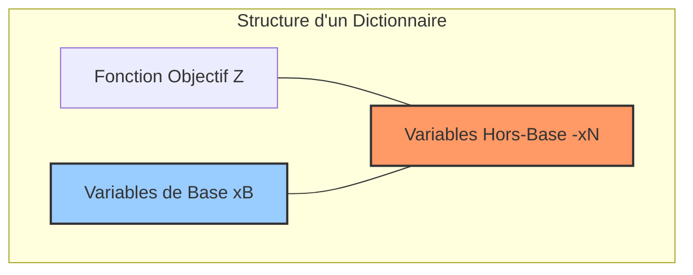
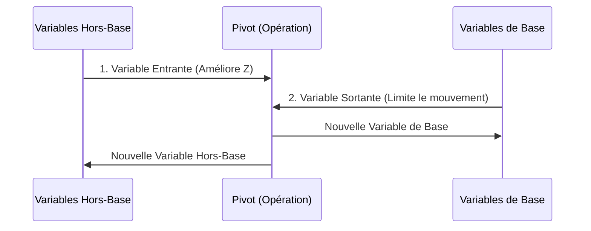

# Chapitre 2 : Propriétés Fondamentales de la Programmation Linéaire

Ce chapitre explore la structure géométrique et algébrique des problèmes de Programmation Linéaire (PL), essentielle pour comprendre comment les algorithmes (comme le Simplexe) trouvent la solution optimale.

---

## 1. Définitions Clés

Un problème de PL est défini par :
*   **Solution Admissible** : Un point $x$ qui vérifie toutes les contraintes.
*   **Domaine Admissible (D)** : L'ensemble de toutes les solutions admissibles. Géométriquement, c'est un **polyèdre**.
*   **Solution Optimale** : Une solution de $D$ qui maximise (ou minimise) la fonction objectif.

---

## 2. Géométrie du Domaine : Polyèdres et Polytopes

Géométriquement, chaque contrainte linéaire définit un demi-espace. Le domaine admissible est l'intersection de ces espaces.

### Comparaison Visuelle : Polyèdre vs Polytope

---

## 3. Résolution Graphique : Étape par Étape

La résolution graphique consiste à visualiser le mouvement de la fonction objectif à travers le domaine. Voici le processus détaillé pour l'exemple $Min Z = -x_1 - 2x_2$.

### Étape 1 : Tracer le Domaine Admissible
On trace d'abord toutes les inéquations pour identifier la zone commune (en jaune).

### Étape 2 : Ligne Objectif Initiale
On trace la droite $Z = 0$ pour voir l'inclinaison de la fonction objectif.

> **💡 Comment tracer Z = 0 ?**
> 1. On prend l'équation : $Z = -x_1 - 2x_2$.
> 2. On fixe $Z = 0$ : $-x_1 - 2x_2 = 0$.
> 3. On isole $x_2$ (comme un $y$) : $2x_2 = -x_1 \implies \mathbf{x_2 = -0,5x_1}$.
> 4. On trouve 2 points pour tracer la règle :
>    - Si $x_1 = 0 \implies x_2 = 0$. Point A = **(0, 0)**.
>    - Si $x_1 = 2 \implies x_2 = -1$. Point B = **(2, -1)**.

### Étape 3 : Glissement Parallèle
On déplace la droite parallèlement. Pour un **Minimum**, on s'éloigne du gradient (direction de croissance).

### Étape 4 : Identification de l'Optimum
Le dernier point du domaine touché par la droite avant de le quitter est l'optimum.

> **🔍 Pourquoi le point (1, 2) est-il l'optimum ?**
> - On déplace notre "règle" (la droite $Z$) parallèlement vers le haut.
> - Elle passe par $(0,0)$, puis $(2,0)$ et $(0,1)$, puis $(2,1)$.
> - Le **tout dernier point** de la zone jaune que la règle touche avant de sortir est le sommet **(1, 2)**.
> - **Preuve par le calcul** :
>   - $Z(0,0) = 0$
>   - $Z(2,1) = -2 - 2(1) = -4$
>   - $Z(1,2) = -1 - 2(2) = \mathbf{-5}$ (La valeur la plus petite possible !)

---

## 4. Exemple Avancé : Système à 4 Contraintes

Dans cet exemple (tiré de la page 14 du cours), nous gérons un domaine plus complexe délimité par quatre droites.

### Énoncé du Problème
Maximiser $Z = 3x_1 + 8x_2$ sous les contraintes suivantes :
1.  $4x_1 - 5x_2 \le 21$ (3)
2.  $2x_1 + 3x_2 \le 30$ (4)
3.  $3x_1 - 2x_2 \le 18$ (5)
4.  $-0,5x_1 + 3x_2 \le 15$ (6)
5.  $x_1, x_2 \ge 0$ (1,2)

### Résolution Visuelle (Générée)

### Guide de Résolution Étape par Étape

**1. Tracer les frontières (Droites)**
Pour chaque inéquation, on trace la droite correspondante en trouvant deux points (ex: intersections avec les axes) :
*   **Droite (4)** : $2x_1 + 3x_2 = 30$. Si $x_1=0 \to x_2=10$. Si $x_2=0 \to x_1=15$.
*   **Droite (6)** : $-0,5x_1 + 3x_2 = 15$. Si $x_1=0 \to x_2=5$. Si $x_1=6 \to x_2=6$.

**2. Identifier le Domaine Admissible**
Le domaine est la zone grisée où **toutes** les conditions sont respectées simultanément. C'est un polygone à plusieurs sommets.

**3. Appliquer la Fonction Objectif**
On trace la direction de croissance de $Z = 3x_1 + 8x_2$.
*   On fait glisser la droite vers le haut et la droite (car on veut **Maximiser** et les coefficients sont positifs).

**4. Trouver l'Optimum**
Le dernier point de contact entre la droite $Z$ et le polygone gris est le sommet **(6, 6)**.
*   **Calcul de la valeur optimale** : $Z^* = 3(6) + 8(6) = 18 + 48 = \mathbf{66}$.

---

## 5. Bases et Solutions de Base (Algèbre)

Pour un PL sous forme standard $Ax = b, x \ge 0$ :

*   **Solution de Base Admissible (SBA)** : Correspond à un **Sommet** du polyèdre.
*   **Théorème** : Si une solution optimale existe, elle se trouve sur au moins un sommet (SBA).

---

## 5. Dictionnaires et Pivotages : De la Géométrie à l'Algèbre

Le passage de la résolution graphique (sommets) à la résolution par ordinateur se fait via les **dictionnaires**.

### A. La Base Initiale (Page 22)
Pour commencer la résolution, on transforme les inéquations ($\le$) en équations ($=$) en ajoutant des **variables d'écart** ($x_E$).
*   **Variables de Base ($x_B$)** : Les nouvelles variables d'écart.
*   **Variables Hors-Base ($x_N$)** : Les variables originales du problème (posées à 0 au départ).

### B. Le Dictionnaire (Tableau Réduit)
Un dictionnaire exprime les variables de base et la fonction objectif en fonction des variables hors-base.

*   **Dictionnaire Admissible (Page 30)** : Un dictionnaire est dit admissible si, en fixant les variables hors-base à zéro, les valeurs des variables de base sont **non-négatives** ($x_B \ge 0$).

### C. Le Pivotage (La règle du mouvement)
Le pivotage est l'opération qui permet de passer d'un sommet à un autre (un dictionnaire à un autre).

1.  **Variable Entrante** : On choisit une variable hors-base qui a un coefficient **positif** dans l'expression de $Z$ (pour augmenter $Z$).
2.  **Variable Sortante** : On choisit la variable de base qui s'annule en premier lors de l'augmentation de la variable entrante (pour ne pas sortir du domaine admissible).

**Signature d'un Dictionnaire Admissible** :
*   Les termes constants dans les lignes des $x_B$ doivent être $\ge 0$.
*   Si tous les coefficients de $Z$ dans le dictionnaire sont $\le 0$, alors la solution courante est **Optimale**.

---
*Ce document couvre désormais la théorie complète de la résolution graphique et l'introduction algébrique aux dictionnaires.*

# added:
# Chapitre 3 : Bases, Solutions de Base et Dictionnaires

Ce chapitre fait le pont entre la géométrie (les sommets du domaine) et l'algèbre (les tableaux que l'ordinateur manipule). L'idée centrale : **chaque sommet du polyèdre correspond exactement à une "solution de base"**.

---

## 1. Passage à la Forme Standard

Avant tout, on transforme les inéquations en équations en ajoutant des **variables d'écart** ($e_i \ge 0$).

### Règle de transformation

$$a_1x_1 + a_2x_2 \le b \quad \Longrightarrow \quad a_1x_1 + a_2x_2 + e_i = b, \quad e_i \ge 0$$

La variable d'écart $e_i$ représente "ce qu'il reste" avant d'atteindre la limite de la contrainte.

### Exemple concret

On reprend le problème $\text{Min } Z = -x_1 - 2x_2$ avec :

$$x_1 + x_2 \le 3 \quad \Rightarrow \quad x_1 + x_2 + e_1 = 3$$
$$x_1 \le 2 \quad \Rightarrow \quad x_1 + e_2 = 2$$
$$x_2 \le 2 \quad \Rightarrow \quad x_2 + e_3 = 2$$

Le système en forme standard devient :

$$\begin{cases} x_1 + x_2 + e_1 = 3 \\ x_1 + e_2 = 2 \\ x_2 + e_3 = 2 \end{cases} \quad \text{avec } x_1, x_2, e_1, e_2, e_3 \ge 0$$

On a maintenant **5 variables** pour **3 équations**.

---

## 2. Variables de Base et Hors-Base

Avec $n$ variables et $m$ équations ($n > m$), on ne peut pas résoudre directement. La technique : fixer $n - m$ variables à **zéro** pour obtenir un système carré.

| Terme | Définition | Dans notre exemple ($n=5, m=3$) |
|---|---|---|
| **Variables Hors-Base ($x_N$)** | Les $n-m = 2$ variables qu'on fixe à $0$ | $x_1 = 0, x_2 = 0$ |
| **Variables de Base ($x_B$)** | Les $m = 3$ variables qu'on calcule | $e_1, e_2, e_3$ |
| **Solution de Base** | La solution obtenue après cette fixation | $(x_1,x_2,e_1,e_2,e_3) = (0,0,3,2,2)$ |

> **Intuition géométrique** : fixer les variables hors-base à zéro, c'est exactement se placer à un **sommet** du polygone. Ici, $x_1=0$ et $x_2=0$ correspond au sommet $(0,0)$.

---

## 3. Solution de Base Admissible (SBA)

Une solution de base est dite **admissible** si toutes les variables de base sont $\ge 0$.

### Test d'admissibilité

À la base initiale ($x_1=0, x_2=0$) :

$$e_1 = 3 \ge 0 \checkmark \quad e_2 = 2 \ge 0 \checkmark \quad e_3 = 2 \ge 0 \checkmark$$

C'est une SBA. Elle correspond au sommet $(0, 0)$ dans le plan $(x_1, x_2)$.

### Contre-exemple (base non admissible)

Si on choisissait comme base $\{x_1, x_2, e_1\}$ avec hors-base $\{e_2=0, e_3=0\}$ :

$$e_3 = 0 \Rightarrow x_2 = 2, \quad e_2 = 0 \Rightarrow x_1 = 2$$
$$e_1 = 3 - x_1 - x_2 = 3 - 2 - 2 = -1 < 0 \quad \times$$

Cette base n'est **pas admissible** — elle correspond à un point hors du domaine.

---

## 4. Correspondance Sommet ↔ SBA

C'est le théorème central du chapitre :

> **Théorème** : Chaque sommet du domaine admissible correspond exactement à une Solution de Base Admissible, et vice versa.

Voici la correspondance complète pour notre exemple :

| Sommet $(x_1, x_2)$ | Variables hors-base | $e_1$ | $e_2$ | $e_3$ | Admissible ? |
|---|---|---|---|---|---|
| $(0, 0)$ | $x_1=0, x_2=0$ | $3$ | $2$ | $2$ | ✅ |
| $(2, 0)$ | $x_2=0, e_2=0$ | $1$ | $0$ | $2$ | ✅ |
| $(2, 1)$ | $e_2=0, e_3=0$ | $0$ | $0$ | ... | ✅ |
| $(1, 2)$ | $e_1=0, e_3=0$ | $0$ | $1$ | $0$ | ✅ |
| $(0, 2)$ | $x_1=0, e_3=0$ | $1$ | $2$ | $0$ | ✅ |

Chaque ligne est un sommet du polygone. La géométrie et l'algèbre décrivent exactement la même chose.

---

## 5. Le Dictionnaire

Un dictionnaire est une réécriture du système qui exprime les **variables de base** et **Z** en fonction des variables hors-base uniquement.

### Construction du dictionnaire initial

On isole $e_1, e_2, e_3$ dans chaque équation :

$$e_1 = 3 - x_1 - x_2$$
$$e_2 = 2 - x_1$$
$$e_3 = 2 - x_2$$
$$Z = -x_1 - 2x_2$$

C'est le **dictionnaire initial**. En fixant les hors-base à zéro ($x_1=0, x_2=0$), on lit directement la solution courante : $e_1=3, e_2=2, e_3=2, Z=0$.

### Structure d'un dictionnaire
### Dictionnaire admissible — condition

Un dictionnaire est admissible si et seulement si toutes les **constantes** (colonne de droite des $x_B$) sont $\ge 0$. Ici : $3, 2, 2 \ge 0$ ✅

---

## 6. Le Pivotage : Changer de Sommet

Le pivotage = passer d'un dictionnaire à un autre = se déplacer d'un sommet vers un sommet voisin meilleur.

### Les deux règles du pivot

**Règle 1 — Variable entrante** : choisir la variable hors-base avec le coefficient le plus **négatif** dans Z (pour minimiser), ou le plus **positif** (pour maximiser). C'est la variable qui améliore Z le plus vite.

Dans notre dictionnaire : $Z = 0 - x_1 - 2x_2$. Le coefficient de $x_2$ est $-2$, plus négatif que $-1$. On choisit **$x_2$ comme variable entrante**.

**Règle 2 — Variable sortante** : augmenter $x_2$ fait baisser les variables de base. On cherche laquelle s'annule en premier (test du ratio minimum) :

$$e_1 = 3 - x_2 \ge 0 \Rightarrow x_2 \le 3$$
$$e_3 = 2 - x_2 \ge 0 \Rightarrow x_2 \le 2 \quad \leftarrow \text{plus contraignant}$$

On peut augmenter $x_2$ jusqu'à $2$ maximum. Donc **$e_3$ sort** (elle s'annule en premier).

### Opération de pivot

On exprime $x_2$ depuis la ligne de $e_3$ :

$$e_3 = 2 - x_2 \implies x_2 = 2 - e_3$$

On substitue $x_2 = 2 - e_3$ dans toutes les autres lignes :

$$e_1 = 3 - x_1 - (2 - e_3) = 1 - x_1 + e_3$$
$$e_2 = 2 - x_1$$
$$Z = -x_1 - 2(2 - e_3) = -4 - x_1 + 2e_3$$

### Dictionnaire après pivot
La solution courante (hors-base $x_1=0, e_3=0$) : $x_2=2, e_1=1, e_2=2$, $Z=-4$. On est passé du sommet $(0,0)$ au sommet $(0,2)$.

### Deuxième pivot

$Z = -4 - x_1 + 2e_3$. Seul $x_1$ a un coefficient négatif ($-1$). On choisit **$x_1$ comme variable entrante**.

Test du ratio :

$$e_1 = 1 - x_1 \ge 0 \Rightarrow x_1 \le 1 \quad \leftarrow \text{plus contraignant}$$
$$e_2 = 2 - x_1 \ge 0 \Rightarrow x_1 \le 2$$

**$e_1$ sort**. On exprime $x_1$ depuis la ligne de $e_1$ :

$$x_1 = 1 - e_1 + e_3$$

On substitue dans toutes les lignes :

$$e_2 = 2 - (1 - e_1 + e_3) = 1 + e_1 - e_3$$
$$x_2 = 2 - e_3$$
$$Z = -4 - (1 - e_1 + e_3) + 2e_3 = -5 + e_1 + e_3$$

### Dictionnaire final (optimal)
### Condition d'optimalité

Tous les coefficients de Z sont $\ge 0$ ($+1$ et $+1$). Augmenter $e_1$ ou $e_3$ ne peut qu'**augmenter** Z — or on minimise, donc on ne bouge plus. La solution est **optimale**.

Solution lue directement : $x_1=1, x_2=2, Z^*=-5$. C'est bien le sommet $(1,2)$ trouvé graphiquement.

---

## 7. Résumé : De la Géométrie à l'Algèbre
> **À retenir** : le Simplexe ne fait rien de magique. Il choisit intelligemment quel sommet visiter ensuite, en lisant les coefficients de Z dans le dictionnaire — exactement comme on glissait la droite Z sur le graphe.
