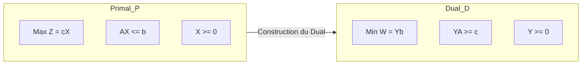
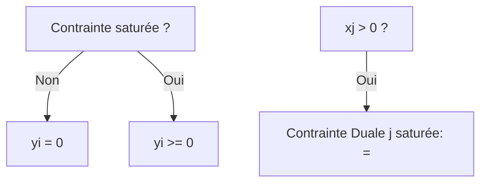

# Programmation Linéaire : La Théorie de la Dualité

Ce document explique en détail le concept de dualité, en se basant sur le support de cours officiel. La dualité est une propriété fondamentale de la programmation linéaire qui permet de voir chaque problème sous deux angles complémentaires.

---

## 1. Pourquoi la Dualité ? (Le "Plus" par rapport au Simplexe)

Le Simplexe (Phase 1 et 2) permet de trouver la solution optimale, mais il ne dit pas tout. La dualité apporte :

*   **Une Preuve d'Optimalité** : Si vous trouvez une solution pour le Primal et une pour le Dual qui donnent la même valeur, vous avez la certitude mathématique d'être à l'optimum.
*   **Interprétation Économique (Prix d'Ombre)** : Elle révèle la valeur réelle (marginale) de chaque ressource.
*   **Analyse de Sensibilité** : Elle permet de comprendre comment l'optimum change si les ressources ou les prix varient, sans relancer le Simplexe.
*   **Efficacité Algorithmique** : Souvent, le problème Dual est beaucoup plus petit (moins de contraintes) et donc plus rapide à résoudre que le Primal.

---

## 2. Définition du Dual (Forme Symétrique)

Chaque programme linéaire (appelé **Primal**) possède un jumeau appelé **Dual**.

### Structure de passage

**Règles de correspondance :**
1.  **Objectif** : Si le Primal est un **MAX**, le Dual est un **MIN** (et inversement).
2.  **Coefficients** : Les coefficients de la fonction objectif du Primal ($c$) deviennent le second membre (RHS) du Dual.
3.  **Ressources** : Le second membre du Primal ($b$) devient les coefficients de la fonction objectif du Dual.
4.  **Matrice** : La matrice des contraintes du Dual est la **transposée** ($A^T$) de celle du Primal.
5.  **Variables/Contraintes** :
    *   Chaque **contrainte** $i$ du Primal correspond à une **variable duale** $y_i$.
    *   Chaque **variable** $x_j$ du Primal correspond à une **contrainte duale** $j$.

---

## 3. Règles Générales de Passage (Signes)

Le professeur utilise des règles précises pour les signes des variables et des contraintes :

| Primal (MAX) | Dual (MIN) |
| :--- | :--- |
| **Contraintes** | **Variables** |
| Type $\le$ | $y_i \ge 0$ |
| Type $\ge$ | $y_i \le 0$ |
| Type $=$ | $y_i$ libre ($\in \mathbb{R}$) |
| **Variables** | **Contraintes** |
| $x_j \ge 0$ | Type $\ge$ |
| $x_j \le 0$ | Type $\le$ |
| $x_j$ libre | Type $=$ |

---

## 4. Les Théorèmes Fondamentaux

C'est le cœur de la théorie que vous devez connaître pour l'examen.

### A. Théorème de la Dualité Faible
Pour toute solution réalisable $X$ du Primal et toute solution réalisable $Y$ du Dual :
$$Z(X) \le W(Y)$$
*Interprétation : Le profit (Max) est toujours inférieur ou égal au coût des ressources (Min).*

### B. Théorème de la Dualité Forte
Si le Primal possède une solution optimale $X^*$, alors le Dual possède une solution optimale $Y^*$ et les valeurs des fonctions objectifs sont égales :
$$Z(X^*) = W(Y^*)$$

### C. Théorème des Écarts Complémentaires (TRÈS IMPORTANT)
Ce théorème permet de trouver la solution du Dual à partir de celle du Primal sans faire de Simplexe.
Soient $X$ et $Y$ deux solutions réalisables. Elles sont optimales si et seulement si :
1.  $y_i \cdot (b_i - A_{i \bullet} X) = 0$ pour chaque contrainte $i$.
    *(Si une ressource n'est pas saturée, son prix dual est nul).*
2.  $x_j \cdot (Y A_{\bullet j} - c_j) = 0$ pour chaque variable $j$.
    *(Si une variable est produite, sa contrainte duale est saturée).*

---

## 5. Interprétation Économique : Le Prix d'Ombre

Le vecteur optimal $Y^*$ du Dual donne les **Prix d'Ombre** (Shadow Prices).

**Définition** : La variable duale $y_i$ représente l'augmentation de la valeur optimale $Z^*$ pour une augmentation unitaire de la ressource $b_i$.

*   **Exemple** : Si $y_1 = 5$, cela signifie que si vous aviez 1 unité de ressource supplémentaire dans la contrainte 1, votre profit total augmenterait de 5 unités.
*   **Décision** : Vous seriez prêt à payer jusqu'à 5 € pour acquérir une unité supplémentaire de cette ressource.

---

## 6. Algorithme du Simplexe Dual

Parfois, il est plus facile de travailler directement avec le Simplexe Dual (si le tableau est optimal mais non réalisable, c'est-à-dire avec des RHS négatifs).

1.  **Sortie** : On choisit la ligne avec le RHS le plus négatif.
2.  **Entrée** : On choisit la variable qui minimise le ratio $|c_j / a_{ij}|$ parmi les coefficients négatifs de la ligne.
