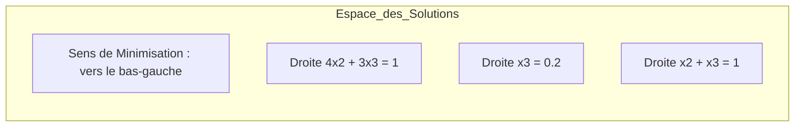
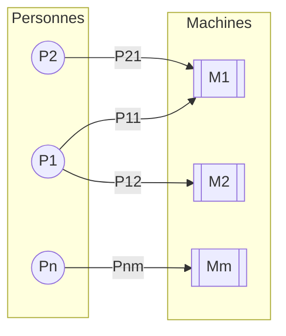
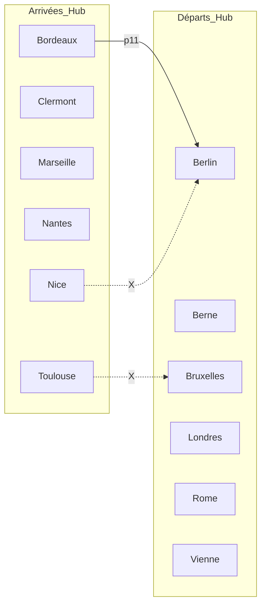
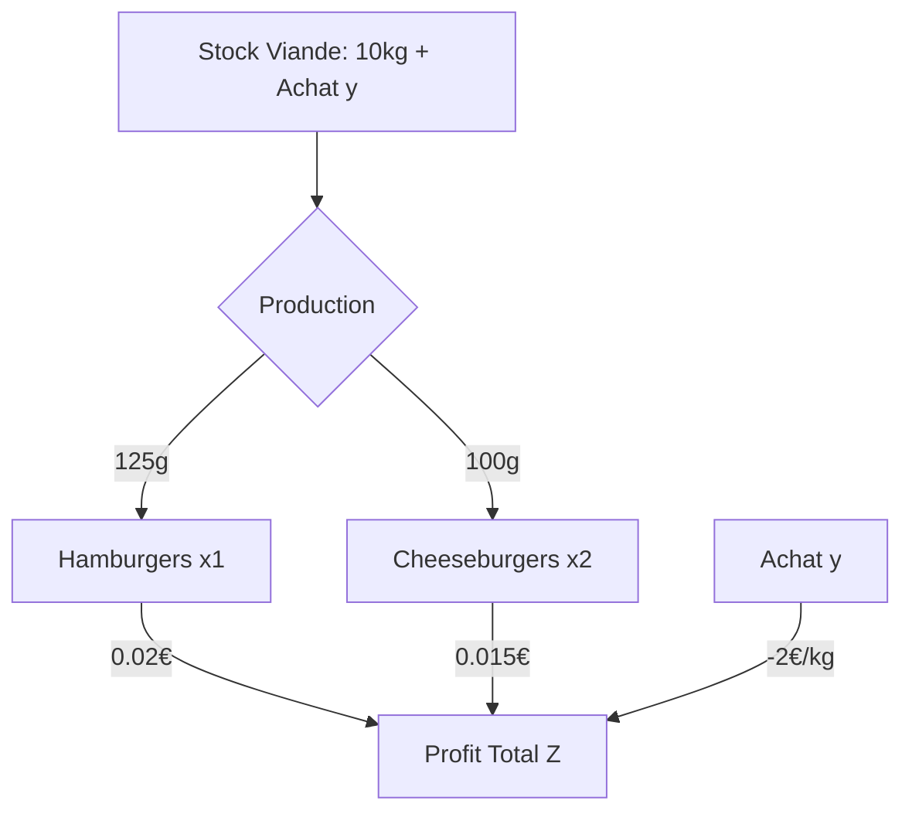
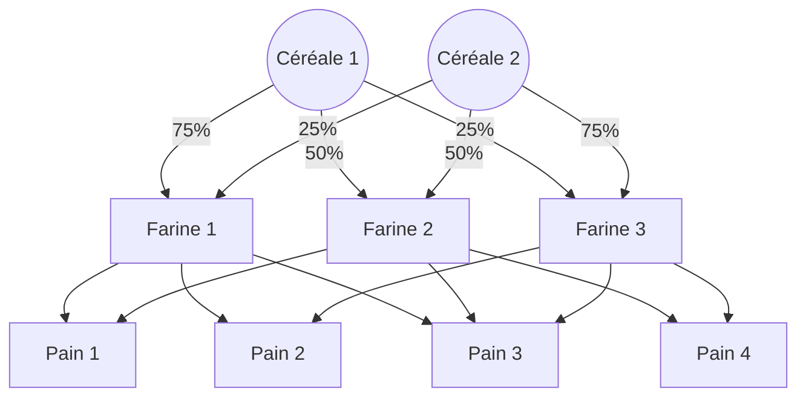
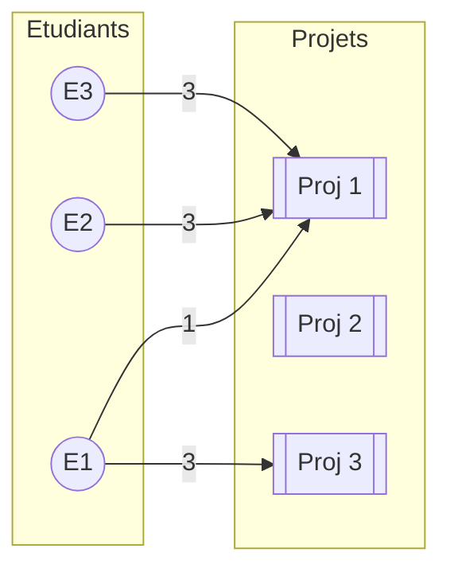
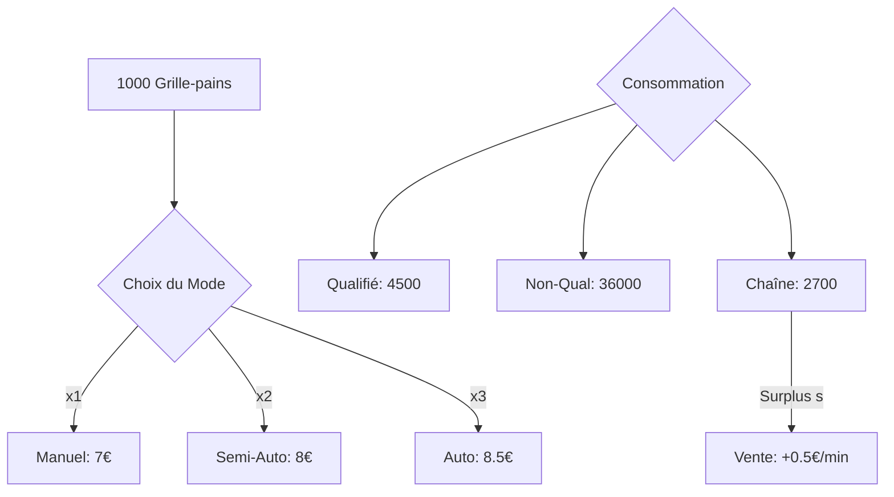
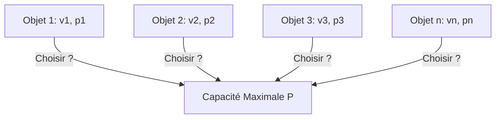
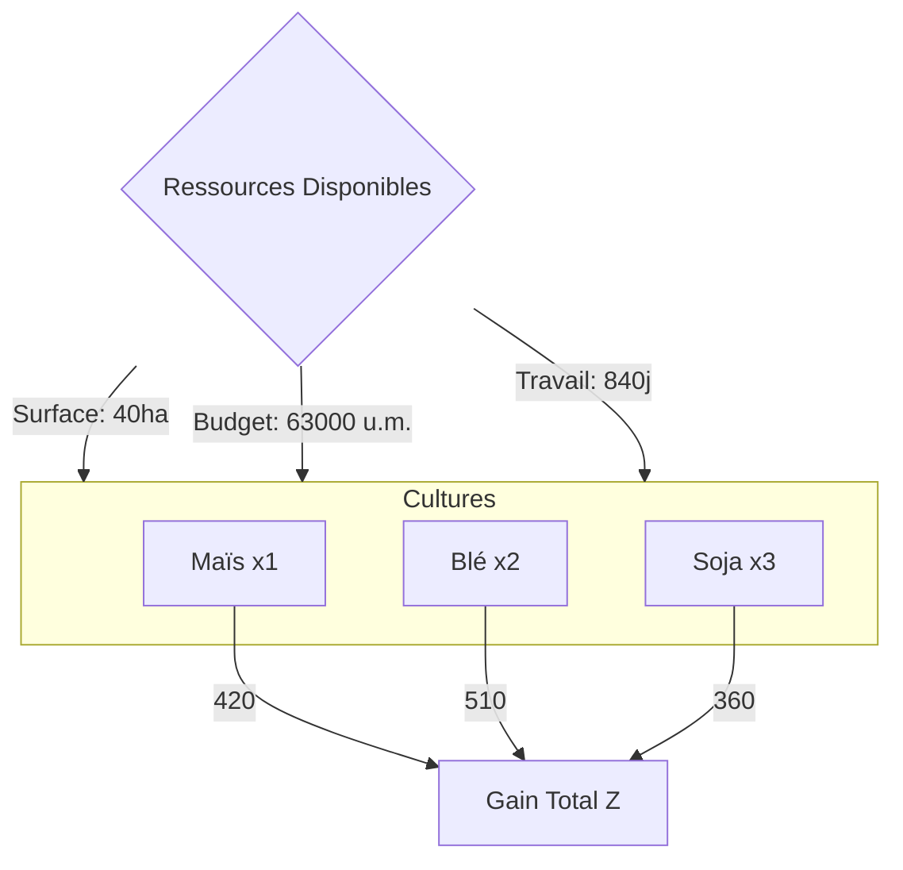
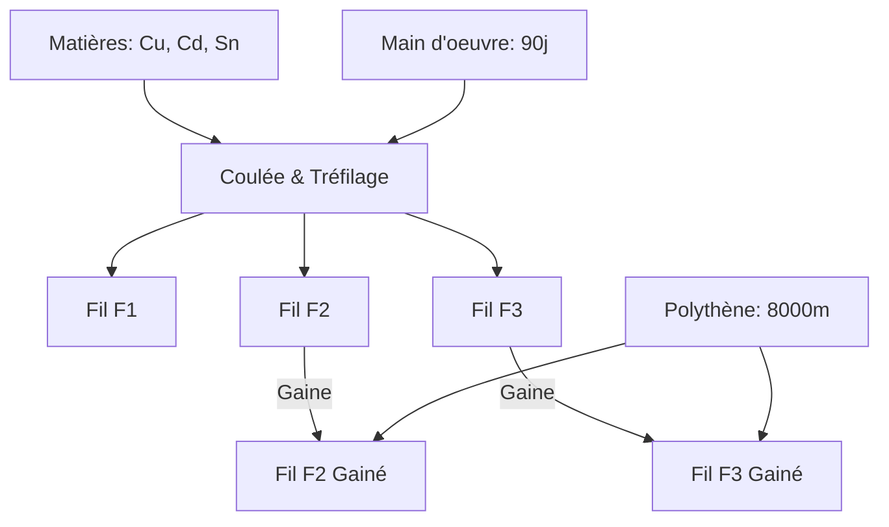

# TD1 : Résolution de Problèmes de Programmation Linéaire

Ce document présente la résolution détaillée et expliquée des exercices de formulation et d'optimisation.

---

## Exercice 1 : Composition d'aliments pour le bétail

### 1. Formulation Algébrique

**Étape 1 : Identification des variables de décision**
On nous demande de trouver la fraction de chaque produit brut dans une tonne d'aliment final.
Soient :
*   $x_1$ : fraction d'orge dans une tonne d'aliment.
*   $x_2$ : fraction d'arachide dans une tonne d'aliment.
*   $x_3$ : fraction de sésame dans une tonne d'aliment.

**Étape 2 : Définition de la fonction objectif**
Le but est de minimiser le coût total par tonne. Les coûts respectifs sont 25, 41 et 39.
$$\text{Min } Z = 25x_1 + 41x_2 + 39x_3$$

**Étape 3 : Identification des contraintes**
1.  **Contrainte de mélange** : La somme des fractions doit être égale à 1 tonne.
    $$x_1 + x_2 + x_3 = 1$$
2.  **Contrainte de protéines** : L'aliment doit contenir au moins 22% de protéines.
    $$0,12x_1 + 0,52x_2 + 0,42x_3 \ge 0,22$$
3.  **Contrainte de graisses** : L'aliment doit contenir au moins 3,6% de graisses.
    $$0,02x_1 + 0,02x_2 + 0,10x_3 \ge 0,036$$
4.  **Contraintes de non-négativité** :
    $$x_1, x_2, x_3 \ge 0$$

---

### 2. Réduction de la dimension du problème

Pour résoudre le problème géométriquement, nous avons besoin de 2 variables seulement. Nous pouvons utiliser la contrainte de mélange ($x_1 + x_2 + x_3 = 1$) pour exprimer une variable en fonction des autres.

Exprimons $x_1$ en fonction de $x_2$ et $x_3$ :
$$x_1 = 1 - x_2 - x_3$$

Remplaçons $x_1$ dans les autres équations :

**A. Nouvelle Fonction Objectif :**
$$Z = 25(1 - x_2 - x_3) + 41x_2 + 39x_3$$
$$Z = 25 - 25x_2 - 25x_3 + 41x_2 + 39x_3$$
$$Z = 16x_2 + 14x_3 + 25$$
*(Minimiser $Z$ revient à minimiser $16x_2 + 14x_3$)*

**B. Contrainte de Protéines :**
$$0,12(1 - x_2 - x_3) + 0,52x_2 + 0,42x_3 \ge 0,22$$
$$0,12 - 0,12x_2 - 0,12x_3 + 0,52x_2 + 0,42x_3 \ge 0,22$$
$$0,40x_2 + 0,30x_3 \ge 0,10$$
En multipliant par 10 :
$$(C1) : 4x_2 + 3x_3 \ge 1$$

**C. Contrainte de Graisses :**
$$0,02(1 - x_2 - x_3) + 0,02x_2 + 0,10x_3 \ge 0,036$$
$$0,02 - 0,02x_2 - 0,02x_3 + 0,02x_2 + 0,10x_3 \ge 0,036$$
$$0,08x_3 \ge 0,016$$
$$(C2) : x_3 \ge 0,2$$

**D. Nouvelles contraintes de domaine :**
Puisque $x_1 \ge 0$, alors $1 - x_2 - x_3 \ge 0 \implies x_2 + x_3 \le 1$.

---

### 3. Résolution Géométrique

Nous travaillons maintenant dans le plan $(x_2, x_3)$.

**Analyse des sommets du domaine admissible :**
Le domaine est délimité par :
1.  $4x_2 + 3x_3 = 1$
2.  $x_3 = 0,2$
3.  $x_2 + x_3 = 1$
4.  $x_2 = 0$

**Intersection de (C1) et (C2) :**
$4x_2 + 3(0,2) = 1 \implies 4x_2 + 0,6 = 1 \implies 4x_2 = 0,4 \implies x_2 = 0,1$.
Point A : $(0,1 ; 0,2)$.
Coût $Z_A = 16(0,1) + 14(0,2) + 25 = 1,6 + 2,8 + 25 = 29,4$.

**Intersection de (C1) et l'axe $x_2=0$ :**
$3x_3 = 1 \implies x_3 = 1/3 \approx 0,33$.
Point B : $(0 ; 0,33)$.
Coût $Z_B = 16(0) + 14(0,33) + 25 \approx 4,62 + 25 = 29,62$.

**Intersection de (C2) et $x_2+x_3=1$ :**
$x_2 + 0,2 = 1 \implies x_2 = 0,8$.
Point C : $(0,8 ; 0,2)$.
Coût $Z_C = 16(0,8) + 14(0,2) + 25 = 12,8 + 2,8 + 25 = 40,6$.

**Conclusion :**
Le coût minimal est atteint au **Point A** :
*   $x_2 = 0,1$ (10% d'arachide)
*   $x_3 = 0,2$ (20% de sésame)
*   $x_1 = 1 - 0,1 - 0,2 = 0,7$ (70% d'orge)

**Le coût minimal par tonne est de 29,4.**

---

## Exercice 2 : Optimisation de la production de feux d'artifice

### Formulation Algébrique

**Étape 1 : Identification des variables de décision**
On cherche à déterminer la quantité de chaque type de fusée à produire pour maximiser le chiffre d'affaires.
Soient :
*   $x_1$ : nombre de fusées de type **rosaces**.
*   $x_2$ : nombre de fusées de type **étoiles**.
*   $x_3$ : nombre de fusées de type **fontaines**.

**Étape 2 : Définition de la fonction objectif**
Le but est de maximiser le chiffre d'affaires global basé sur les prix de vente unitaires (48, 36 et 90).
$$\text{Max } Z = 48x_1 + 36x_2 + 90x_3$$

**Étape 3 : Identification des contraintes**
Attention : Il faut convertir les ressources disponibles dans la même unité que les consommations unitaires (grammes).
*   Poudre disponible : 100 kg = 100 000 g
*   Carton disponible : 12 kg = 12 000 g

1.  **Temps de construction (en min)** : La limite est de 3000 minutes.
    $$4x_1 + 2x_2 + 12x_3 \le 3000$$
2.  **Quantité de poudre (en g)** : La limite est de 100 000 g.
    $$100x_1 + 150x_2 + 100x_3 \le 100000$$
3.  **Quantité de carton (en g)** : La limite est de 12 000 g.
    $$20x_1 + 10x_2 + 40x_3 \le 12000$$
4.  **Contraintes de non-négativité** :
    On ne peut pas produire une quantité négative de fusées.
    $$x_1, x_2, x_3 \ge 0$$

### Résumé du Programme Linéaire (PL)

$$
\begin{cases} 
\text{Max } Z = 48x_1 + 36x_2 + 90x_3 \\
s.c. \\
4x_1 + 2x_2 + 12x_3 \le 3000 & \text{(Temps)} \\
100x_1 + 150x_2 + 100x_3 \le 100000 & \text{(Poudre)} \\
20x_1 + 10x_2 + 40x_3 \le 12000 & \text{(Carton)} \\
x_1, x_2, x_3 \ge 0
\end{cases}
$$

---

## Exercice 3 : Produire à partir de lots

### Formulation Algébrique

Ce problème nécessite de modéliser l'achat de composants par lots pour satisfaire une production de produits finis.

**Étape 1 : Variables de décision**
1.  **Production** : $x_1, x_2, x_3$ (quantités de P1, P2 et P3 à produire).
2.  **Achats** : $y_1, y_2$ (nombre de lots de type 1 et type 2 à acheter).

**Étape 2 : Rappel des données (Coefficients)**

| Produit | A (consommé) | B (consommé) | C (consommé) | Prix Vente | Limite |
| :--- | :---: | :---: | :---: | :---: | :---: |
| **P1** | 3 | 5 | 2 | 120 € | 100 |
| **P2** | 4 | 1 | 2 | 120 € | 100 |
| **P3** | 2 | 3 | 5 | 120 € | 200 |

| Lot | A (fourni) | B (fourni) | C (fourni) | Prix Achat |
| :--- | :---: | :---: | :---: | :---: |
| **Lot 1** | 3 | 2 | 3 | 50 € |
| **Lot 2** | 2 | 3 | 3 | 60 € |

**Étape 3 : Fonction Objectif (Maximiser la Marge)**
$\text{Marge} = (120x_1 + 120x_2 + 120x_3) - (50y_1 + 60y_2)$
$$\text{Max } Z = 120x_1 + 120x_2 + 120x_3 - 50y_1 - 60y_2$$

**Étape 4 : Les Contraintes**

1.  **Demande contractuelle** :
    $x_1 \le 100$
    $x_2 \le 100$
    $x_3 \le 200$

2.  **Équilibre des composants (Consommation $\le$ Disponibilité)** :
    *   **Composant A** : $3x_1 + 4x_2 + 2x_3 \le 3y_1 + 2y_2$
    *   **Composant B** : $5x_1 + 1x_2 + 3x_3 \le 2y_1 + 3y_2$
    *   **Composant C** : $2x_1 + 2x_2 + 5x_3 \le 3y_1 + 3y_2$

3.  **Non-négativité** :
    $x_i \ge 0$ et $y_j \ge 0$.

### Résumé du Programme Linéaire (PL)

$$
\begin{cases} 
\text{Max } Z = 120x_1 + 120x_2 + 120x_3 - 50y_1 - 60y_2 \\
s.c. \\
x_1 \le 100, x_2 \le 100, x_3 \le 200 \\
3x_1 + 4x_2 + 1x_3 - 3y_1 - 2y_2 \le 0 \\
5x_1 + 2x_2 + 2x_3 - 2y_1 - 3y_2 \le 0 \\
2x_1 + 3x_2 + 5x_3 - 3y_1 - 3y_2 \le 0 \\
x_1, x_2, x_3, y_1, y_2 \ge 0
\end{cases}
$$

---

## Exercice 4 : Affectation des opérateurs aux machines

### 1. Rappel du Concept : Le Problème d'Affectation

Le **Problème d'Affectation** est un cas particulier du problème de transport. Il consiste à apparier deux ensembles (ici des personnes et des machines) de manière à optimiser un critère global (productivité, coût, temps).

**Points clés :**
*   **Variables Binaires** : Une variable ne peut prendre que deux valeurs : 1 (affecté) ou 0 (non affecté).
*   **Unicité** : Chaque machine ne reçoit qu'un seul opérateur. Chaque opérateur ne peut être sur plus d'une machine.
*   **Algorithme de résolution** : On utilise généralement la **Méthode Hongroise** (ou algorithme de Kuhn-Munkres) pour résoudre ce type de problème efficacement sans tester toutes les combinaisons possibles ($n!$).

### 2. Formulation Algébrique

**Étape 1 : Identification des variables de décision**
Soit $x_{ij}$ la variable binaire telle que :
*   $x_{ij} = 1$ si la personne $i$ est affectée à la machine $j$.
*   $x_{ij} = 0$ sinon.
Pour $i \in \{1, \dots, n\}$ et $j \in \{1, \dots, m\}$.

**Étape 2 : Définition de la fonction objectif**
Nous voulons maximiser la productivité totale de l'atelier, qui est la somme des productivités individuelles $P_{ij}$ des couples (personne, machine) formés.
$$\text{Max } Z = \sum_{i=1}^{n} \sum_{j=1}^{m} P_{ij} \cdot x_{ij}$$

**Étape 3 : Identification des contraintes**

1.  **Chaque machine doit avoir un opérateur** :
    Pour chaque machine $j$, la somme des personnes qui lui sont affectées doit être exactement 1.
    $$\sum_{i=1}^{n} x_{ij} = 1 \quad \forall j \in \{1, \dots, m\}$$

2.  **Chaque personne peut être affectée à au plus une machine** :
    Pour chaque personne $i$, la somme des machines auxquelles elle est affectée ne peut dépasser 1.
    $$\sum_{j=1}^{m} x_{ij} \le 1 \quad \forall i \in \{1, \dots, n\}$$

3.  **Nature des variables** :
    $$x_{ij} \in \{0, 1\}$$

### 3. Résumé du Programme Linéaire (PL)

$$
\begin{cases} 
\text{Max } Z = \sum_{i=1}^{n} \sum_{j=1}^{m} P_{ij} x_{ij} \\
s.c. \\
\sum_{i=1}^{n} x_{ij} = 1, & j = 1, \dots, m \\
\sum_{j=1}^{m} x_{ij} \le 1, & i = 1, \dots, n \\
x_{ij} \in \{0, 1\}
\end{cases}
$$

---

## Exercice 5 : Optimisation des correspondances (Hub SafeFlight)

### 1. Rappel du Concept : Minimisation vs Maximisation

Dans ce problème, on nous demande de **minimiser le nombre de passagers changeant d'avion**. 

**L'astuce de modélisation :**
Soit $T$ le nombre total de passagers en transfert. 
$\text{Passagers changeant d'avion} = T - \text{Passagers restant dans le même avion}$.
Puisque $T$ est une constante, minimiser les changements revient exactement à **maximiser le nombre de passagers qui ne quittent pas leur siège** (ceux dont le vol de provenance $i$ est réemployé pour le vol de destination $j$).

C'est donc à nouveau un **Problème d'Affectation**, mais avec des contraintes d'interdiction (vols en retard).

### 2. Formulation Algébrique

**Étape 1 : Variables de décision**
Soit $x_{ij}$ la variable binaire :
*   $x_{ij} = 1$ si l'avion provenant de $i$ est utilisé pour le vol vers $j$.
*   $x_{ij} = 0$ sinon.

**Étape 2 : Fonction Objectif**
Maximiser le nombre de passagers "statiques" (qui restent dans l'avion) :
$$\text{Max } Z = \sum_{i=1}^{n} \sum_{j=1}^{n} p_{ij} x_{ij}$$
Où $p_{ij}$ est le nombre de passagers du tableau.

**Étape 3 : Contraintes**

1.  **Chaque vol de départ doit être assuré** :
    $$\sum_{i=1}^{n} x_{ij} = 1 \quad \forall j \in \{1, \dots, n\}$$

2.  **Chaque avion arrivé doit repartir vers une seule destination** :
    $$\sum_{j=1}^{n} x_{ij} = 1 \quad \forall i \in \{1, \dots, n\}$$

3.  **Gestion des interdictions (Retards)** :
    Certaines affectations sont impossibles. On peut les modéliser en forçant ces variables à zéro :
    *   $x_{\text{Nice}, \text{Berlin}} = 0$
    *   $x_{\text{Toulouse}, \text{Berlin}} = 0$
    *   $x_{\text{Toulouse}, \text{Berne}} = 0$
    *   $x_{\text{Toulouse}, \text{Bruxelles}} = 0$

### 3. Modèle Général pour $n$ avions

Si on note $p_{ij}$ la productivité (passagers restants) entre l'origine $i$ et la destination $j$ :

$$
\begin{cases} 
\text{Max } Z = \sum_{i=1}^{n} \sum_{j=1}^{n} p_{ij} x_{ij} \\
s.c. \\
\sum_{i=1}^{n} x_{ij} = 1, & j = 1, \dots, n \\
\sum_{j=1}^{n} x_{ij} = 1, & i = 1, \dots, n \\
x_{ij} = 0 & \text{pour les couples }(i,j)\text{ impossibles} \\
x_{ij} \in \{0, 1\}
\end{cases}
$$

---

## Exercice 6 : Optimisation d'un Fast-Food (Hamburgers)

### 1. Rappel du Concept : Ressources avec coût d'achat

Dans ce problème, une ressource (la viande) n'est pas limitée de façon absolue, mais son extension a un **coût additionnel**. 

**Logique économique :**
On ne doit commander de la viande supplémentaire que si le profit généré par les sandwiches produits avec cette viande est supérieur au coût de la livraison (2 €/kg).
*   Avec 1 kg de viande, on fait 8 hamburgers ($1 / 0,125$). Profit = $8 \times 0,02 = 0,16$ €.
*   Coût du kg = 2 €.
*   **Analyse** : Le coût de la ressource (2€) est bien plus élevé que le profit qu'elle génère (0,16€). Le modèle mathématique devrait donc logiquement choisir de ne pas commander de viande supplémentaire ($y=0$).

### 2. Formulation Algébrique

**Étape 1 : Variables de décision**
*   $x_1$ : nombre de hamburgers produits.
*   $x_2$ : nombre de cheeseburgers produits.
*   $y$ : quantité de viande supplémentaire commandée (en kg).

**Étape 2 : Fonction Objectif (Maximiser la Marge)**
$$\text{Max } Z = 0,02x_1 + 0,015x_2 - 2y$$

**Étape 3 : Identification des contraintes**

1.  **Contrainte de Viande** (Consommation $\le$ Disponibilité) :
    Les coefficients doivent être dans la même unité (kg).
    *   Hamburger : 125g = 0,125 kg
    *   Cheeseburger : 100g = 0,100 kg
    $$0,125x_1 + 0,1x_2 \le 10 + y$$
    Soit sous forme standard : $0,125x_1 + 0,1x_2 - y \le 10$

2.  **Contrainte de Demande** :
    Le total des sandwiches ne peut dépasser 900.
    $$x_1 + x_2 \le 900$$

3.  **Non-négativité** :
    $$x_1, x_2, y \ge 0$$

### 3. Résumé du Programme Linéaire (PL)

$$
\begin{cases} 
\text{Max } Z = 0,02x_1 + 0,015x_2 - 2y \\
s.c. \\
0,125x_1 + 0,1x_2 - y \le 10 \\
x_1 + x_2 \le 900 \\
x_1, x_2, y \ge 0
\end{cases}
$$

---

## Exercice 7 : Boulangerie (Production à plusieurs niveaux)

### 1. Rappel du Concept : Chaîne de transformation

Ce problème présente une **production multi-niveaux** :
1.  Les **Céréales** (Ressources de base) produisent des **Farines**.
2.  Les **Farines** (Produits intermédiaires) produisent des **Pains** (Produits finis).

**La difficulté** : Les contraintes de stock portent sur les céréales ($b_1, b_2$), mais les variables de décision portent sur les pains ($x_j$). Il faut donc "remonter la chaîne" pour exprimer la consommation de céréales en fonction du nombre de pains.

### 2. Formulation Algébrique

**Étape 1 : Variables de décision**
Soient $x_1, x_2, x_3, x_4$ les quantités de pains de types 1, 2, 3 et 4 à produire.

**Étape 2 : Fonction Objectif (Maximiser le CA)**
$$\text{Max } Z = p_1x_1 + p_2x_2 + p_3x_3 + p_4x_4$$

**Étape 3 : Identification des contraintes de stock**

D'abord, exprimons la quantité de chaque farine nécessaire :
*   $Farine_1 = 0,2x_1 + 0,25x_2 + 0,1x_3$
*   $Farine_2 = 0,3x_1 + 0,1x_3 + 0,1x_4$
*   $Farine_3 = 0,25x_2 + 0,3x_3 + 0,2x_4$

Ensuite, calculons la consommation de céréales en utilisant les proportions ($C_1$ dans $F_1 = 0,75$, etc.) :

1.  **Contrainte Céréale 1** :
    $0,75(Farine_1) + 0,50(Farine_2) + 0,25(Farine_3) \le b_1$
    En remplaçant par les $x_j$ :
    $0,75(0,2x_1 + 0,25x_2 + 0,1x_3) + 0,5(0,3x_1 + 0,1x_3 + 0,1x_4) + 0,25(0,25x_2 + 0,3x_3 + 0,2x_4) \le b_1$

2.  **Contrainte Céréale 2** :
    $0,25(Farine_1) + 0,50(Farine_2) + 0,75(Farine_3) \le b_2$
    En remplaçant par les $x_j$ :
    $0,25(0,2x_1 + 0,25x_2 + 0,1x_3) + 0,5(0,3x_1 + 0,1x_3 + 0,1x_4) + 0,75(0,25x_2 + 0,3x_3 + 0,2x_4) \le b_2$

### 3. Résumé du Programme Linéaire (PL) simplifié

Après développement des calculs (exemple pour $C_1$) :
*   Coeff $x_1$ : $0,75 \times 0,2 + 0,5 \times 0,3 = 0,15 + 0,15 = 0,3$
*   Coeff $x_2$ : $0,75 \times 0,25 + 0,25 \times 0,25 = 0,1875 + 0,0625 = 0,25$
*   ... et ainsi de suite.

$$
\begin{cases} 
\text{Max } Z = p_1x_1 + p_2x_2 + p_3x_3 + p_4x_4 \\
s.c. \\
0,3x_1 + 0,25x_2 + 0,2x_3 + 0,1x_4 \le b_1 \\
0,2x_1 + 0,25x_2 + 0,3x_3 + 0,2x_4 \le b_2 \\
x_1, x_2, x_3, x_4 \ge 0
\end{cases}
$$

---

## Exercice 8 : Attribution de projets (Maximisation de la satisfaction)

### 1. Rappel du Concept : Affectation Qualitative

Ce problème est identique dans sa structure à l'exercice 4 (opérateurs/machines) et l'exercice 5 (avions), mais ici le critère à maximiser est la **satisfaction** (notes de préférence).

**L'objectif** : Trouver l'appariement "étudiant-projet" qui rend le groupe le plus heureux possible collectivement. 

### 2. Modèle Général (n étudiants, n projets)

**Variables de décision** :
$x_{ij} = 1$ si le projet $j$ est attribué à l'étudiant $i$, $0$ sinon.

**Fonction Objectif** :
$$\text{Max } Z = \sum_{i=1}^{n} \sum_{j=1}^{n} p_{ij} x_{ij}$$
Où $p_{ij}$ est la note donnée par l'étudiant $i$ au projet $j$.

**Contraintes** :
1.  **Chaque étudiant reçoit exactement un projet** :
    $$\sum_{j=1}^{n} x_{ij} = 1 \quad \forall i \in \{1, \dots, n\}$$
2.  **Chaque projet est attribué à exactement un étudiant** :
    $$\sum_{i=1}^{n} x_{ij} = 1 \quad \forall j \in \{1, \dots, n\}$$
3.  **Intégrité** : $x_{ij} \in \{0, 1\}$.

### 3. Application au cas n = 3

D'après l'énoncé, le tableau des préférences $p_{ij}$ est :

| Étudiant | Projet 1 | Projet 2 | Projet 3 |
| :--- | :---: | :---: | :---: |
| **E1** | 1 | 2 | 3 |
| **E2** | 3 | 2 | 1 |
| **E3** | 3 | 1 | 2 |

**Le Programme Linéaire spécifique :**

$$
\begin{cases} 
\text{Max } Z = (1x_{11} + 2x_{12} + 3x_{13}) + (3x_{21} + 2x_{22} + 1x_{23}) + (3x_{31} + 1x_{32} + 2x_{33}) \\
s.c. \\
x_{11} + x_{12} + x_{13} = 1 & \text{(Etudiant 1)} \\
x_{21} + x_{22} + x_{23} = 1 & \text{(Etudiant 2)} \\
x_{31} + x_{32} + x_{33} = 1 & \text{(Etudiant 3)} \\
x_{11} + x_{21} + x_{31} = 1 & \text{(Projet 1)} \\
x_{12} + x_{22} + x_{32} = 1 & \text{(Projet 2)} \\
x_{13} + x_{23} + x_{33} = 1 & \text{(Projet 3)} \\
x_{ij} \in \{0, 1\}
\end{cases}
$$

---

## Exercice 9 : Mouliseb (Minimisation et Valorisation des ressources)

### 1. Rappel du Concept : Minimisation avec revente de surplus

Dans ce problème, on cherche à minimiser un coût total. La particularité de la question 2 est la **valorisation des ressources inutilisées**.

**L'idée clé** : Une minute de chaîne d'assemblage non utilisée n'est plus "perdue", elle rapporte 0,50 €. 
*   En minimisation, un gain se traduit par un coefficient **négatif** dans la fonction objectif (car il vient réduire le coût total).
*   On utilise une **variable d'écart** explicite ($s$) pour représenter la quantité de ressource revendue.

### 2. Formulation Mathématique (Question 1)

**Variables de décision** :
$x_1, x_2, x_3$ : nombre de grille-pains fabriqués respectivement en manuel, semi-auto et auto.

**Fonction Objectif (Minimisation du coût)** :
$$\text{Min } Z = 7x_1 + 8x_2 + 8,5x_3$$

**Contraintes** :
1.  **Objectif de production** : $x_1 + x_2 + x_3 = 1000$
2.  **Ouvriers qualifiés** : $1x_1 + 4x_2 + 8x_3 \le 4500$
3.  **Ouvriers non-qualifiés** : $40x_1 + 30x_2 + 20x_3 \le 36000$
4.  **Chaîne d'assemblage** : $3x_1 + 2x_2 + 4x_3 \le 2700$
5.  **Non-négativité** : $x_1, x_2, x_3 \ge 0$

### 3. Modification pour la revente (Question 2)

On introduit $s$ comme la quantité de minutes de chaîne d'assemblage non utilisées. La contrainte de la chaîne devient une **égalité** :
$$3x_1 + 2x_2 + 4x_3 + s = 2700$$

**Nouvelle Fonction Objectif** :
On soustrait le gain de la revente du coût total de production :
$$\text{Min } Z = 7x_1 + 8x_2 + 8,5x_3 - 0,5s$$

**Résumé du PL (complet)** :
$$
\begin{cases} 
\text{Min } Z = 7x_1 + 8x_2 + 8,5x_3 - 0,5s \\
s.c. \\
x_1 + x_2 + x_3 = 1000 \\
x_1 + 4x_2 + 8x_3 \le 4500 \\
40x_1 + 30x_2 + 20x_3 \le 36000 \\
3x_1 + 2x_2 + 4x_3 + s = 2700 \\
x_1, x_2, x_3, s \ge 0
\end{cases}
$$

---

## Exercice 10 : Le Problème du Sac à Dos (Knapsack)

### 1. Rappel du Concept : Sélection binaire sous contrainte

Le **Problème du Sac à Dos** est un classique de l'optimisation combinatoire. Il consiste à choisir, parmi un ensemble d'objets, ceux qui maximisent la valeur totale transportée sans dépasser une capacité de poids fixe.

**Points clés :**
*   **Arbitrage** : On doit choisir entre des objets de forte valeur mais lourds, et des objets de faible valeur mais légers.
*   **Variables Binaires** : Un objet est soit pris ($1$), soit laissé ($0$). On ne peut pas prendre une fraction d'objet (sauf dans le cas du sac à dos "fractionnaire", mais ici il s'agit du cas entier).

### 2. Formulation Algébrique Générale

**Variables de décision** :
$x_i \in \{0, 1\}$ tel que :
*   $x_i = 1$ si l'objet $i$ est mis dans le sac.
*   $x_i = 0$ sinon.

**Fonction Objectif (Maximiser la valeur)** :
$$\text{Max } Z = \sum_{i=1}^{n} v_i x_i$$

**Contrainte (Poids maximal autorisé)** :
$$\sum_{i=1}^{n} p_i x_i \le P$$

### 3. Application au cas n = 4 (P = 30 kg)

Données :
*   $v = \{13, 12, 8, 10\}$
*   $p = \{7, 4, 3, 3\}$

**Le Programme Linéaire spécifique :**

$$
\begin{cases} 
\text{Max } Z = 13x_1 + 12x_2 + 8x_3 + 10x_4 \\
s.c. \\
7x_1 + 4x_2 + 3x_3 + 3x_4 \le 30 \\
x_i \in \{0, 1\} \quad \forall i \in \{1, 2, 3, 4\}
\end{cases}
$$

---

## Exercice 11 : Optimisation d'exploitation agricole

### 1. Rappel du Concept : Allocation de ressources multiples

Dans ce problème, l'agriculteur doit décider de la répartition de son terrain entre trois cultures. Il fait face à **trois contraintes limitantes** simultanées :
1.  **Le foncier** : La surface totale disponible (hectares).
2.  **Le financier** : Le budget total pour la préparation (unités monétaires).
3.  **L'humain** : La capacité de travail totale (journées).

**L'objectif** est de trouver la combinaison optimale de cultures qui maximise le gain total sans violer aucune de ces trois limites.

### 2. Formulation Algébrique

**Étape 1 : Identification des variables de décision**
Soient :
*   $x_1$ : nombre d'hectares semés en maïs.
*   $x_2$ : nombre d'hectares semés en blé.
*   $x_3$ : nombre d'hectares semés en soja.

**Étape 2 : Définition de la fonction objectif**
Maximiser le gain total espéré :
$$\text{Max } Z = 420x_1 + 510x_2 + 360x_3$$

**Étape 3 : Identification des contraintes**

1.  **Contrainte de surface** : La somme des hectares ne peut dépasser 40.
    $$x_1 + x_2 + x_3 \le 40$$

2.  **Contrainte de budget** (Coûts de préparation) :
    $$1500x_1 + 1800x_2 + 1050x_3 \le 63000$$

3.  **Contrainte de travail** (Journées nécessaires) :
    $$18x_1 + 27x_2 + 15x_3 \le 840$$

4.  **Non-négativité** :
    $$x_1, x_2, x_3 \ge 0$$

### 3. Résumé du Programme Linéaire (PL)

$$
\begin{cases} 
\text{Max } Z = 420x_1 + 510x_2 + 360(1 + p)x_3 \\
s.c. \\
x_1 + x_2 + x_3 \le 40 \\
1500x_1 + 1800x_2 + 1050x_3 \le 63000 \\
18x_1 + 27x_2 + 15x_3 \le 840 \\
x_1, x_2, x_3 \ge 0
\end{cases}
$$

### 2. Nouvelle formulation avec prime d'encouragement (p)

Si une prime $p$ est introduite pour le soja, le nouveau gain par hectare de soja devient $360 + p \cdot 360$, soit **$360(1 + p)$**.

**Nouvelle Fonction Objectif :**
$$\text{Max } Z = 420x_1 + 510x_2 + 360(1 + p)x_3$$

Les contraintes restent inchangées car la prime n'affecte que le profit, pas la consommation des ressources.

---

### 3. Résolution par la méthode du Simplexe et discussion

#### Concept : Analyse de sensibilité
Dans un problème de Simplexe, les coefficients de la fonction objectif influencent le choix de la **variable entrante**. Si le gain d'une culture augmente (via $p$), elle a plus de chances d'entrer dans la base et de remplacer une autre culture.

**Mise en forme (Simplification des contraintes) :**
*   (C1) $x_1 + x_2 + x_3 \le 40$
*   (C2) $10x_1 + 12x_2 + 7x_3 \le 420$ (Division par 150)
*   (C3) $6x_1 + 9x_2 + 5x_3 \le 280$ (Division par 3)

#### Initialisation du Tableau
À $p=0$, le soja ($x_3$) a un coefficient de 360.
Comparons l'efficacité relative (Gain / Ressource la plus limitante) :
*   Le blé ($x_2$) est très rentable par hectare (510) mais consomme beaucoup de travail (27j).
*   Le soja ($x_3$) est moins rentable par hectare (360) mais très économe en ressources.

**Discussion selon p :**

1.  **Si $p$ est faible ou nul ($p \le 0,16$)** :
    Le blé et le maïs restent compétitifs. Le blé est privilégié car son gain (510) compense sa forte consommation de ressources tant que le soja ne dépasse pas un certain seuil de profit.
    *   *Solution* : Mélange Maïs/Blé.

2.  **Si $p$ augmente ($0,16 < p < 0,5$)** :
    Le soja devient plus attractif que le blé par rapport à l'occupation du sol et du budget. L'agriculteur commence à remplacer le blé par le soja.
    *   *Solution* : Entrée massive du soja dans le plan de culture.

3.  **Si $p$ est élevé ($p \ge 0,5$)** :
    Le soja devient la culture dominante. Le gain par hectare du soja ($360 \times 1,5 = 540$) dépasse celui du blé (510). Comme le soja consomme moins de budget et de travail, l'agriculteur a intérêt à cultiver **uniquement du soja** sur les 40 hectares.
    *   *Vérification des ressources pour 40ha de soja* :
        *   Terre : 40/40 (Saturé)
        *   Budget : $1050 \times 40 = 42\,000 \le 63\,000$ (OK)
        *   Travail : $15 \times 40 = 600 \le 840$ (OK)

**Conclusion :**
Il existe un **seuil critique** (autour de $p = 0,5$) où le soja devient tellement rentable qu'il évince totalement les autres cultures grâce à sa faible consommation de ressources par unité de gain.

*Note : Dans ce cas précis, si on additionne tous les poids ($7+4+3+3 = 17$), on remarque que $17 < 30$. La solution optimale est donc triviale : on prend tous les objets ($x_i=1 \forall i$). Cependant, le but de l'exercice est la modélisation.*

---

## Exercice 13 : Fabrication de fils téléphoniques

### 1. Rappel du Concept : Harmonisation des unités

Dans ce type de problème, la principale source d'erreur est le mélange d'unités différentes. Avant de formuler, il faut tout convertir dans un système cohérent.

**Données converties (pour 100m de fils) :**
*   **Production** : On définit $x_i$ comme le nombre d'unités de **100 mètres** de fils $F_i$.
*   **Cuivre** : kg (OK).
*   **Cadmium/Étain** : décagrammes (dag) (OK).
*   **Polythène** : L'entreprise dispose de 80 hm. Or, $1 \text{ hm} = 100 \text{ m}$. Donc $80 \text{ hm} = 8000 \text{ m}$. Comme une unité de fil $x_i$ représente 100m, l'entreprise dispose de **80 unités** de gaine.

### 2. Formulation du PL (sans gainage)

**Variables de décision** :
$x_1, x_2, x_3$ : nombre d'unités de 100m de fils $F_1, F_2, F_3$.

**Fonction Objectif** :
$$\text{Max } Z = 4200x_1 + 3900x_2 + 5200x_3$$

**Contraintes** :
1.  **Cuivre** : $9x_1 + 5x_2 + 6x_3 \le 600$ (kg)
2.  **Cadmium** : $2x_1 + 1x_2 + 2x_3 \le 150$ (dag)
3.  **Étain** : $0x_1 + 0x_2 + 1x_3 \le 60$ (dag)
4.  **Main-d'œuvre** : $1x_1 + 1x_2 + 1x_3 \le 90$ (jours)
5.  **Non-négativité** : $x_1, x_2, x_3 \ge 0$

### 3. Reformulation avec protection Polythène

L'ajout du gainage pour $F_2$ et $F_3$ ajoute une contrainte supplémentaire. 
*   Consommation : 100m de polythène par unité de 100m de fil.
*   Disponibilité : 80 hectomètres = 8000 mètres = 80 unités de 100m.

**Nouvelle Contrainte** :
$$x_2 + x_3 \le 80$$

**Résumé du PL final** :
$$
\begin{cases} 
\text{Max } Z = 4200x_1 + 3900x_2 + 5200x_3 \\
s.c. \\
9x_1 + 5x_2 + 6x_3 \le 600 & \text{(Cuivre)} \\
2x_1 + 1x_2 + 2x_3 \le 150 & \text{(Cadmium)} \\
x_3 \le 60 & \text{(Étain)} \\
x_1 + x_2 + x_3 \le 90 & \text{(Travail)} \\
x_2 + x_3 \le 80 & \text{(Polythène)} \\
x_1, x_2, x_3 \ge 0
\end{cases}
$$

