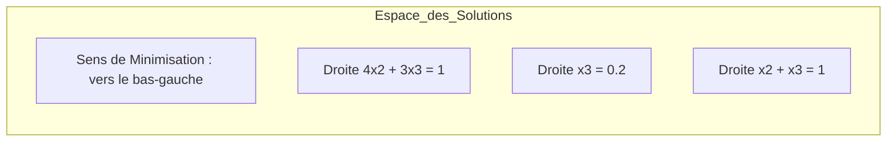

# TD1 : Résolution de Problèmes de Programmation Linéaire

Ce document présente la résolution détaillée et expliquée des exercices de formulation et d'optimisation.

---

## Exercice 1 : Composition d'aliments pour le bétail

### 1. Formulation Algébrique

**Étape 1 : Identification des variables de décision**
On nous demande de trouver la fraction de chaque produit brut dans une tonne d'aliment final.
Soient :
*   $x_1$ : fraction d'orge dans une tonne d'aliment.
*   $x_2$ : fraction d'arachide dans une tonne d'aliment.
*   $x_3$ : fraction de sésame dans une tonne d'aliment.

**Étape 2 : Définition de la fonction objectif**
Le but est de minimiser le coût total par tonne. Les coûts respectifs sont 25, 41 et 39.
$$\text{Min } Z = 25x_1 + 41x_2 + 39x_3$$

**Étape 3 : Identification des contraintes**
1.  **Contrainte de mélange** : La somme des fractions doit être égale à 1 tonne.
    $$x_1 + x_2 + x_3 = 1$$
2.  **Contrainte de protéines** : L'aliment doit contenir au moins 22% de protéines.
    $$0,12x_1 + 0,52x_2 + 0,42x_3 \ge 0,22$$
3.  **Contrainte de graisses** : L'aliment doit contenir au moins 3,6% de graisses.
    $$0,02x_1 + 0,02x_2 + 0,10x_3 \ge 0,036$$
4.  **Contraintes de non-négativité** :
    $$x_1, x_2, x_3 \ge 0$$

---

### 2. Réduction de la dimension du problème

Pour résoudre le problème géométriquement, nous avons besoin de 2 variables seulement. Nous pouvons utiliser la contrainte de mélange ($x_1 + x_2 + x_3 = 1$) pour exprimer une variable en fonction des autres.

Exprimons $x_1$ en fonction de $x_2$ et $x_3$ :
$$x_1 = 1 - x_2 - x_3$$

Remplaçons $x_1$ dans les autres équations :

**A. Nouvelle Fonction Objectif :**
$$Z = 25(1 - x_2 - x_3) + 41x_2 + 39x_3$$
$$Z = 25 - 25x_2 - 25x_3 + 41x_2 + 39x_3$$
$$Z = 16x_2 + 14x_3 + 25$$
*(Minimiser $Z$ revient à minimiser $16x_2 + 14x_3$)*

**B. Contrainte de Protéines :**
$$0,12(1 - x_2 - x_3) + 0,52x_2 + 0,42x_3 \ge 0,22$$
$$0,12 - 0,12x_2 - 0,12x_3 + 0,52x_2 + 0,42x_3 \ge 0,22$$
$$0,40x_2 + 0,30x_3 \ge 0,10$$
En multipliant par 10 :
$$(C1) : 4x_2 + 3x_3 \ge 1$$

**C. Contrainte de Graisses :**
$$0,02(1 - x_2 - x_3) + 0,02x_2 + 0,10x_3 \ge 0,036$$
$$0,02 - 0,02x_2 - 0,02x_3 + 0,02x_2 + 0,10x_3 \ge 0,036$$
$$0,08x_3 \ge 0,016$$
$$(C2) : x_3 \ge 0,2$$

**D. Nouvelles contraintes de domaine :**
Puisque $x_1 \ge 0$, alors $1 - x_2 - x_3 \ge 0 \implies x_2 + x_3 \le 1$.

---

### 3. Résolution Géométrique

Nous travaillons maintenant dans le plan $(x_2, x_3)$.

**Analyse des sommets du domaine admissible :**
Le domaine est délimité par :
1.  $4x_2 + 3x_3 = 1$
2.  $x_3 = 0,2$
3.  $x_2 + x_3 = 1$
4.  $x_2 = 0$

**Intersection de (C1) et (C2) :**
$4x_2 + 3(0,2) = 1 \implies 4x_2 + 0,6 = 1 \implies 4x_2 = 0,4 \implies x_2 = 0,1$.
Point A : $(0,1 ; 0,2)$.
Coût $Z_A = 16(0,1) + 14(0,2) + 25 = 1,6 + 2,8 + 25 = 29,4$.

**Intersection de (C1) et l'axe $x_2=0$ :**
$3x_3 = 1 \implies x_3 = 1/3 \approx 0,33$.
Point B : $(0 ; 0,33)$.
Coût $Z_B = 16(0) + 14(0,33) + 25 \approx 4,62 + 25 = 29,62$.

**Intersection de (C2) et $x_2+x_3=1$ :**
$x_2 + 0,2 = 1 \implies x_2 = 0,8$.
Point C : $(0,8 ; 0,2)$.
Coût $Z_C = 16(0,8) + 14(0,2) + 25 = 12,8 + 2,8 + 25 = 40,6$.

**Conclusion :**
Le coût minimal est atteint au **Point A** :
*   $x_2 = 0,1$ (10% d'arachide)
*   $x_3 = 0,2$ (20% de sésame)
*   $x_1 = 1 - 0,1 - 0,2 = 0,7$ (70% d'orge)

**Le coût minimal par tonne est de 29,4.**

---

## Exercice 2 : Optimisation de la production de feux d'artifice

### Formulation Algébrique

**Étape 1 : Identification des variables de décision**
On cherche à déterminer la quantité de chaque type de fusée à produire pour maximiser le chiffre d'affaires.
Soient :
*   $x_1$ : nombre de fusées de type **rosaces**.
*   $x_2$ : nombre de fusées de type **étoiles**.
*   $x_3$ : nombre de fusées de type **fontaines**.

**Étape 2 : Définition de la fonction objectif**
Le but est de maximiser le chiffre d'affaires global basé sur les prix de vente unitaires (48, 36 et 90).
$$\text{Max } Z = 48x_1 + 36x_2 + 90x_3$$

**Étape 3 : Identification des contraintes**
Attention : Il faut convertir les ressources disponibles dans la même unité que les consommations unitaires (grammes).
*   Poudre disponible : 100 kg = 100 000 g
*   Carton disponible : 12 kg = 12 000 g

1.  **Temps de construction (en min)** : La limite est de 3000 minutes.
    $$4x_1 + 2x_2 + 12x_3 \le 3000$$
2.  **Quantité de poudre (en g)** : La limite est de 100 000 g.
    $$100x_1 + 150x_2 + 100x_3 \le 100000$$
3.  **Quantité de carton (en g)** : La limite est de 12 000 g.
    $$20x_1 + 10x_2 + 40x_3 \le 12000$$
4.  **Contraintes de non-négativité** :
    On ne peut pas produire une quantité négative de fusées.
    $$x_1, x_2, x_3 \ge 0$$

### Résumé du Programme Linéaire (PL)

$$
\begin{cases} 
\text{Max } Z = 48x_1 + 36x_2 + 90x_3 \\
s.c. \\
4x_1 + 2x_2 + 12x_3 \le 3000 & \text{(Temps)} \\
100x_1 + 150x_2 + 100x_3 \le 100000 & \text{(Poudre)} \\
20x_1 + 10x_2 + 40x_3 \le 12000 & \text{(Carton)} \\
x_1, x_2, x_3 \ge 0
\end{cases}
$$

---

## Exercice 3 : Produire à partir de lots

### Formulation Algébrique

Ce problème nécessite de modéliser l'achat de composants par lots pour satisfaire une production de produits finis.

**Étape 1 : Variables de décision**
1.  **Production** : $x_1, x_2, x_3$ (quantités de P1, P2 et P3 à produire).
2.  **Achats** : $y_1, y_2$ (nombre de lots de type 1 et type 2 à acheter).

**Étape 2 : Rappel des données (Coefficients)**

| Produit | A (consommé) | B (consommé) | C (consommé) | Prix Vente | Limite |
| :--- | :---: | :---: | :---: | :---: | :---: |
| **P1** | 3 | 5 | 2 | 120 € | 100 |
| **P2** | 4 | 1 | 2 | 120 € | 100 |
| **P3** | 2 | 3 | 5 | 120 € | 200 |

| Lot | A (fourni) | B (fourni) | C (fourni) | Prix Achat |
| :--- | :---: | :---: | :---: | :---: |
| **Lot 1** | 3 | 2 | 3 | 50 € |
| **Lot 2** | 2 | 3 | 3 | 60 € |

**Étape 3 : Fonction Objectif (Maximiser la Marge)**
$\text{Marge} = (120x_1 + 120x_2 + 120x_3) - (50y_1 + 60y_2)$
$$\text{Max } Z = 120x_1 + 120x_2 + 120x_3 - 50y_1 - 60y_2$$

**Étape 4 : Les Contraintes**

1.  **Demande contractuelle** :
    $x_1 \le 100$
    $x_2 \le 100$
    $x_3 \le 200$

2.  **Équilibre des composants (Consommation $\le$ Disponibilité)** :
    *   **Composant A** : $3x_1 + 4x_2 + 2x_3 \le 3y_1 + 2y_2$
    *   **Composant B** : $5x_1 + 1x_2 + 3x_3 \le 2y_1 + 3y_2$
    *   **Composant C** : $2x_1 + 2x_2 + 5x_3 \le 3y_1 + 3y_2$

3.  **Non-négativité** :
    $x_i \ge 0$ et $y_j \ge 0$.

### Résumé du Programme Linéaire (PL)

$$
\begin{cases} 
\text{Max } Z = 120x_1 + 120x_2 + 120x_3 - 50y_1 - 60y_2 \\
s.c. \\
x_1 \le 100, x_2 \le 100, x_3 \le 200 \\
3x_1 + 4x_2 + 1x_3 - 3y_1 - 2y_2 \le 0 \\
5x_1 + 2x_2 + 2x_3 - 2y_1 - 3y_2 \le 0 \\
2x_1 + 3x_2 + 5x_3 - 3y_1 - 3y_2 \le 0 \\
x_1, x_2, x_3, y_1, y_2 \ge 0
\end{cases}
$$

