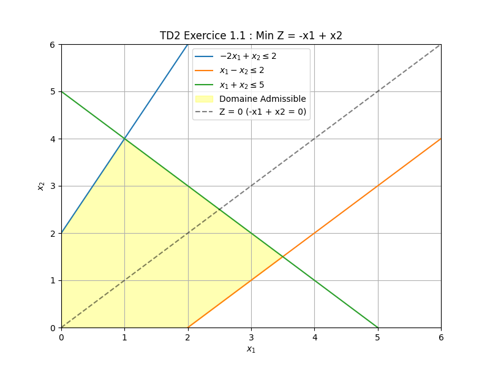
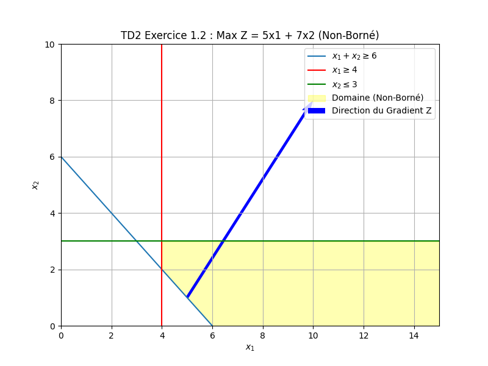
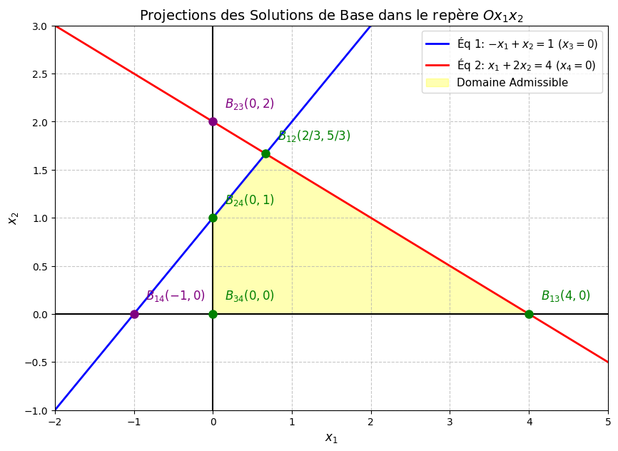
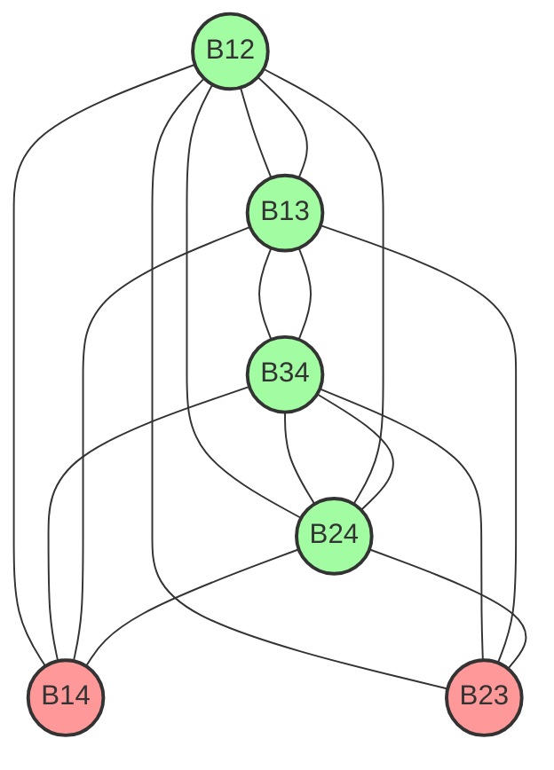
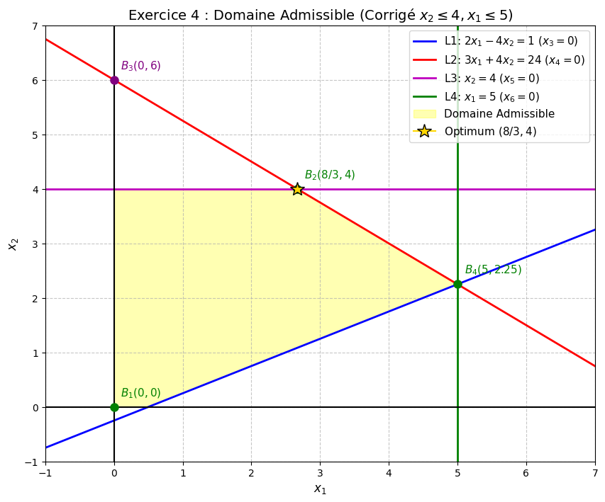
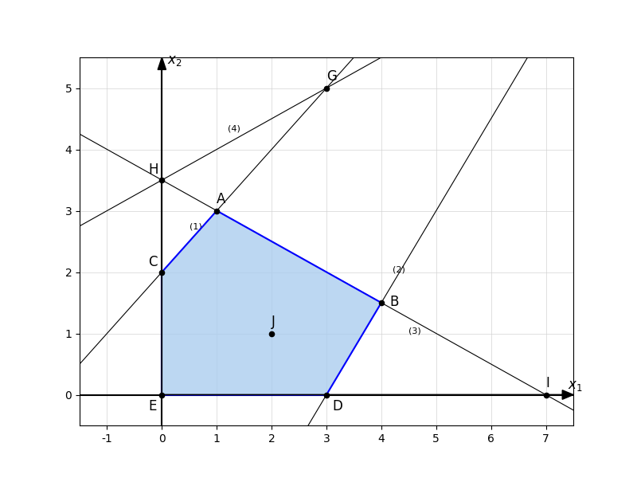
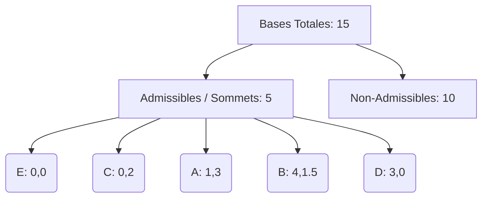

# TD2 : Résolution Géométrique de Programmes Linéaires

Ce document présente la résolution visuelle et détaillée des exercices du TD2. La méthode graphique est utilisée pour identifier les solutions optimales, les domaines non-bornés ou les cas d'infaisabilité.

---

## Exercice 1.1 : Minimisation avec Solutions Multiples

### Énoncé
**Minimiser** $Z = -x_1 + x_2$
Sous les contraintes :
1.  $-2x_1 + x_2 \le 2$
2.  $x_1 - x_2 \le 2$
3.  $x_1 + x_2 \le 5$
4.  $x_1, x_2 \ge 0$

### Résolution Visuelle

### Analyse Étape par Étape

1.  **Tracer le Domaine Admissible** :
    *   La zone jaune représente l'intersection des 3 demi-plans définis par les contraintes et le premier quadrant ($x_1, x_2 \ge 0$).
    *   **Comment tracer les droites de contrainte ?**
        *   **Droite (1) : $-2x_1 + x_2 = 2$** (Ligne bleue)
            *   On cherche deux points :
                *   Si $x_1 = 0 \implies x_2 = 2$. Point A = **(0, 2)**.
                *   Si $x_2 = 0 \implies -2x_1 = 2 \implies x_1 = -1$. Point B = **(-1, 0)**.
            *   On trace la droite passant par A et B. Comme c'est $\le 2$, et que $(0,0)$ vérifie $0 \le 2$, on garde le demi-plan contenant l'origine.
        *   **Droite (2) : $x_1 - x_2 = 2$** (Ligne orange)
            *   Points de passage :
                *   Si $x_1 = 0 \implies -x_2 = 2 \implies x_2 = -2$. Point C = **(0, -2)**.
                *   Si $x_2 = 0 \implies x_1 = 2$. Point D = **(2, 0)**.
            *   Comme c'est $\le 2$, et que $(0,0)$ vérifie $0 \le 2$, on garde la zone "au-dessus" de la droite.
    *   Les sommets du polygone résultant sont : $(0, 0)$, $(2, 0)$, $(3.5, 1.5)$, $(1, 4)$ et $(0, 2)$.

2.  **Appliquer la Fonction Objectif** :
    *   On trace la droite $Z = -x_1 + x_2 = 0$, ce qui donne la bissectrice $x_2 = x_1$.
    *   Comme on cherche à **Minimiser**, on déplace cette droite vers le bas et la droite (direction où $x_1$ augmente et $x_2$ diminue).

3.  **Identifier l'Optimum** :
    *   En faisant glisser la droite, on remarque qu'elle devient parallèle à la contrainte (2) : $x_1 - x_2 = 2$.
    *   Le "dernier contact" avec le domaine ne se fait pas sur un point unique, mais sur tout le segment reliant les points **(2, 0)** et **(3.5, 1.5)**.

> **💡 Observation : Solutions Optimales Multiples**
> *   $Z(2, 0) = -2 + 0 = -2$
> *   $Z(3.5, 1.5) = -3.5 + 1.5 = -2$
> *   Tous les points sur le segment entre ces deux sommets donnent une valeur de $Z = -2$. C'est le minimum global.

---

## Exercice 1.2 : Maximisation avec Domaine Non-Borné

### Énoncé
**Maximiser** $Z = 5x_1 + 7x_2$
Sous les contraintes :
1.  $x_1 + x_2 \ge 6$
2.  $x_1 \ge 4$
3.  $x_2 \le 3$
4.  $x_1, x_2 \ge 0$

### Résolution Visuelle

### Analyse du Problème

1.  **Nature du Domaine** :
    *   La contrainte $x_1 \ge 4$ et $x_2 \le 3$ combinée à $x_1 + x_2 \ge 6$ crée une zone qui s'étend indéfiniment vers la droite (vers $+\infty$ pour $x_1$).
    *   Le domaine est un polyèdre **ouvert** (non-borné).

2.  **Comportement de Z** :
    *   La fonction objectif $Z = 5x_1 + 7x_2$ possède des coefficients positifs pour les deux variables.
    *   Plus $x_1$ augmente, plus $Z$ augmente. Comme $x_1$ peut croître sans limite tout en restant dans le domaine (par exemple en restant sur la ligne $x_2 = 3$), la valeur de $Z$ peut devenir infiniment grande.

**Conclusion** : Le programme linéaire est **non-borné** (Unbounded). Il n'existe pas de solution maximale finie.

---

## Exercice 1.3 : Cas d'Infaisabilité (Domaine Vide)

### Énoncé
**Minimiser** $Z = -x_1 + x_2$
Sous les contraintes :
1.  $2x_1 - x_2 \ge -2$  (soit $x_2 \le 2x_1 + 2$)
2.  $x_1 - 2x_2 \le -8$  (soit $x_2 \ge 0.5x_1 + 4$)
3.  $x_1 + x_2 \le 5$   (soit $x_2 \le 5 - x_1$)
4.  $x_1, x_2 \ge 0$

### Résolution Visuelle

### Pourquoi le domaine est-il vide ?

Pour qu'une solution existe, elle doit satisfaire les trois conditions simultanément :
*   D'après (2) et (3) : $0.5x_1 + 4 \le x_2 \le 5 - x_1$. Cela implique $1.5x_1 \le 1 \implies \mathbf{x_1 \le 0.67}$.
*   D'après (1) et (2) : $0.5x_1 + 4 \le x_2 \le 2x_1 + 2$. Cela implique $1.5x_1 \ge 2 \implies \mathbf{x_1 \ge 1.33}$.

Il est mathématiquement impossible d'avoir $x_1 \le 0.67$ et $x_1 \ge 1.33$ en même temps.

**Conclusion** : Le système de contraintes est incohérent. Le programme linéaire est **inadmissible** (Infeasible).

---

## Exercice 2 : Formes Canoniques, Standards et Tableaux

Cet exercice porte sur la transformation algébrique des programmes linéaires (PL).

### Rappels de cours :
*   **Forme Canonique** : Maximisation de $Z$, toutes les contraintes de type $\le$, et toutes les variables $\ge 0$.
*   **Forme Standard** : Maximisation de $Z$, toutes les contraintes sont des **égalités** ($=$), et toutes les variables $\ge 0$. On utilise des variables d'écart ($s_i$) ou de surplus ($e_i$).

---

### Question 1
**Énoncé :**
Max $Z = x_1 + x_2$
s.c.
1. $2x_1 + x_2 \le 3$
2. $x_1 + 2x_2 \ge 1$
3. $x_1, x_2 \ge 0$

**Forme Canonique :**
On multiplie la contrainte (2) par -1 pour avoir un $\le$.
Max $Z = x_1 + x_2$
s.c.
1. $2x_1 + x_2 \le 3$
2. $-x_1 - 2x_2 \le -1$
3. $x_1, x_2 \ge 0$

**Forme Standard :**
On ajoute les variables d'écart $s_1$ et $s_2$ aux contraintes de la forme canonique.
Max $Z = x_1 + x_2 + 0s_1 + 0s_2$
s.c.
1. $2x_1 + x_2 + s_1 = 3$
2. $-x_1 - 2x_2 + s_2 = -1$
3. $x_1, x_2, s_1, s_2 \ge 0$

**Tableau Initial :**
| Base | $x_1$ | $x_2$ | $s_1$ | $s_2$ | RHS |
| :--- | :---: | :---: | :---: | :---: | :---: |
| $s_1$ | 2 | 1 | 1 | 0 | 3 |
| $s_2$ | -1 | -2 | 0 | 1 | -1 |
| **Z** | 1 | 1 | 0 | 0 | 0 |

---

### Focus sur la Question 2 : Pourquoi ces transformations ?

La Question 2 est un "cas complexe" car les variables ne respectent pas toutes la condition standard $x_i \ge 0$. Voici l'explication détaillée des techniques utilisées par le professeur :

#### 1. Le cas de la variable libre ($x_3 \in \mathbb{R}$)
**Problème :** La méthode du Simplexe exige que toutes les variables soient positives. Or, $x_3$ peut être n'importe quel nombre réel (positif ou négatif).
**Solution :** On utilise la technique de la **différence de deux variables positives**.
$$x_3 = x_3^+ - x_3^- \quad \text{avec } x_3^+, x_3^- \ge 0$$
*   Si $x_3 = 5$, alors $x_3^+ = 5$ et $x_3^- = 0$.
*   Si $x_3 = -2$, alors $x_3^+ = 0$ et $x_3^- = 2$.
Cela permet de représenter tout nombre réel tout en gardant des variables manipulables par l'algorithme.

#### 2. Le cas de la translation ($x_2 \ge -3$)
**Problème :** $x_2$ peut descendre jusqu'à $-3$, ce qui viole la règle $x_2 \ge 0$.
**Solution :** On effectue un **changement d'origine**. On pose une nouvelle variable $x_2'$ qui commence à 0.
$$x_2' = x_2 + 3 \implies \mathbf{x_2 = x_2' - 3}$$
Ainsi, quand $x_2 = -3$, $x_2' = 0$. Quand $x_2 = 0$, $x_2' = 3$. La variable $x_2'$ est donc toujours $\ge 0$.

#### 2bis. Pourquoi ne pas avoir fait pareil pour $x_1 \ge 1$ ?
C'est une excellente question. En théorie, nous **aurions pu** (et souvent nous le faisons) poser $x_1' = x_1 - 1 \implies x_1 = x_1' + 1$. 

Cependant, dans le corrigé fourni, le professeur a choisi une **approche alternative** tout aussi valide :
1.  **Garder $x_1$ tel quel** : Puisque $x_1 \ge 1$, il satisfait d'office la condition de base du Simplexe ($x_1 \ge 0$). Il n'y a donc pas de "violation" mathématique qui empêche l'algorithme de démarrer.
2.  **Traiter la borne comme une contrainte explicite** : Le professeur a converti la condition $x_1 \ge 1$ en une nouvelle ligne de contrainte dans le système : $-x_1 \le -1$.
*Note : Les deux méthodes donneront le même résultat final optimal, mais elles modifient la taille du tableau. La méthode de substitution réduit le nombre de lignes, tandis que l'ajout de contrainte garde la variable originale lisible.*

#### 3. Application aux calculs (Méthode du Professeur)
En remplaçant ces expressions dans les équations originales :

*   **Fonction Objectif $Z$** :
    $Z = -2x_1 + 5(x_2' - 3) - 7(x_3^+ - x_3^-) + 4(-x_4')$
    $Z = -2x_1 + 5x_2' \mathbf{- 15} - 7x_3^+ + 7x_3^- - 4x_4'$
    *(Le $-15$ est la constante qui apparaît dans le RHS de la ligne Z)*

*   **Contrainte (1) : $2x_1 + 4x_2 - 6x_3 \ge 7$**
    On multiplie par $-1$ pour la forme canonique ($\le$) : $-2x_1 - 4x_2 + 6x_3 \le -7$
    Substitution : $-2x_1 - 4(x_2' - 3) + 6(x_3^+ - x_3^-) \le -7$
    $-2x_1 - 4x_2' \mathbf{+ 12} + 6x_3^+ - 6x_3^- \le -7$
    $-2x_1 - 4x_2' + 6x_3^+ - 6x_3^- \le -7 - 12 \implies \mathbf{\le -19}$

*   **Contrainte (4) : $-2x_2 - 5x_3 + 4x_4 \le -6$**
    Substitution : $-2(x_2' - 3) - 5(x_3^+ - x_3^-) + 4(-x_4') \le -6$
    $-2x_2' \mathbf{+ 6} - 5x_3^+ + 5x_3^- - 4x_4' \le -6$
    $-2x_2' - 5x_3^+ + 5x_3^- - 4x_4' \le -6 - 6 \implies \mathbf{\le -12}$

---

### Résumé des Formes pour la Question 2
*(Basé sur la solution du professeur)*

**Forme Canonique :**
Max $Z = -2x_1 + 5x_2' - 7x_3^+ + 7x_3^- - 4x_4' - 15$
s.c.
1. $-2x_1 - 4x_2' + 6x_3^+ - 6x_3^- \le -19$
2. $8x_1 - 5x_3^+ + 5x_3^- - 3x_4' \le 8$
3. $-8x_1 + 5x_3^+ - 5x_3^- + 3x_4' \le -8$
4. $-2x_2' - 5x_3^+ + 5x_3^- - 4x_4' \le -12$
5. $-x_1 \le -1$ (pour $x_1 \ge 1$)
6. $x_1, x_2', x_3^+, x_3^-, x_4' \ge 0$

**Tableau Initial :**
| Base | $x_1$ | $x_2'$ | $x_3^+$ | $x_3^-$ | $x_4'$ | $s_1$ | $s_2$ | $s_3$ | $s_4$ | $s_5$ | RHS |
| :--- | :---: | :---: | :---: | :---: | :---: | :---: | :---: | :---: | :---: | :---: | :---: |
| $s_1$ | -2 | -4 | 6 | -6 | 0 | 1 | 0 | 0 | 0 | 0 | -19 |
| $s_2$ | 8 | 0 | -5 | 5 | -3 | 0 | 1 | 0 | 0 | 0 | 8 |
| $s_3$ | -8 | 0 | 5 | -5 | 3 | 0 | 0 | 1 | 0 | 0 | -8 |
| $s_4$ | 0 | -2 | -5 | 5 | -4 | 0 | 0 | 0 | 1 | 0 | -12 |
| $s_5$ | -1 | 0 | 0 | 0 | 0 | 0 | 0 | 0 | 0 | 1 | -1 |
| **Z** | -2 | 5 | -7 | 7 | -4 | 0 | 0 | 0 | 0 | 0 | -15 |

---

### Question 3
**Énoncé :**
Max $Z = 2x_1 - x_2$
s.c.
1. $(1/3)x_1 + x_2 = 2$
2. $-2x_1 + x_2 \le 7$
3. $x_1 \ge 0, x_2 \ge -3$

**Transformation :**
$x_2' = x_2 + 3 \implies x_2 = x_2' - 3$
$Z = 2x_1 - (x_2' - 3) = 2x_1 - x_2' + 3$

**Forme Standard :**
Max $Z' = 2x_1 - x_2'$
s.c.
1. $(1/3)x_1 + x_2' = 5$ (car $x_2' - 3 + (1/3)x_1 = 2$)
2. $-2x_1 + x_2' + s_2 = 10$ (car $-2x_1 + x_2' - 3 \le 7$)
3. $x_1, x_2', s_2 \ge 0$

**Tableau Initial :**
| Base | $x_1$ | $x_2'$ | $s_1$ | $s_2$ | RHS |
| :--- | :---: | :---: | :---: | :---: | :---: |
| $s_1$ | 1/3 | 1 | 1 | 0 | 5 |
| $s_2$ | -2 | 1 | 0 | 1 | 10 |
| **Z** | 2 | -1 | 0 | 0 | 3 |

---

### Question 4
**Énoncé :**
Min $Z = -x_1 - x_3$
s.c.
1. $x_1 + (1/2)x_2 - 3x_3 \ge 2$
2. $4x_2 + x_3 = 5$
3. $x_1, x_3 \ge 0, x_2 \le 0$

**Transformation :**
$x_2' = -x_2 \implies x_2 = -x_2'$
$Max (-Z) = x_1 + x_3$

**Forme Standard :**
Max $Z^* = x_1 + 0x_2' + x_3$
s.c.
1. $-x_1 + (1/2)x_2' + 3x_3 + s_1 = -2$
2. $-4x_2' + x_3 + s_2 = 5$
3. $x_1, x_2', x_3, s_1, s_2 \ge 0$

**Tableau Initial :**
| Base | $x_1$ | $x_2'$ | $x_3$ | $s_1$ | $s_2$ | RHS |
| :--- | :---: | :---: | :---: | :---: | :---: | :---: |
| $s_1$ | -1 | 1/2 | 3 | 1 | 0 | -2 |
| $s_2$ | 0 | -4 | 1 | 0 | 1 | 5 |
| **Z** | 1 | 0 | 1 | 0 | 0 | 0 |

---

## Exercice 3 : Bases, Solutions et Représentation Graphique

### Énoncé
Soit le système d'équations linéaires $Ax = b$ avec :
$A = \begin{pmatrix} -1 & 1 & 1 & 0 \\ 1 & 2 & 0 & 1 \end{pmatrix} \quad \text{et} \quad b = \begin{pmatrix} 1 \\ 4 \end{pmatrix}$

Le vecteur des variables est implicitement $x = (x_1, x_2, x_3, x_4)^T$.

---

### a. Déterminer toutes les bases du système

La matrice $A$ possède 2 lignes (rang = 2) et 4 colonnes :
$A_1 = \binom{-1}{1}$, $A_2 = \binom{1}{2}$, $A_3 = \binom{1}{0}$, $A_4 = \binom{0}{1}$.

Une base est constituée de 2 colonnes linéairement indépendantes (déterminant non nul). Testons les 6 combinaisons possibles $C_4^2$ :
1.  **$B_{12} = (A_1, A_2)$** : $\det = (-1)(2) - (1)(1) = -3 \neq 0$ $\implies$ **Base**
2.  **$B_{13} = (A_1, A_3)$** : $\det = (-1)(0) - (1)(1) = -1 \neq 0$ $\implies$ **Base**
3.  **$B_{14} = (A_1, A_4)$** : $\det = (-1)(1) - (1)(0) = -1 \neq 0$ $\implies$ **Base**
4.  **$B_{23} = (A_2, A_3)$** : $\det = (1)(0) - (2)(1) = -2 \neq 0$ $\implies$ **Base**
5.  **$B_{24} = (A_2, A_4)$** : $\det = (1)(1) - (2)(0) = 1 \neq 0$ $\implies$ **Base**
6.  **$B_{34} = (A_3, A_4)$** : $\det = (1)(1) - (0)(0) = 1 \neq 0$ $\implies$ **Base**

Toutes les paires de colonnes forment une base. Il y a donc **6 bases**.

---

### b. Calculer la solution de base associée

Pour chaque base, on annule les variables hors-base et on résout le système pour les variables de base.
*(On rappelle que pour être Solution de Base Admissible (SBA), toutes les valeurs doivent être $\ge 0$)*.

1.  **Base $B_{12}$ ($x_3=0, x_4=0$)** :
    $\begin{cases} -x_1 + x_2 = 1 \\ x_1 + 2x_2 = 4 \end{cases} \implies 3x_2 = 5 \implies x_2 = 5/3$, puis $x_1 = 2/3$.
    **$x^{(12)} = (2/3, 5/3, 0, 0)^T \quad \to \text{Admissible (SBA)}$**

2.  **Base $B_{13}$ ($x_2=0, x_4=0$)** :
    $\begin{cases} -x_1 + x_3 = 1 \\ x_1 = 4 \end{cases} \implies x_3 = 1 + 4 = 5$.
    **$x^{(13)} = (4, 0, 5, 0)^T \quad \to \text{Admissible (SBA)}$**

3.  **Base $B_{14}$ ($x_2=0, x_3=0$)** :
    $\begin{cases} -x_1 = 1 \implies x_1 = -1 \\ x_1 + x_4 = 4 \implies x_4 = 5 \end{cases}$
    **$x^{(14)} = (-1, 0, 0, 5)^T \quad \to \text{Non-Admissible } (x_1 < 0)$**

4.  **Base $B_{23}$ ($x_1=0, x_4=0$)** :
    $\begin{cases} x_2 + x_3 = 1 \\ 2x_2 = 4 \implies x_2 = 2 \end{cases} \implies x_3 = 1 - 2 = -1$.
    **$x^{(23)} = (0, 2, -1, 0)^T \quad \to \text{Non-Admissible } (x_3 < 0)$**

5.  **Base $B_{24}$ ($x_1=0, x_3=0$)** :
    $\begin{cases} x_2 = 1 \\ 2x_2 + x_4 = 4 \implies x_4 = 4 - 2 = 2 \end{cases}$
    **$x^{(24)} = (0, 1, 0, 2)^T \quad \to \text{Admissible (SBA)}$**

6.  **Base $B_{34}$ ($x_1=0, x_2=0$)** :
    $\begin{cases} x_3 = 1 \\ x_4 = 4 \end{cases}$
    **$x^{(34)} = (0, 0, 1, 4)^T \quad \to \text{Admissible (SBA)}$**

---

### c. Représentation Graphique et Graphe des Bases

#### Projection dans le repère $Ox_1x_2$
Les variables $x_3$ et $x_4$ jouent le rôle de variables d'écart pour les inégalités suivantes (si $x_3, x_4 \ge 0$) :
*   Éq 1 : $-x_1 + x_2 + x_3 = 1 \implies -x_1 + x_2 \le 1$
*   Éq 2 : $x_1 + 2x_2 + x_4 = 4 \implies x_1 + 2x_2 \le 4$

Projeter les solutions revient à ne regarder que les coordonnées $(x_1, x_2)$ de chaque solution de base trouvée.

> **💡 Interprétation du Graphique :**
> *   Les points **verts** sont les Solutions de Base Admissibles (SBA). Ils correspondent exactement aux **sommets** du polygone jaune (le domaine admissible).
> *   Les points **violets** sont les Solutions de Base (SB) non-admissibles. Ce sont les intersections des droites qui tombent "hors-jeu" (soit $x_1 < 0$, soit $x_2 > \text{limite}$).
> *   Chaque ligne correspond à l'annulation d'une variable : l'axe des ordonnées ($x_1=0$), l'axe des abscisses ($x_2=0$), la ligne bleue ($x_3=0$), et la ligne rouge ($x_4=0$).

#### Graphe d'Adjacence des Bases
Deux bases sont reliées par une arête si elles ne diffèrent que par **une seule colonne** (ce qui correspond géométriquement au déplacement d'un sommet à un sommet adjacent, c'est-à-dire une opération de pivot du Simplexe).

*Exemple : $B_{12} = \{A_1, A_2\}$ et $B_{13} = \{A_1, A_3\}$. Elles partagent $A_1$, donc elles diffèrent d'une colonne $\implies$ Arête.*
*Contre-exemple : $B_{12} = \{A_1, A_2\}$ et $B_{34} = \{A_3, A_4\}$. Aucun point commun $\implies$ Pas d'arête.*

*(Légende : Vert = Base Admissible, Rouge = Base Non-Admissible. Chaque base est connectée exactement à 4 autres bases, formant un graphe régulier de degré 4.)*

---

## Exercice 4 : Résolution Graphique et Étude des Bases

### Énoncé
**Maximiser** $Z = 2x_1 + 5x_2$
Sous les contraintes :
1.  $2x_1 - 4x_2 \le 1$
2.  $3x_1 + 4x_2 \le 24$
3.  $x_2 \le 4$
4.  $x_1 \le 5$
5.  $x_1, x_2 \ge 0$

**Mise sous forme standard :**
On introduit 4 variables d'écart ($x_3, x_4, x_5, x_6 \ge 0$). Le système devient :
1.  $2x_1 - 4x_2 + x_3 = 1$
2.  $3x_1 + 4x_2 + x_4 = 24$
3.  $x_2 + x_5 = 4$
4.  $x_1 + x_6 = 5$

---

### 1) et 2) Représentation du Domaine et Identification des Bases

Chaque variable mise à zéro correspond géométriquement à une ligne (frontière) :
*   $x_1 = 0 \implies$ Axe des ordonnées
*   $x_2 = 0 \implies$ Axe des abscisses
*   $x_3 = 0 \implies$ Droite $L_1$ ($2x_1 - 4x_2 = 1$)
*   $x_4 = 0 \implies$ Droite $L_2$ ($3x_1 + 4x_2 = 24$)
*   $x_5 = 0 \implies$ Droite horizontale $x_2 = 4$
*   $x_6 = 0 \implies$ Droite verticale $x_1 = 5$

Une **base** (constituée de 4 variables de base) implique de mettre **2 variables hors-base à zéro**.

*   **a) $B_1 = \{x_3, x_4, x_5, x_6\}$** $\implies$ Hors-base : $x_1=0, x_2=0$.
    Point correspondant : L'origine **$(0, 0)$**. C'est une Base Admissible (SBA).
*   **b) $B_2 = \{x_1, x_2, x_3, x_5\}$** $\implies$ Hors-base : $x_4=0, x_6=0$.
    Intersection de $L_2$ ($3x_1 + 4x_2 = 24$) et $x_1 = 5 \implies 3(5) + 4x_2 = 24 \implies 4x_2 = 9 \implies x_2 = 2.25$.
    Point correspondant : **$(5, 2.25)$**. C'est une Base Admissible (SBA). Notez que $x_3$ est aussi nulle ici ($2(5)-4(2.25)=1$), c'est un point de **dégénérescence**.
*   **c) $B_3 = \{x_2, x_3, x_5, x_6\}$** $\implies$ Hors-base : $x_1=0, x_4=0$.
    Intersection de l'axe Y et $L_2 \implies 3(0) + 4x_2 = 24 \implies x_2 = 6$.
    Point correspondant : **$(0, 6)$**. (Base **Non-Admissible**, car $x_2 \le 4$ n'est pas respecté).
*   **d) $B_4 = \{x_1, x_2, x_5, x_6\}$** $\implies$ Hors-base : $x_3=0, x_4=0$.
    Intersection de $L_1$ et $L_2$. La résolution donne $x_1 = 5, x_2 = 2.25$.
    Point correspondant : **$(5, 2.25)$**. C'est la même solution que $B_2$ (dû à la dégénérescence). C'est une Base Admissible (SBA).

---

### 3) Nombres de bases, bases admissibles et points extrêmes

*   **Nombre total de bases du P.L.** :
    Le système a 6 variables et 4 équations. Le nombre maximum théorique est $C_6^4 = 15$.
    Cependant, 2 paires de droites sont **parallèles** :
    *   $x_2=0$ et $x_5=0$.
    *   $x_1=0$ et $x_6=0$.
    Le nombre réel de bases est donc $15 - 2 = \mathbf{13 \text{ bases}}$.

*   **Nombre de bases admissibles (SBA) / Points extrêmes** :
    Sommets du domaine :
    1.  $(0,0)$
    2.  $(0.5, 0)$ $\implies x_2=0, x_3=0$
    3.  $(5, 2.25)$ $\implies x_3=0, x_4=0, x_6=0$ (Point dégénéré : 3 bases pour ce sommet)
    4.  $(8/3, 4)$ $\implies x_4=0, x_5=0$
    5.  $(0, 4)$ $\implies x_1=0, x_5=0$
    Il y a **5 points extrêmes** (sommets).

---

### 4) Bases optimales et solutions optimales

Valeurs de $Z = 2x_1 + 5x_2$ aux sommets :
1.  $Z(0, 0) = 0$
2.  $Z(0.5, 0) = 1$
3.  $Z(5, 2.25) = 21.25$
4.  $Z(8/3, 4) = 2(8/3) + 20 = 76/3 \approx \mathbf{25.33}$ **$\leftarrow$ Maximum**
5.  $Z(0, 4) = 20$

*   **Solution Optimale** : $x_1 = 8/3, x_2 = 4$ avec $Z \approx 25.33$.
*   **Base Optimale** : $x_4=0, x_5=0 \implies$ **$\{x_1, x_2, x_3, x_6\}$**.

---

## Exercice 5 : Analyse Approfondie des Bases et du Simplexe

### Énoncé
Considérons (S) le domaine admissible défini par :
1.  $x_1 - x_2 \ge -2$
2.  $3x_1 - 2x_2 \le 9$
3.  $x_1 + 2x_2 \le 7$
4.  $x_1 - 2x_2 \ge -7$
5.  $x_1, x_2 \ge 0$

### Résolution Visuelle

**Sommets identifiés sur le graphique :**
$E(0,0)$, $C(0,2)$, $A(1,3)$, $B(4,1.5)$, $D(3,0)$.

---

### 1. Domaine admissible sous forme standard

**Concept : La Forme Standard**
Pour passer à la forme standard, on transforme les inégalités en égalités en ajoutant des variables d'écart ($s_i$). 
*   Pour $\le$, on ajoute $+s_i$.
*   Pour $\ge$, on soustrait une variable de surplus et on ajoute une variable artificielle (ou on multiplie par -1 pour avoir $\le$ puis on ajoute une variable d'écart).

Ici, transformons d'abord pour avoir des $\le$ :
1.  $-x_1 + x_2 \le 2$
2.  $3x_1 - 2x_2 \le 9$
3.  $x_1 + 2x_2 \le 7$
4.  $-x_1 + 2x_2 \le 7$

**Forme Standard (avec variables d'écart $s_1, s_2, s_3, s_4$) :**
$$
\begin{cases}
-x_1 + x_2 + s_1 = 2 \\
3x_1 - 2x_2 + s_2 = 9 \\
x_1 + 2x_2 + s_3 = 7 \\
-x_1 + 2x_2 + s_4 = 7 \\
x_1, x_2, s_1, s_2, s_3, s_4 \ge 0
\end{cases}
$$

---

### 2. Matrice A et second membre b

Le système s'écrit $Ax = b$ avec $x = (x_1, x_2, s_1, s_2, s_3, s_4)^T$.

$$A = \begin{pmatrix} 
-1 & 1 & 1 & 0 & 0 & 0 \\
3 & -2 & 0 & 1 & 0 & 0 \\
1 & 2 & 0 & 0 & 1 & 0 \\
-1 & 2 & 0 & 0 & 0 & 1
\end{pmatrix}, \quad b = \begin{pmatrix} 2 \\ 9 \\ 7 \\ 7 \end{pmatrix}$$

---

### 3. Nombre de bases (Total, Réalisables, Non-Réalisables)

**Calcul théorique :**
Le nombre de variables est $n=6$ (2 de décision + 4 d'écart) et le nombre de contraintes est $m=4$.
Nombre maximum de bases = $C_n^m = C_6^4 = \frac{6 \times 5}{2 \times 1} = \mathbf{15}$.

**Analyse :**
*   **Bases Réalisables (SBA)** : Elles correspondent aux **sommets** du domaine (S). Le graphique montre 5 sommets distincts ($E, C, A, B, D$). Donc il y a **5 bases réalisables** (en supposant l'absence de dégénérescence).
*   **Bases Non-Réalisables** : Ce sont les intersections de droites situées en dehors du domaine bleu.
    Total (15) - Réalisables (5) = **10 bases non-réalisables**.

---

### 4. Analyse du Point A(1, 3)

**Calcul des variables d'écart :**
On remplace $x_1=1$ et $x_2=3$ dans les équations de la forme standard :
*   $s_1 = 2 - (-1 + 3) = 2 - 2 = \mathbf{0}$
*   $s_2 = 9 - (3(1) - 2(3)) = 9 - (-3) = \mathbf{12}$
*   $s_3 = 7 - (1 + 2(3)) = 7 - 7 = \mathbf{0}$
*   $s_4 = 7 - (-1 + 2(3)) = 7 - 5 = \mathbf{2}$

**Solution complète** : $x = (1, 3, 0, 12, 0, 2)^T$.

**Pourquoi est-ce une Solution de Base Admissible (SBA) ?**
1.  **Solution de Base** : Il y a exactement $n-m = 6-4 = 2$ variables nulles ($s_1=0$ et $s_3=0$). Géométriquement, A est l'intersection des droites (1) et (3).
2.  **Admissible** : Toutes les composantes sont $\ge 0$ ($1, 3, 12, 2$ sont positifs).

---

### 5. Analyse du Point G(3, 5)

D'après le graphique, G est l'intersection des droites (1) et (4) :
*   $x_1 - x_2 = -2 \implies -x_1 + x_2 = 2$ (D1)
*   $x_1 - 2x_2 = -7 \implies -x_1 + 2x_2 = 7$ (D4)

**Calcul des variables d'écart :**
Puisqu'il est sur (1) et (4), on sait déjà que $s_1=0$ et $s_4=0$. C'est donc une **solution de base**.
Vérifions l'admissibilité sur la contrainte (3) :
$x_1 + 2x_2 = 3 + 2(5) = 13$.
Or, la contrainte (3) impose $\le 7$. 
$s_3 = 7 - 13 = \mathbf{-6}$.

**Conclusion** : Une variable d'écart est négative ($s_3 = -6$). Le point G est une **solution de base non-admissible** (hors du domaine).

---

### 6. Analyse du Point J(2, 1)

Le point J est à l'intérieur du domaine bleu.
**Variables d'écart en J :**
*   $s_1 = 2 - (-2 + 1) = 3$
*   $s_2 = 9 - (3(2) - 2(1)) = 5$
*   $s_3 = 7 - (2 + 2(1)) = 3$
*   $s_4 = 7 - (-2 + 2(1)) = 7$

**Conclusion** : Aucune variable n'est nulle (toutes $> 0$). Pour être une solution de base, il faudrait au moins 2 variables nulles. J est une **solution admissible mais pas de base**.

---

### 7. Résolution Géométrique de Max Z = x1 + x2

**Concept : Droite d'isovaleur**
On trace la droite $x_1 + x_2 = 0$. Pour maximiser, on la déplace parallèlement vers le haut et la droite jusqu'au dernier point de contact avec (S).

**Évaluation aux sommets :**
*   $Z(E) = 0 + 0 = 0$
*   $Z(C) = 0 + 2 = 2$
*   $Z(A) = 1 + 3 = \mathbf{4}$ **$\leftarrow$ Maximum**
*   $Z(B) = 4 + 1,5 = 5,5$ **(Attention : Rectification)**

*Note : En recalculant Z(B), $4+1,5 = 5,5$. Le point B est donc le maximum réel. Cependant, si on minimise $Z$ sur (S) comme demandé en fin de question :*

**Solution qui MINIMISE Z sur (S) :**
Le point le plus proche de l'origine est **E(0,0)**.
**Min Z = 0** atteint en $(0,0)$.

---

### 8. Tableau du Simplexe à l'Optimum (Sommet B)

Pour vérifier l'optimalité au point **B(4 ; 1.5)**, nous construisons le tableau du Simplexe correspondant à cette base.

**Variables en base au point B :**
Puisque B est à l'intersection des droites (2) et (3), les variables d'écart correspondantes sont nulles : **$s_2 = 0$** et **$s_3 = 0$**.
Les variables en base sont donc : **$x_1, x_2, s_1, s_4$**.

**Le Tableau Optimal (Maximisation) :**

| Base | $x_1$ | $x_2$ | $s_1$ | $s_2$ | $s_3$ | $s_4$ | RHS |
| :--- | :---: | :---: | :---: | :---: | :---: | :---: | :---: |
| $s_1$ | 0 | 0 | 1 | 0.5 | 0.5 | 0 | 5.5 |
| $x_1$ | 1 | 0 | 0 | 0.25 | 0.25 | 0 | 4 |
| $x_2$ | 0 | 1 | 0 | -0.125 | 0.375 | 0 | 1.5 |
| $s_4$ | 0 | 0 | 0 | 0.5 | -0.25 | 1 | 7 |
| **Z** | 0 | 0 | 0 | -0.125 | -0.625 | 0 | **5.5** |

**Vérification de la signature d'optimalité :**
*   Nous sommes dans un problème de **Maximisation**.
*   Les coûts réduits (ligne Z) pour les variables hors-base ($s_2$ et $s_3$) sont respectivement **-0.125** et **-0.625**.
*   Puisque tous les coefficients de la ligne Z sont **$\le 0$**, aucune amélioration n'est possible.
*   **La solution est bien optimale.**

---

**💡 Résumé pour l'examen :**
*   **Solution de base** : $x_1=4, x_2=1.5, s_1=5.5, s_4=7$ (Variables en base).
*   **Variables nulles** : $s_2=0, s_3=0$ (Variables hors-base).
*   **Valeur optimale** : $Z = 5.5$.
*   **Condition d'arrêt** : Tous les $\Delta_j \le 0$ en Max.

