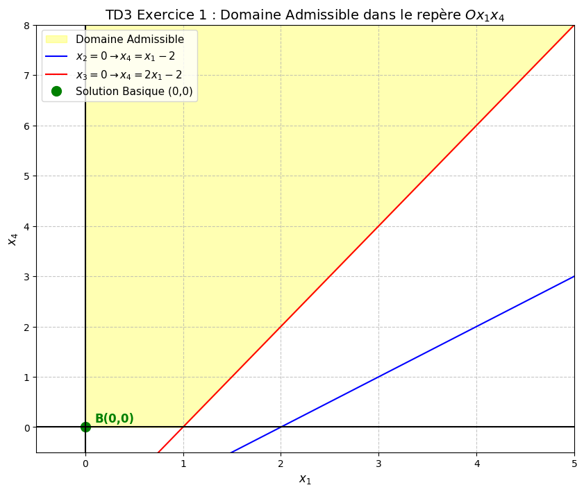
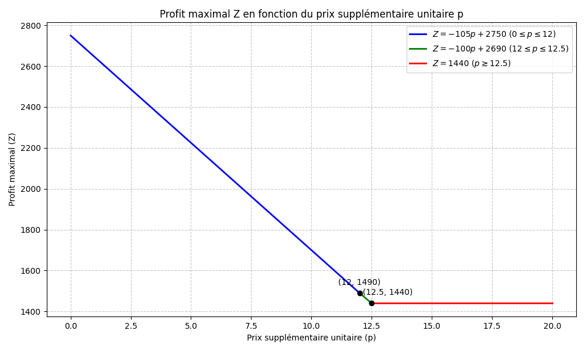
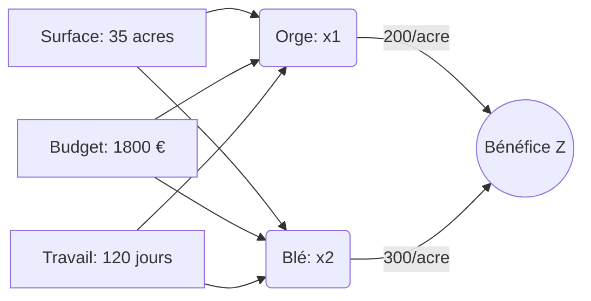

# TD3 : Méthode du Simplexe et Analyse des Tableaux

Ce document détaille la résolution des exercices du TD3. Pour chaque question, le concept théorique est expliqué avant de présenter la solution.

---

## Exercice 1

### Énoncé
Lors de la résolution d’un programme linéaire, on est tombé sur le tableau suivant :

| $x_1$ | $x_2$ | $x_3$ | $x_4$ | $Z$ | Constantes |
| :---: | :---: | :---: | :---: | :---: | :---: |
| 1 | 1 | 0 | -1 | 0 | 2 |
| 2 | 0 | 1 | -1 | 0 | 2 |
| 1 | 0 | 0 | -5 | 1 | 3 |

---

### Question a.1 : Donner les indices des variables basiques et des variables hors base.

**Concept : Base et Forme Canonique**
Dans la méthode du Simplexe, chaque ligne correspond à une équation. Une variable est dite **basique** (ou en base) si elle permet d'isoler une équation. Graphiquement dans le tableau, sa colonne doit former un vecteur unitaire de la base canonique (c'est-à-dire un seul "1" et des "0" partout ailleurs sur les lignes de contraintes). Les variables dont les colonnes ne respectent pas cette règle sont dites **hors-base**.

**Résolution :**
*   **Variables Basiques** :
    *   La colonne de **$x_2$** est $\begin{pmatrix} 1 \\ 0 \\ 0 \end{pmatrix}$. C'est la variable basique de la ligne 1.
    *   La colonne de **$x_3$** est $\begin{pmatrix} 0 \\ 1 \\ 0 \end{pmatrix}$. C'est la variable basique de la ligne 2.
    *   *(Note : $Z$ est la variable basique de l'objectif sur la ligne 3).*
    *   Les indices des variables basiques (système de contraintes) sont donc **$\{2, 3\}$**.
*   **Variables Hors Base** :
    *   Les colonnes de $x_1$ et $x_4$ ne sont pas unitaires.
    *   Les indices des variables hors base sont donc **$\{1, 4\}$**.

---

### Question a.2 : Quelle est la solution basique associée au tableau ?

**Concept : Calcul de la Solution Basique**
Le principe du tableau du Simplexe est de pouvoir lire une solution immédiatement. Pour ce faire, la règle est de **fixer toutes les variables hors-base à zéro**. Les variables basiques prennent alors directement les valeurs de la colonne des constantes (RHS - Right Hand Side).

**Résolution :**
On annule les variables hors base : on pose $x_1 = 0$ et $x_4 = 0$.
En remplaçant dans les équations du tableau :
*   Ligne 1 : $1(0) + 1x_2 + 0x_3 - 1(0) = 2 \implies \mathbf{x_2 = 2}$
*   Ligne 2 : $2(0) + 0x_2 + 1x_3 - 1(0) = 2 \implies \mathbf{x_3 = 2}$
*   Ligne 3 (Objectif) : $1(0) + 0x_2 + 0x_3 - 5(0) + 1Z = 3 \implies \mathbf{Z = 3}$

La solution basique associée est le vecteur $X = (x_1, x_2, x_3, x_4)^T = \mathbf{(0, 2, 2, 0)^T}$.

---

### Question a.3 : Est-elle admissible ?

**Concept : Admissibilité**
Une solution est dite **admissible** (ou réalisable) si elle respecte toutes les contraintes du problème, y compris les contraintes de non-négativité. Dans le contexte du Simplexe standard, cela signifie que toutes les variables (de décision et d'écart) doivent avoir des valeurs positives ou nulles ($x_i \ge 0$).

**Résolution :**
Notre solution basique est $(0, 2, 2, 0)$.
Puisque $x_1=0$, $x_2=2$, $x_3=2$, et $x_4=0$, toutes les valeurs sont $\ge 0$.
**Conclusion : Oui, la solution est admissible.**

---

### Question b : Représenter le domaine admissible du problème dans le repère $Ox_1x_4$, ainsi que la solution basique du tableau donné.

**Concept : Projection du Domaine Admissible**
Pour représenter un problème à 4 variables ($x_1, x_2, x_3, x_4$) dans un plan 2D défini par deux variables ($x_1$ et $x_4$), il faut exprimer les autres variables ($x_2$ et $x_3$) en fonction de ces deux-là grâce aux équations du système. Ensuite, on applique la règle de non-négativité ($x_i \ge 0$ pour tout $i$) pour obtenir les inéquations qui définissent les frontières du domaine dans ce plan.

**Résolution :**
1.  **Exprimons $x_2$ et $x_3$ en fonction de $x_1$ et $x_4$ :**
    D'après les lignes du tableau :
    *   Ligne 1 : $x_1 + x_2 - x_4 = 2 \implies \mathbf{x_2 = 2 - x_1 + x_4}$
    *   Ligne 2 : $2x_1 + x_3 - x_4 = 2 \implies \mathbf{x_3 = 2 - 2x_1 + x_4}$

2.  **Appliquons les contraintes de non-négativité :**
    *   $x_1 \ge 0$ (Axe des ordonnées)
    *   $x_4 \ge 0$ (Axe des abscisses)
    *   $x_2 \ge 0 \implies 2 - x_1 + x_4 \ge 0 \implies \mathbf{x_4 \ge x_1 - 2}$ (Limite induite par $x_2$)
    *   $x_3 \ge 0 \implies 2 - 2x_1 + x_4 \ge 0 \implies \mathbf{x_4 \ge 2x_1 - 2}$ (Limite induite par $x_3$)

3.  **Représentation Graphique :**
    Le domaine admissible est la zone où $x_4$ est supérieur à la fois à $(x_1 - 2)$ et à $(2x_1 - 2)$, tout en restant dans le cadran positif ($x_1 \ge 0, x_4 \ge 0$). C'est une région ouverte (non-bornée).
    La solution basique actuelle a pour coordonnées $(x_1=0, x_4=0)$, ce qui correspond à l'origine du repère $Ox_1x_4$.

*(Le point vert à l'origine représente la solution basique actuelle)*

---

## Exercice 2

### Énoncé
Voici un tableau du simplexe obtenu en maximisant une fonction objectif soumise à 3 contraintes. Les variables $x_1$ et $x_2$ sont les variables du problème original, et $e_1, e_2, e_3$ sont des variables d'écart.

| Base | $x_1$ | $x_2$ | $e_1$ | $e_2$ | $e_3$ | RHS |
| :--- | :---: | :---: | :---: | :---: | :---: | :---: |
| **?** | -2/3 | 0 | $f$ | 0 | 1/6 | 46 |
| **?** | -1/8 | 0 | 0 | 1 | 5/2 | $k$ |
| **?** | $b$ | 1 | $g$ | $i$ | -1/6 | 4 |
| **Z** | $c$ | $e$ | $h$ | $j$ | 1/2 | $m$ |

Le vecteur $c$ est donné par : $c^T = (a \quad d \quad 0 \quad 0 \quad 0)$. (Ce vecteur correspond à la ligne $Z$).

---

### Question 1 : Donner les variables de base de ce tableau.

**Concept : Repérage de la Base**
Comme vu dans l'exercice 1, les variables de base sont celles dont les colonnes forment la matrice identité (vecteurs unitaires). L'ordre des lignes nous indique quelle variable est en base pour quelle équation.

**Résolution :**
*   Colonne **$x_2$** : $\begin{pmatrix} 0 \\ 0 \\ 1 \end{pmatrix}$. C'est la variable de base de la ligne 3.
*   Colonne **$e_2$** : $\begin{pmatrix} 0 \\ 1 \\ 0 \end{pmatrix}$. C'est la variable de base de la ligne 2.
*   Par élimination, la ligne 1 a besoin de sa variable de base. La seule candidate pour গঠন le vecteur $\begin{pmatrix} 1 \\ 0 \\ 0 \end{pmatrix}$ est la variable **$e_1$**.
*   Les variables de base sont donc : **$e_1$ (ligne 1), $e_2$ (ligne 2), et $x_2$ (ligne 3)**.

---

### Question 2 : Indiquer quels sont les paramètres forcés et déterminer leurs valeurs.

**Concept : Propriétés de la Forme Canonique**
Pour qu'un tableau soit valide et prêt pour le Simplexe, deux règles strictes s'appliquent aux variables de base :
1.  Leur colonne dans la zone des contraintes doit être un vecteur unitaire.
2.  Leur coefficient dans la ligne de la fonction objectif ($Z$) doit être **strictement nul** (car leur contribution est déjà prise en compte dans la valeur de $Z$ affichée en RHS).

**Résolution :**
1.  **Structure des colonnes de base :**
    *   Puisque $e_1$ est la variable de base de la ligne 1, sa colonne doit être $\begin{pmatrix} 1 \\ 0 \\ 0 \end{pmatrix}$. Par conséquent : **$f = 1$** et **$g = 0$**.
    *   Puisque $e_2$ est la variable de base de la ligne 2, sa colonne doit être $\begin{pmatrix} 0 \\ 1 \\ 0 \end{pmatrix}$. Par conséquent : **$i = 0$**.
2.  **Ligne de la fonction objectif ($Z$) :**
    Les coûts réduits des variables en base ($x_2, e_1, e_2$) doivent être nuls.
    Par conséquent : **$e = 0$** (pour $x_2$), **$h = 0$** (pour $e_1$), et **$j = 0$** (pour $e_2$).
3.  **Lien avec le vecteur $c^T$ :**
    L'énoncé stipule que la ligne $Z$ correspond à $c^T = (a \quad d \quad 0 \quad 0 \quad 0)$.
    En comparant avec le tableau $(c \quad e \quad h \quad j \quad 1/2)$, on trouve :
    *   Le coefficient de $x_1$ est **$c = a$**.
    *   Le coefficient de $x_2$ est $e = d$. Or on sait que $e = 0$, donc **$d = 0$**.

---

### Question 3 : À quelles conditions les paramètres donnent-ils une solution dégénérée ?

**Concept : Dégénérescence**
Une solution de base est dite **dégénérée** si au moins l'une des variables de base prend la valeur **zéro**. Graphiquement, cela signifie que plus de contraintes que nécessaire s'intersectent en un même sommet (créant une redondance).

**Résolution :**
Les valeurs des variables de base se lisent dans la colonne RHS :
*   $e_1 = 46$
*   $e_2 = k$
*   $x_2 = 4$
Pour que la solution soit dégénérée, il faut qu'au moins une de ces valeurs soit nulle. Or 46 et 4 sont non-nuls.
La condition est donc : **$k = 0$**.

---

### Question 4 : À quelles conditions le tableau est-il l'unique solution optimale ?

**Concept : Optimalité et Unicité**
Dans un problème de **maximisation**, on ne peut plus améliorer $Z$ si faire entrer n'importe quelle variable hors-base détériore l'objectif. Cela se traduit par des coûts réduits ($c_j$) de signes spécifiques selon la convention. Si l'on écrit la ligne $Z$ telle que $Z + \sum c_j x_j = m$, un coût $c_j \ge 0$ indique l'optimalité. (Une convention courante veut que les $c_j \le 0$ signalent l'optimalité. L'important est que l'entrée d'une variable hors-base pénalise Z).
Pour que la solution soit **unique**, l'entrée de *toute* variable hors base doit pénaliser *strictement* $Z$.

**Résolution :**
En assumant la convention où les coûts des variables hors-base doivent décourager leur entrée en base :
*   Le coût de la variable hors-base $x_1$ est $c$. Il doit décourager le pivotage (ex: $c < 0$ ou $c > 0$ selon la convention adoptée par votre professeur).
*   Pour l'**unicité**, ce coût doit être strict (par exemple, **$c \neq 0$** en respectant le signe d'optimalité).
*   *(Note : Le coefficient $1/2$ pour $e_3$ indique généralement que le tableau n'est pas encore optimal dans une convention standard, ou qu'il l'est dans l'autre. La condition porte de toute façon sur le paramètre inconnu $c$)*.

---

### Question 5 : À quelles conditions le tableau est-il optimal avec plusieurs solutions ?

**Concept : Solutions Multiples (Segment optimal)**
Il existe des solutions optimales multiples si le tableau est à l'optimum, **ET** qu'au moins une variable **hors-base** possède un coût réduit **strictement égal à zéro**. Cela permet de faire entrer cette variable en base, de bouger sur une arête du domaine, sans changer la valeur de l'objectif $Z$.

**Résolution :**
Si le tableau est optimal, il suffit d'imposer un coût nul pour une variable hors-base pour avoir des solutions multiples.
Ici, la variable $x_1$ a pour coût réduit $c$.
La condition est : **$c = 0$**.

---

### Question 6 : À quelles conditions le problème n'est-il pas borné ?

**Concept : Problème Non-Borné**
Un problème est non-borné vers l'infini si une variable hors-base peut améliorer $Z$ (donc elle "veut" entrer en base), mais qu'il n'y a **aucune contrainte pour bloquer son augmentation**. Dans l'algorithme du Simplexe, cela se voit si tous les coefficients dans la colonne de cette variable (au-dessus de la ligne $Z$) sont **négatifs ou nuls** ($\le 0$). On ne peut alors pas calculer le ratio de sortie $\theta$.

**Résolution :**
Regardons la colonne d'une variable qui pourrait entrer en base : $x_1$.
Ses coefficients de contrainte sont :
*   Ligne 1 : $-2/3$ ($\le 0$)
*   Ligne 2 : $-1/8$ ($\le 0$)
*   Ligne 3 : $b$
Pour qu'il n'y ait aucun pivot possible (aucune limite à l'augmentation de $x_1$), il faut que le coefficient de la ligne 3 soit également négatif ou nul.
La condition est : **$b \le 0$** (en supposant que $c$ a un signe favorable au pivotage).

---

## Exercice 3

### Énoncé
Soit le programme linéaire :
**Maximiser** $z = 2x_1 + 3x_2$
Sous contraintes :
1. $x_1 \le 40$
2. $x_2 \le 70$
3. $x_1 + x_2 \le 80$
4. $x_1 + x_2 \ge 20$
$x_1, x_2 \ge 0$

On supprime provisoirement la contrainte (4), résoudre alors à l'aide de l'algorithme du simplexe.

---

### Question 1 : Résoudre le problème relâché (sans la contrainte 4) avec l'algorithme du simplexe.

**Concept : Standardisation et Algorithme du Simplexe**
Pour utiliser le Simplexe, il faut d'abord transformer les inéquations en équations en ajoutant des **variables d'écart** ($x_i \ge 0$). Ensuite, on construit le tableau initial. À chaque itération :
1.  On choisit la **variable entrante** : celle qui a le coût réduit le plus favorable (ici, le plus grand positif ou le plus petit négatif selon l'écriture de Z).
2.  On choisit la **variable sortante** : celle qui a le plus petit ratio strictement positif (Constante / Coefficient du pivot).
3.  On effectue le **pivotage** (opérations sur les lignes) pour recréer une colonne identité pour la nouvelle variable de base.
On s'arrête quand tous les coûts réduits n'autorisent plus d'amélioration.

**Résolution :**

**Mise sous forme standard :**
On ajoute les variables d'écart $x_3, x_4, x_5$ pour les contraintes 1, 2 et 3.
Max $Z = 2x_1 + 3x_2$
1. $x_1 + x_3 = 40$
2. $x_2 + x_4 = 70$
3. $x_1 + x_2 + x_5 = 80$
Équation de Z : $Z - 2x_1 - 3x_2 = 0$

**Tableau Initial ($T_0$) :**
| Base | $x_1$ | $x_2$ | $x_3$ | $x_4$ | $x_5$ | RHS |
| :--- | :---: | :---: | :---: | :---: | :---: | :---: |
| **$x_3$** | 1 | 0 | 1 | 0 | 0 | 40 |
| **$x_4$** | 0 | **1** | 0 | 1 | 0 | 70 |
| **$x_5$** | 1 | 1 | 0 | 0 | 1 | 80 |
| **Z** | -2 | **-3** | 0 | 0 | 0 | 0 |

*   **Entrante** : $x_2$ (coût réduit le plus négatif : -3).
*   **Sortante** : Ratios : $x_4 \to 70/1=70$ ; $x_5 \to 80/1=80$. Min = 70 $\implies$ $x_4$ sort. Le pivot est **1** (Ligne 2).

**Itération 1 ($T_1$) :**
*   $L_2' = L_2$
*   $L_1' = L_1$
*   $L_3' = L_3 - L_2'$
*   $Z' = Z + 3L_2'$

| Base | $x_1$ | $x_2$ | $x_3$ | $x_4$ | $x_5$ | RHS |
| :--- | :---: | :---: | :---: | :---: | :---: | :---: |
| **$x_3$** | 1 | 0 | 1 | 0 | 0 | 40 |
| **$x_2$** | 0 | 1 | 0 | 1 | 0 | 70 |
| **$x_5$** | **1** | 0 | 0 | -1 | 1 | 10 |
| **Z** | **-2** | 0 | 0 | 3 | 0 | 210 |

*   **Entrante** : $x_1$ (coût réduit -2).
*   **Sortante** : Ratios : $x_3 \to 40/1=40$ ; $x_5 \to 10/1=10$. Min = 10 $\implies$ $x_5$ sort. Le pivot est **1** (Ligne 3).

**Itération 2 ($T_2$) :**
*   $L_3'' = L_3'$
*   $L_1'' = L_1' - L_3''$
*   $L_2'' = L_2'$
*   $Z'' = Z' + 2L_3''$

| Base | $x_1$ | $x_2$ | $x_3$ | $x_4$ | $x_5$ | RHS |
| :--- | :---: | :---: | :---: | :---: | :---: | :---: |
| **$x_3$** | 0 | 0 | 1 | 1 | -1 | 30 |
| **$x_2$** | 0 | 1 | 0 | 1 | 0 | 70 |
| **$x_1$** | 1 | 0 | 0 | -1 | 1 | 10 |
| **Z** | 0 | 0 | 0 | 1 | 2 | 230 |

Tous les coûts réduits sur la ligne $Z$ sont $\ge 0$. Le tableau est optimal.
**Solution optimale du problème relâché : $x_1 = 10$, $x_2 = 70$ avec un maximum de $Z = 230$.**

---

### Question 2 : L'optimum trouvé satisfait-il la contrainte (4) ? Qu'en déduisez-vous ?

**Concept : Contrainte Redondante / Inactive à l'optimum**
Lorsqu'on résout un problème en ignorant temporairement une contrainte (relâchement), on obtient un optimum qui est potentiellement "meilleur" ou égal à celui du vrai problème. Si cet optimum trouvé s'avère **respecter naturellement** la contrainte qu'on avait enlevée, cela signifie que cette contrainte ne limitait pas l'atteinte du sommet optimal. Elle est dite **redondante** vis-à-vis de la solution optimale, et notre résultat est donc l'optimum global du problème complet.

**Résolution :**
1.  **Vérification :**
    La contrainte (4) est : $x_1 + x_2 \ge 20$.
    On remplace avec notre solution trouvée ($x_1=10, x_2=70$) :
    $10 + 70 = 80$.
    Or, $80 \ge 20$.
    **La contrainte (4) est donc largement satisfaite.**

2.  **Déduction :**
    Puisque la solution optimale du problème sans la contrainte (4) respecte cette même contrainte, **elle est la solution optimale du problème complet**. La contrainte (4) est inactive (ou redondante) à l'optimum. Il n'est pas nécessaire de recommencer les calculs pour résoudre le problème initial avec les 4 contraintes.

---

## Exercice 5

### Énoncé
En cours de la résolution d’un programme linéaire avec l’algorithme du simplexe on tombe sur le tableau suivant :

| $x_1$ | $x_2$ | $x_3$ | $x_4$ | $Z$ | RHS |
| :---: | :---: | :---: | :---: | :---: | :---: |
| 0 | 1 | 0 | 1 | 0 | 2 |
| 1 | 0 | 0 | 1 | 0 | 1 |
| 0 | 0 | $\alpha - 2$ | $\alpha - 1$ | 1 | $-\alpha + 2$ |

Discuter en fonction de la valeur du paramètre $\alpha$ la résolution du programme linéaire.

---

### Question : Discuter en fonction de la valeur du paramètre $\alpha$

**Concept : Critères d'Optimalité et Problèmes Non-Bornés**
Pour évaluer un tableau du Simplexe contenant un paramètre dans la ligne d'objectif (ici formulée comme $Z + \sum c_j x_j = RHS$), on observe les coûts réduits $c_j$ des variables hors-base :
1.  **Optimalité stricte** : Si tous les $c_j > 0$, l'entrée de toute variable dégraderait l'objectif $Z$. Le sommet actuel est l'unique optimum.
2.  **Solutions Multiples** : Si tous les $c_j \ge 0$ (optimalité atteinte) mais qu'au moins un coût réduit hors-base est **égal à zéro** ($c_j = 0$). Cela signifie qu'on peut déplacer la solution le long d'une arête du polyèdre sans changer la valeur de $Z$, créant une infinité de solutions (segment ou demi-droite).
3.  **Problème Non-Borné** : Si une variable hors-base a un coût réduit négatif ($c_j < 0$, elle doit donc entrer en base pour améliorer $Z$) **ET** que tous les coefficients de sa colonne dans la matrice des contraintes sont $\le 0$. Dans ce cas, aucun pivot n'est possible, la variable peut augmenter à l'infini sans violer aucune contrainte, et $Z \to \infty$.

**Résolution :**

**Analyse initiale du tableau :**
*   **Variables de base** : $x_2$ (Ligne 1) et $x_1$ (Ligne 2).
*   **Variables hors-base** : $x_3$ et $x_4$.
*   **Solution basique actuelle** : $x_1 = 1, x_2 = 2, x_3 = 0, x_4 = 0$ avec $Z = -\alpha + 2$. Elle est toujours admissible car les constantes (2 et 1) sont $\ge 0$.
*   **Coûts réduits** :
    *   $c_3 = \alpha - 2$
    *   $c_4 = \alpha - 1$
*   *Remarque importante* : On a toujours $c_3 - c_4 = -1$, ce qui implique que **$c_3 < c_4$ est toujours vrai**.

**Discussion selon les cas :**

1.  **Cas 1 : $\alpha > 2$**
    *   On a $c_3 = \alpha - 2 > 0$ et $c_4 = \alpha - 1 > 1 > 0$.
    *   Tous les coûts réduits hors-base sont strictement positifs.
    *   **Conclusion** : Le tableau donne la solution **optimale et unique**. L'optimum est $(1, 2, 0, 0)$.

2.  **Cas 2 : $\alpha = 2$**
    *   On a $c_3 = 0$ et $c_4 = 1 > 0$.
    *   Tous les coûts sont $\ge 0$, donc la solution actuelle est **optimale**.
    *   Cependant, $c_3 = 0$ signifie que $x_3$ peut entrer en base sans changer $Z$.
    *   Si l'on regarde la colonne de $x_3$, ses coefficients de contrainte sont $\begin{pmatrix} 0 \\ 0 \end{pmatrix}$. Puisqu'ils sont $\le 0$, la variable $x_3$ peut augmenter à l'infini sans jamais forcer une variable de base à devenir négative.
    *   **Conclusion** : Le problème admet une **infinité de solutions optimales** (non-bornées, formant une demi-droite).

3.  **Cas 3 : $\alpha < 2$**
    *   On a $c_3 = \alpha - 2 < 0$. La variable $x_3$ est favorable pour entrer en base car elle améliorerait $Z$.
    *   *(Note : L'algorithme du simplexe choisit le coût le plus négatif. Comme $c_3 < c_4$ toujours, $x_3$ sera toujours le premier choix d'entrée).*
    *   En regardant la colonne de $x_3$, les coefficients sont $0$ et $0$. Il n'y a **aucun pivot strictement positif**, donc on ne peut pas calculer de ratio de sortie (les contraintes ne bloquent pas $x_3$).
    *   **Conclusion** : Le programme linéaire est **non-borné** (il n'y a pas d'optimum fini, $Z \to +\infty$).

---

## Exercice 6

### Énoncé
Soit le programme linéaire suivant :
**Maximiser** $Z = 14x_1 + 0x_2 + 10x_3$
Sous les contraintes :
1. $x_1 - x_2 + x_3 \le 3$
2. $2x_1 + x_2 + 4x_3 \le 8$
3. $5x_1 - x_2 + x_3 \le 5$
$x_1, x_2, x_3 \ge 0$

1. Résoudre ce problème à l'aide de la méthode du simplexe.
2. Montrer qu'il existe une solution réalisable de base et une seule équivalente à celle trouvée dans la 1ère question.

---

### Question 1 : Résoudre avec la méthode du simplexe

**Concept : Itérations du Simplexe**
On standardise le problème en ajoutant des variables d'écart ($e_1, e_2, e_3$) pour chaque inéquation "$\le$". Ensuite, on itère en faisant entrer la variable avec le coût réduit le plus défavorable (le plus négatif pour une maximisation avec $Z - \sum c_j x_j = 0$) et sortir celle qui limite le plus l'augmentation (ratio minimal).

**Résolution :**

**Mise sous forme standard :**
Max $Z = 14x_1 + 0x_2 + 10x_3 \implies Z - 14x_1 - 10x_3 = 0$
1. $x_1 - x_2 + x_3 + e_1 = 3$
2. $2x_1 + x_2 + 4x_3 + e_2 = 8$
3. $5x_1 - x_2 + x_3 + e_3 = 5$

**Tableau Initial ($T_0$) :**
| Base | $x_1$ | $x_2$ | $x_3$ | $e_1$ | $e_2$ | $e_3$ | RHS |
| :--- | :---: | :---: | :---: | :---: | :---: | :---: | :---: |
| **$e_1$** | 1 | -1 | 1 | 1 | 0 | 0 | 3 |
| **$e_2$** | 2 | 1 | 4 | 0 | 1 | 0 | 8 |
| **$e_3$** | **5** | -1 | 1 | 0 | 0 | 1 | 5 |
| **Z** | **-14** | 0 | -10 | 0 | 0 | 0 | 0 |

**Itération 1 ($T_1$) :**
*   **Variable entrante** : $x_1$ (coût le plus négatif : -14).
*   **Variable sortante** : On calcule les ratios : $e_1 \to 3/1=3$, $e_2 \to 8/2=4$, $e_3 \to 5/5=1$. Le minimum est 1, donc **$e_3$ sort**.
*   **Le pivot** est le coefficient à l'intersection : **5** (Ligne 3).

**Détail des calculs des lignes :**
*   **Nouvelle Ligne du pivot ($L_3'$):** On divise l'ancienne $L_3$ par le pivot (5).
    $L_3' = $L_3 / 5 = (1, -1/5, 1/5, 0, 0, 1/5 \mid 1)$
*   **Ligne 1 ($L_1'$):** $L_1' = L_1 - (1) \times L_3'$
    $L_1' = (1, -1, 1, 1, 0, 0 \mid 3) - (1, -1/5, 1/5, 0, 0, 1/5 \mid 1) = (0, -4/5, 4/5, 1, 0, -1/5 \mid 2)$
*   **Ligne 2 ($L_2'$):** $L_2' = L_2 - (2) \times L_3'$
    $L_2' = (2, 1, 4, 0, 1, 0 \mid 8) - (2, -2/5, 2/5, 0, 0, 2/5 \mid 2) = (0, 7/5, 18/5, 0, 1, -2/5 \mid 6)$
*   **Ligne Z ($Z'$):** $Z' = Z - (-14) \times L_3' = Z + 14 \times L_3'$
    $Z' = (-14, 0, -10, 0, 0, 0 \mid 0) + (14, -14/5, 14/5, 0, 0, 14/5 \mid 14) = (0, -14/5, -36/5, 0, 0, 14/5 \mid 14)$

| Base | $x_1$ | $x_2$ | $x_3$ | $e_1$ | $e_2$ | $e_3$ | RHS |
| :--- | :---: | :---: | :---: | :---: | :---: | :---: | :---: |
| **$e_1$** | 0 | -4/5 | 4/5 | 1 | 0 | -1/5 | 2 |
| **$e_2$** | 0 | 7/5 | **18/5** | 0 | 1 | -2/5 | 6 |
| **$x_1$** | 1 | -1/5 | 1/5 | 0 | 0 | 1/5 | 1 |
| **Z** | 0 | -14/5 | **-36/5** | 0 | 0 | 14/5 | 14 |

---

**Itération 2 ($T_2$) :**
*   **Variable entrante** : $x_3$ (coût le plus négatif : -36/5).
*   **Variable sortante** : Ratios : $e_1 \to 2 / (4/5) = 2 \times 5/4 = 2.5$. $e_2 \to 6 / (18/5) = 6 \times 5/18 = 30/18 \approx 1.66$. $x_1 \to 1 / (1/5) = 5$. Le minimum est 1.66, donc **$e_2$ sort**.
*   **Le pivot** est : **18/5** (Ligne 2).

**Détail des calculs des lignes :**
*   **Nouvelle Ligne du pivot ($L_2''$):** On divise l'ancienne $L_2'$ par le pivot (18/5), ce qui revient à multiplier par 5/18.
    $L_2'' = L_2' \times (5/18) = (0, \frac{7}{5}\cdot\frac{5}{18}, \frac{18}{5}\cdot\frac{5}{18}, 0, 1\cdot\frac{5}{18}, \frac{-2}{5}\cdot\frac{5}{18} \mid 6\cdot\frac{5}{18})$
    $L_2'' = (0, 7/18, 1, 0, 5/18, -1/9 \mid 30/18) = (0, 7/18, 1, 0, 5/18, -1/9 \mid 5/3)$
*   **Ligne 1 ($L_1''$):** $L_1'' = L_1' - (4/5) \times L_2''$
    $L_1'' = (0, -4/5, 4/5, 1, 0, -1/5 \mid 2) - (0, \frac{28}{90}, \frac{4}{5}, 0, \frac{20}{90}, \frac{-4}{45} \mid \frac{20}{15})$
    *(En mettant au même dénominateur 90) :*
    $L_1'' = (0, \frac{-72-28}{90}, 0, 1, \frac{-20}{90}, \frac{-18+8}{90} \mid \frac{6-4}{3})$
    $L_1'' = (0, -100/90, 0, 1, -20/90, -10/90 \mid 2/3) = (0, -10/9, 0, 1, -2/9, -1/9 \mid 2/3)$
*   **Ligne 3 ($L_3''$):** $L_3'' = L_3' - (1/5) \times L_2''$
    $L_3'' = (1, -1/5, 1/5, 0, 0, 1/5 \mid 1) - (0, \frac{7}{90}, \frac{1}{5}, 0, \frac{5}{90}, \frac{-2}{90} \mid \frac{1}{3})$
    $L_3'' = (1, \frac{-18-7}{90}, 0, 0, \frac{-5}{90}, \frac{18+2}{90} \mid \frac{3-1}{3})$
    $L_3'' = (1, -25/90, 0, 0, -5/90, 20/90 \mid 2/3) = (1, -5/18, 0, 0, -1/18, 2/9 \mid 2/3)$
*   **Ligne Z ($Z''$):** $Z'' = Z' - (-36/5) \times L_2'' = Z' + (36/5) \times L_2''$
    $Z'' = (0, -14/5, -36/5, 0, 0, 14/5 \mid 14) + (0, \frac{36}{5}\cdot\frac{7}{18}, \frac{36}{5}, 0, \frac{36}{5}\cdot\frac{5}{18}, \frac{36}{5}\cdot\frac{-1}{9} \mid \frac{36}{5}\cdot\frac{5}{3})$
    $Z'' = (0, -14/5, -36/5, 0, 0, 14/5 \mid 14) + (0, 14/5, 36/5, 0, 2, -4/5 \mid 12)$
    $Z'' = (0, 0, 0, 0, 2, \frac{14-4}{5} \mid 14+12) = (0, 0, 0, 0, 2, 2 \mid 26)$

| Base | $x_1$ | $x_2$ | $x_3$ | $e_1$ | $e_2$ | $e_3$ | RHS |
| :--- | :---: | :---: | :---: | :---: | :---: | :---: | :---: |
| **$e_1$** | 0 | -10/9 | 0 | 1 | -2/9 | -1/9 | 2/3 |
| **$x_3$** | 0 | **7/18** | 1 | 0 | 5/18 | -1/9 | 5/3 |
| **$x_1$** | 1 | -5/18 | 0 | 0 | -1/18 | 2/9 | 2/3 |
| **Z** | 0 | **0** | 0 | 0 | 2 | 2 | 26 |

Tous les coûts réduits sur la ligne $Z$ sont positifs ou nuls ($\ge 0$). Le tableau est optimal.
**Solution Optimale 1** : $x_1 = 2/3$, $x_2 = 0$, $x_3 = 5/3$ avec $Z_{max} = 26$.

---

### Question 2 : Montrer qu'il existe une solution réalisable de base et une seule équivalente à celle trouvée.

**Concept : Multiplicité des Solutions Optimales**
Deux solutions de base sont "équivalentes" en optimisation si elles donnent exactement la même valeur optimale de l'objectif $Z$. Cela se produit lorsque, au tableau optimal, une variable **hors-base a un coût réduit strictement égal à 0**. Faire entrer cette variable en base ne changera pas la valeur de $Z$, mais donnera une nouvelle Solution de Base Admissible (SBA), correspondant à un sommet adjacent. S'il n'y a qu'**un seul pivot possible** (une seule contrainte bloquante) dans cette colonne, alors il n'y a qu'une seule autre solution de base optimale.

**Résolution :**
1.  **Identification du coût réduit nul :**
    Dans le tableau optimal $T_2$, la variable **$x_2$ est hors-base** (elle n'appartient pas à la base $\{e_1, x_3, x_1\}$), mais **son coût réduit sur la ligne $Z$ est exactement 0**.
    Cela prouve qu'il existe d'autres solutions optimales (une face entière du polyèdre est optimale).

2.  **Recherche de la nouvelle solution de base (Pivotage) :**
    Faisons entrer $x_2$ en base.
    On calcule les ratios pour trouver la variable sortante en regardant les coefficients de la colonne $x_2$ :
    *   Ligne $e_1$ : coefficient -10/9 $\le 0 \implies$ Pas de limite, on ne calcule pas de ratio.
    *   Ligne $x_3$ : coefficient 7/18 $> 0 \implies$ Ratio = $(5/3) / (7/18) = 30/7$.
    *   Ligne $x_1$ : coefficient -5/18 $\le 0 \implies$ Pas de limite.

    Il n'y a qu'**un seul ratio strictement positif** (celui de la ligne $x_3$). Cela signifie qu'il n'y a qu'**une seule variable qui peut sortir** de la base pour laisser entrer $x_2$ sans rendre le système inadmissible. Le seul pivot possible est **7/18**.

3.  **Calcul de la nouvelle Solution de Base (Tableau $T_3$) :**
    En pivotant sur la ligne $x_3$ :
    La nouvelle ligne 2 (pour $x_2$) est l'ancienne multipliée par 18/7 :
    $x_2 = (5/3) \times (18/7) = \mathbf{30/7}$
    Puisque nous voulons juste identifier la solution, nous remettons à jour les valeurs RHS.
    Nouvelle valeur pour $e_1$ : $RHS = 2/3 - (-10/9) \times (30/7) = 2/3 + 300/63 = 342/63 = \mathbf{38/7}$
    Nouvelle valeur pour $x_1$ : $RHS = 2/3 - (-5/18) \times (30/7) = 2/3 + 150/126 = 234/126 = \mathbf{13/7}$
    La ligne $Z$ ne change pas car le coût réduit de $x_2$ était $0$.

**Conclusion :**
Comme il n'y avait qu'un seul pivot valide pour entrer $x_2$, **il n'existe qu'une seule autre Solution de Base Admissible (SBA) optimale**.
Cette seconde solution est : **$x_1 = 13/7$, $x_2 = 30/7$, $x_3 = 0$** (avec toujours $Z_{max} = 26$.

---

## Exercice 7 : Optimisation de la production et de l'achat (Gepetto SA)

### Énoncé
L’entreprise Gepetto SA vend des soldats et des trains de bois. Elle dispose d’un total de 145 planches de bois et de 90 heures de travail.
*   **Soldat** : 3 planches, 2 heures de travail, prix de vente 32 Dh.
*   **Train** : 5 planches, 4 heures de travail, prix de vente 55 Dh.
*   **Contraintes de marché** : Au plus 50 soldats et 50 trains peuvent être vendus.

Gepetto SA peut aussi acheter chez un fournisseur :
*   **Soldats supp.** : Prix d'achat $20 + p$ Dh.
*   **Trains supp.** : Prix d'achat $30 + 2p$ Dh.
Ils sont revendus au même prix que la production interne.

---

### Question 1 : Formuler le problème de production seule sous forme de programme linéaire.

**Concept : Modélisation de la production**
La modélisation consiste à définir des **variables de décision** représentant les quantités à produire, une **fonction objectif** à maximiser (le profit total) et un ensemble de **contraintes** traduisant les limites de ressources (bois, temps) et les limites commerciales (demande du marché).

**Résolution :**
1.  **Variables de décision** :
    *   $x_1$ : Nombre de soldats produits.
    *   $x_2$ : Nombre de trains produits.

2.  **Fonction Objectif** (Maximiser le profit $Z$) :
    En l'absence de coûts de production précisés, le profit est assimilé au prix de vente :
    **Maximiser $Z = 32x_1 + 55x_2$**

3.  **Contraintes** :
    *   **Bois** : $3x_1 + 5x_2 \le 145$ (Disponibilité des planches)
    *   **Travail** : $2x_1 + 4x_2 \le 90$ (Disponibilité des heures)
    *   **Marché (Soldats)** : $x_1 \le 50$
    *   **Marché (Trains)** : $x_2 \le 50$
    *   **Non-négativité** : $x_1, x_2 \ge 0$

---

### Question 2 : Reformuler le problème en incluant les possibilités d'achat.

**Concept : Profit Marginal et Variables d'Achat**
Lorsqu'on introduit l'achat de produits finis, le profit généré par ces derniers est différent de celui des produits fabriqués. Le profit par unité achetée est égal au **Prix de Vente - Prix d'Achat**. Les ressources de production (bois et heures) ne sont consommées que par les unités produites en interne, tandis que les contraintes de marché s'appliquent au **total** des unités (produites + achetées).

**Résolution :**
1.  **Variables de décision** :
    *   $x_1$ : Soldats produits.
    *   $x_2$ : Trains produits.
    *   $y_1$ : Soldats achetés.
    *   $y_2$ : Trains achetés.

2.  **Calcul des profits unitaires pour l'achat** :
    *   Profit/soldat acheté : $32 - (20 + p) = \mathbf{12 - p}$ Dh.
    *   Profit/train acheté : $55 - (30 + 2p) = \mathbf{25 - 2p}$ Dh.

3.  **Fonction Objectif** :
    **Maximiser $Z = 32x_1 + 55x_2 + (12 - p)y_1 + (25 - 2p)y_2$**

4.  **Contraintes reformulées** :
    *   **Ressources (production seule)** :
        *   $3x_1 + 5x_2 \le 145$ (Bois)
        *   $2x_1 + 4x_2 \le 90$ (Travail)
    *   **Marché (total vendu)** :
        *   $x_1 + y_1 \le 50$ (Limite de vente soldats)
        *   $x_2 + y_2 \le 50$ (Limite de vente trains)
    *   **Non-négativité** : $x_1, x_2, y_1, y_2 \ge 0$

---

### Question 3 : Tableau initial du simplexe

**Concept : Standardisation**
Pour résoudre le problème avec l'algorithme du simplexe, on transforme les inégalités $\le$ en égalités en ajoutant des variables d'écart positives ou nulles ($x_5, x_6, x_7, x_8$).

**Résolution :**
En renommant $y_1$ en $x_3$ et $y_2$ en $x_4$ pour correspondre à la notation du tableau de l'énoncé, le programme sous forme standard est :
Maximiser $Z$ tel que $Z - 32x_1 - 55x_2 - (12-p)x_3 - (25-2p)x_4 = 0$
Sous contraintes :
1. $3x_1 + 5x_2 + x_5 = 145$
2. $2x_1 + 4x_2 + x_6 = 90$
3. $x_1 + x_3 + x_7 = 50$
4. $x_2 + x_4 + x_8 = 50$

Le premier tableau du simplexe est :

| Base | $x_1$ | $x_2$ | $x_3$ | $x_4$ | $x_5$ | $x_6$ | $x_7$ | $x_8$ | $Z$ | RHS |
| :---: | :---: | :---: | :---: | :---: | :---: | :---: | :---: | :---: | :---: | :---: |
| **$x_5$** | 3 | 5 | 0 | 0 | 1 | 0 | 0 | 0 | 0 | 145 |
| **$x_6$** | 2 | 4 | 0 | 0 | 0 | 1 | 0 | 0 | 0 | 90 |
| **$x_7$** | 1 | 0 | 1 | 0 | 0 | 0 | 1 | 0 | 0 | 50 |
| **$x_8$** | 0 | 1 | 0 | 1 | 0 | 0 | 0 | 1 | 0 | 50 |
| **Z** | -32 | -55 | p-12 | 2p-25 | 0 | 0 | 0 | 0 | 1 | 0 |

---

### Question 4 : Étude de la solution optimale en fonction de $p \ge 0$

**Concept : Post-optimisation et analyse de sensibilité**
Pour un problème de maximisation, un tableau est optimal si tous les coûts réduits sur la ligne $Z$ sont positifs ou nuls ($c_j \ge 0$). Si un coût réduit dépend d'un paramètre $p$, l'optimalité dépend de la valeur de ce paramètre. Si pour une certaine plage de $p$, la condition n'est pas respectée, la variable avec le coût réduit négatif doit entrer en base, menant à une nouvelle solution optimale.

**Résolution :**

**1. Analyse du tableau fourni :**
Le tableau de l'énoncé a pour variables de base $x_5, x_1, x_7, x_8$.
Les coûts réduits des variables hors-base sont : $c_2 = 9$, $c_3 = p - 12$, $c_4 = 2p - 25$, $c_6 = 16$.
Pour que le tableau soit optimal, il faut que tous soient $\ge 0$ :
*   $p - 12 \ge 0 \implies p \ge 12$
*   $2p - 25 \ge 0 \implies p \ge 12.5$
La condition globale est donc **$p \ge 12.5$**.
*   **Si $p \ge 12.5$ :** La solution est $x_1 = 45$, et toutes les autres variables de décision ($x_2, x_3, x_4$) sont nulles. Profit : **$Z = 1440$**.

**2. Si $p < 12.5$ :**
Le coût $c_4 = 2p - 25$ devient strictement négatif, la variable $x_4$ (trains achetés) entre en base.
Dans la colonne $x_4$, le seul coefficient $>0$ est 1 sur la ligne de $x_8$. Le ratio est $50/1 = 50$. $x_8$ sort de la base.
On effectue le pivot sur la ligne $L_4$ : $x_4 = 50 - x_2 - x_8$.
La nouvelle ligne d'objectif est $L_Z' = L_Z - (2p-25)L_4$.
*   Nouveau profit : $Z' = 1440 - (2p-25) \times 50 = 2690 - 100p$
*   Nouveaux coûts réduits pertinents : $c'_2 = 9 - (2p-25) = 34 - 2p$ ; $c'_3 = p - 12$ ; $c'_8 = 25 - 2p$.
Pour que ce nouveau tableau soit optimal, il faut : $34 - 2p \ge 0$ ($p \le 17$), $p - 12 \ge 0$ ($p \ge 12$), et $25 - 2p \ge 0$ ($p \le 12.5$).
*   **Si $12 \le p \le 12.5$ :** La solution est optimale. $x_1 = 45$, $x_4 = 50$ (les autres variables de décision sont nulles). Profit : **$Z = 2690 - 100p$**.

**3. Si $p < 12$ :**
Le coût $c'_3 = p - 12$ devient négatif, la variable $x_3$ (soldats achetés) entre en base.
Le pivot se fait sur la ligne $L_3$ avec $x_7$ qui sort.
La nouvelle ligne d'objectif devient $L_Z'' = L_Z' - (p-12)L_3$.
*   Nouveau profit : $Z'' = (2690 - 100p) - (p-12) \times 5 = 2750 - 105p$.
*   Nouveaux coûts réduits : $c''_2 = 10 \ge 0$, $c''_6 = 10 + p/2 \ge 0$, $c''_7 = 12 - p \ge 0 \implies p \le 12$.
*   **Si $0 \le p \le 12$ :** La solution est optimale. $x_1 = 45$, $x_3 = 5$, $x_4 = 50$. Profit : **$Z = 2750 - 105p$**.

---

### Question 5 : Représentation géométrique du profit

**Concept : Fonction de profit optimal paramétrique**
La fonction $Z^*(p)$ donnant le profit maximum selon le paramètre $p$ est une fonction **concave et continue**, formée par des segments de droite correspondants aux différentes solutions de base optimales trouvées lors de l'analyse de sensibilité.

**Résolution :**
D'après la question précédente, le profil de profit s'exprime ainsi :
*   Pour $0 \le p \le 12$ : $Z(p) = -105p + 2750$
*   Pour $12 \le p \le 12.5$ : $Z(p) = -100p + 2690$
*   Pour $p \ge 12.5$ : $Z(p) = 1440$

La fonction est continue aux points de rupture :
*   Pour $p = 12$ : $Z = 2750 - 105(12) = 1490$
*   Pour $p = 12.5$ : $Z = 2690 - 100(12.5) = 1440$

Voici la représentation graphique de cette fonction :

---

## Exercice 9 : Allocation de cultures (Orge et Blé)

### 1. Formulation du Programme Linéaire

**Concept : Allocation de ressources**
Il s'agit d'un problème classique où l'on cherche à maximiser un bénéfice sous plusieurs contraintes de ressources (surface, budget, travail).

**Variables de décision** :
*   $x_1$ : Nombre d'acres alloués à l'orge.
*   $x_2$ : Nombre d'acres alloués au blé.

**Fonction Objectif (Maximisation du bénéfice)** :
$$\text{Max } Z = 200x_1 + 300x_2$$

**Contraintes** :
1.  **Surface** : $x_1 + x_2 \le 35$
2.  **Budget (Coût d'exploitation)** : $30x_1 + 60x_2 \le 1800$
3.  **Travail (Jours)** : $4x_1 + 3x_2 \le 120$
4.  **Non-négativité** : $x_1, x_2 \ge 0$

---

### 2. Résolution par la méthode du Simplexe

**Étape 1 : Forme Standard**
On ajoute des variables d'écart ($e_1, e_2, e_3 \ge 0$) pour transformer les inégalités en égalités.
*Note : Pour simplifier les calculs manuels, on peut diviser la contrainte de budget par 30 : $x_1 + 2x_2 \le 60$.*

Max $Z = 200x_1 + 300x_2 \implies Z - 200x_1 - 300x_2 = 0$
1. $x_1 + x_2 + e_1 = 35$
2. $x_1 + 2x_2 + e_2 = 60$ *(Contrainte de budget simplifiée)*
3. $4x_1 + 3x_2 + e_3 = 120$

**Étape 2 : Tableau Initial ($T_0$)**

| Base | $x_1$ | $x_2$ | $e_1$ | $e_2$ | $e_3$ | RHS |
| :--- | :---: | :---: | :---: | :---: | :---: | :---: |
| **$e_1$** | 1 | 1 | 1 | 0 | 0 | 35 |
| **$e_2$** | 1 | **2** | 0 | 1 | 0 | 60 |
| **$e_3$** | 4 | 3 | 0 | 0 | 1 | 120 |
| **Z** | -200 | **-300** | 0 | 0 | 0 | 0 |

*   **Variable entrante** : $x_2$ (coût réduit le plus négatif : -300).
*   **Variable sortante** : Ratios : $e_1 \to 35/1 = 35$, $e_2 \to 60/2 = 30$, $e_3 \to 120/3 = 40$. Le ratio minimum est 30, donc **$e_2$ sort**.
*   **Pivot** : **2** (Ligne 2).

---

**Étape 3 : Itération 1 ($T_1$)**

*   $L_2' = L_2 / 2 = (1/2, 1, 0, 1/2, 0 \mid 30)$
*   $L_1' = L_1 - L_2' = (1, 1, 1, 0, 0 \mid 35) - (1/2, 1, 0, 1/2, 0 \mid 30) = (1/2, 0, 1, -1/2, 0 \mid 5)$
*   $L_3' = L_3 - 3L_2' = (4, 3, 0, 0, 1 \mid 120) - (3/2, 3, 0, 3/2, 0 \mid 90) = (5/2, 0, 0, -3/2, 1 \mid 30)$
*   $Z' = Z + 300L_2' = (-200, -300, 0, 0, 0 \mid 0) + (150, 300, 0, 150, 0 \mid 9000) = (-50, 0, 0, 150, 0 \mid 9000)$

| Base | $x_1$ | $x_2$ | $e_1$ | $e_2$ | $e_3$ | RHS |
| :--- | :---: | :---: | :---: | :---: | :---: | :---: |
| **$e_1$** | **1/2** | 0 | 1 | -1/2 | 0 | 5 |
| **$x_2$** | 1/2 | 1 | 0 | 1/2 | 0 | 30 |
| **$e_3$** | 5/2 | 0 | 0 | -3/2 | 1 | 30 |
| **Z** | **-50** | 0 | 0 | 150 | 0 | 9000 |

*   **Variable entrante** : $x_1$ (coût réduit négatif : -50).
*   **Variable sortante** : Ratios : $e_1 \to 5 / 0.5 = 10$, $x_2 \to 30 / 0.5 = 60$, $e_3 \to 30 / 2.5 = 12$. Le ratio minimum est 10, donc **$e_1$ sort**.
*   **Pivot** : **1/2** (Ligne 1).

---

**Étape 4 : Itération 2 ($T_2$ - Optimum)**

*   $L_1'' = L_1' / (1/2) = 2 \times L_1' = (1, 0, 2, -1, 0 \mid 10)$
*   $L_2'' = L_2' - (1/2)L_1'' = (1/2, 1, 0, 1/2, 0 \mid 30) - (1/2, 0, 1, -1/2, 0 \mid 5) = (0, 1, -1, 1, 0 \mid 25)$
*   $L_3'' = L_3' - (5/2)L_1'' = (5/2, 0, 0, -3/2, 1 \mid 30) - (5/2, 0, 5, -5/2, 0 \mid 25) = (0, 0, -5, 1, 1 \mid 5)$
*   $Z'' = Z' + 50L_1'' = (-50, 0, 0, 150, 0 \mid 9000) + (50, 0, 100, -50, 0 \mid 500) = (0, 0, 100, 100, 0 \mid 9500)$

| Base | $x_1$ | $x_2$ | $e_1$ | $e_2$ | $e_3$ | RHS |
| :--- | :---: | :---: | :---: | :---: | :---: | :---: |
| **$x_1$** | 1 | 0 | 2 | -1 | 0 | 10 |
| **$x_2$** | 0 | 1 | -1 | 1 | 0 | 25 |
| **$e_3$** | 0 | 0 | -5 | 1 | 1 | 5 |
| **Z** | 0 | 0 | 100 | 100 | 0 | **9500** |

Tous les coûts réduits sur la ligne $Z$ sont positifs ou nuls ($\ge 0$). Le tableau est donc **optimal**.

---

### 3. Conclusion et Interprétation

**Solution optimale :**
L'agriculteur doit planter :
*   **$x_1 = 10$ acres d'orge**.
*   **$x_2 = 25$ acres de blé**.

**Bénéfice maximal :**
*   **$Z = 9500$ u.m.**

**Analyse des ressources (Variables d'écart) :**
*   $e_1 = 0$ : Toute la surface (35 acres) est utilisée ($10 + 25 = 35$).
*   $e_2 = 0$ : Tout le budget (1800) est consommé ($30\times10 + 60\times25 = 1800$).
*   $e_3 = 5$ : Il reste **5 jours de travail non utilisés** sur les 120 jours disponibles ($4\times10 + 3\times25 = 115 \le 120$).

